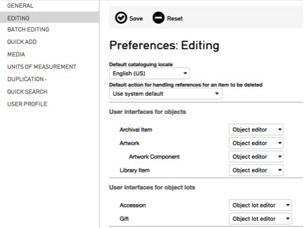

.. _providence-user-interfaces:

User Interfaces
===============
User Interface Administration
=============================

.. contents::
   :local:
   
User Interface Configuration
----------------------------

There are several configuration options that can be set system wide or for individual users that can improve cataloging efficiency for editing interfaces. 
These configuration options are set via *Manage > Administration> User Interfaces*. If your account does not have access to administration configuration please contact your system administrator. Individual users can select the User Interface they prefer in *Manage > My Preferences > Editing*.

*Fig 5.1a: Selecting preferred user interface for record types in Manage > My Preferences > Editing*

**Creating User Interfaces**

It is possible to make multiple Editor Screen Interfaces for record types that are geared to specific cataloging tasks or users’ working style (see the manual entry for `Editor Screens <https://manual.collectiveaccess.org/usermanual/creating_records.html#editor-screens>`_). For example, if a cataloger is responsible for entering data in only a small subset of metadata elements for a record, a new User Interface can be configured with only those elements to support that specific workflow. 

When creating User Interfaces, access to User Interfaces and User Interface screens can be set at the account, group and role level to limit availability to subsets of users (see the manual entry for `Access Control <https://manual.collectiveaccess.org/usermanual/manage.html#access-control>`_). 

Similarly, users can select User Interfaces for use in Quick Add forms in *Manage > My Preferences > Quick Add*. Creating custom User Interfaces for Quick Add screens can be very useful for ensuring a core subset of information is entered during the Quick Add process. See the manual entry for `Relationships <https://manual.collectiveaccess.org/usermanual/creating_records.html#relationships>`_ for more information on Quick Add.
 

   
   *Fig 5.1b: Manage > My Preferences > Quick Add*

**Configuring Metadata Elements in User Interfaces**
To adjust the configuration of a metadata element within a User Interface, first edit a User Interface and select the screen the metadata element appears on. Access metadata element configuration options by clicking the information icon   alongside element names in the list of “Elements to display on this screen”. Settings are specific to the placement of the element within the current User Interface and will not apply to all placements of the element throughout the system.  

   *Fig 5.2: Selecting and configuring metadata elements in Manage > Administration > User Interfaces. Clicking the information icon reveals configuration options for elements within the User Interface screen.*

The following selection of options may be useful for customizing complex User Interfaces.  

**Expand/ Collapse Metadata Elements**: Metadata elements within all editors can be expanded and collapsed by clicking the arrow icon   to the right of each element’s label. Users can configure metadata elements to be expanded or collapsed by default when forms are loaded. In the information window for metadata elements in a User Interface you will find two options, “Expand collapse if value exists” and “Expand collapse if no value is present”.  Both settings have the following options: Don’t force (default), Collapse, Expand.

**Sort Elements in Repeating Bundles**: Sort order and direction for repeatable elements can be configured by selecting options from the “Sort using” and “Sort direction” dropdowns. Different sort options are available for different metadata elements.

Metadata Elements for related records can be dragged and dropped into arbitrary order when the “Format of relationship list” dropdown is set to “Bubbles (draggable)” and “Sort using” is set to “User defined sort order”.

   *Fig 5.3: Configuring sort order and format of relationship lists in Manage > Administration > User Interfaces*

Configure Help Text and Documentation Links for Metadata Elements: Help text and links to documentation for metadata elements can be configured for elements or for elements within the context of a specific User Interface. Help text appears when users hover over the element title and links to documentation are available when clicking the information icon alongside the title of an element.

   *Fig 5.4: Element help text revealed on hover.  Information icon linked to URL in “Documentation URL” for the element*

Text entered in the “Description” field and links entered in the “Documentation URL” field for metadata elements in *Manage > Administration > Metadata Elements* are available wherever the element is used in a User Interface. Text entered in the “Descriptive text for bundle” and “Documentation URL” fields in the configuration options for elements within a User Interface screen in *Manage > Administration > User Interfaces* will only appear for that specific User Interface and will override the Metadata Element description and documentation URL.
