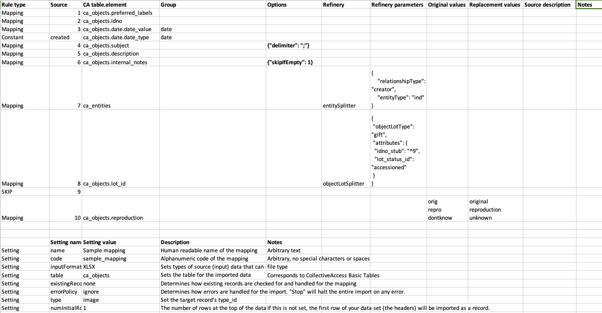

.. _import_mappings:
Import Mappings
===============

.. contents::
   :local:
   
   
.. toctree::
   :maxdepth: 1
   :caption: Sub-pages

   mappings/rules
   mappings/refineries
   mappings/builders
   mappings/splitters
   mappings/mappingOptions
   mappings/formats
   
   
Introduction
------------
Users can map and migrate data directly from the command line or the Providence user interface (under "Import > Data") into a Providence installation, mapping to the installation profile. An *import mapping* is a spreadsheet that defines how data is imported into CollectiveAccess. There are many settings and options in the import mapping. This documentation is organized by column, with a description of the function of each column along with the available settings for that column.

Import mappings operate under two basic assumption about your data: that each row in a data set corresponds to a single record and that each column corresponds to a single metadata element. The exception to these rules is an option called treatAsIdentifiersForMultipleRows that will explode a single row into multiple records. This is very useful if you have a data source that references common metadata shared by many pre-existing records in a single row. See the Options section for more details: http://manual.collectiveaccess.org/import/tutorial.html#options-column-5.


Running a data import involves seven basic steps:

1. Create an import mapping document (in Excel or Google Sheets) that will serve as a crosswalk between source data and the destination in CollectiveAccess.
2. Create a backup of the database by executing a data dump *before running the import*.
3. Run the import from either the command line or the graphical user interface.
4. Check the data in CollectiveAccess and look for errors or points of inconsistencies.
5. Revise your mapping accordingly.
6. Load the data dump so that the system returns to its pre-import state.
7. Run the import again. 


Sample Mapping
--------------


   
Download these files to see how the Sample Mapping applies to the Sample Data within the Sample Profile. Note that you can upload these to Google Drive and import both import mappings and source data via Google Drive. 

| `Sample mapping.xlsx <../_static/_files/Sample_mapping.xlsx>`_
| `Sample data.xlsx <../_static/_files/Sample_data.xlsx>`_
| `Sample import profile.xml <../_static/_files/Sample_import_profile.xml>`_

Supported Data Input Formats
----------------------------

Data can be in: Exif, MODS, RDF, Vernon, FMPDSOResult, MediaBin, ResourceSpace, WordpressRSS, CSVDelimited, FMPXMLResult, MySQL, SimpleXML, WorldCat, CollectiveAccess (CA-to-CA imports), Inmagic, Omeka, TEI, iDigBio, EAD, MARC, PBCoreInst, TabDelimited, Excel, MARCXML, PastPerfectXML, ULAN

A full description of the supported import formats and how they may be referenced is available in the in the :doc:`mappings/formats` page.

Creating a Mapping
------------------
Settings 
````````

Start from the sample worksheet provided above. Settings include the importer name, format of the input data, CollectiveAccess table to import to, and more. This section can be placed at the top or bottom of a mapping spreadsheet with the setting in the first column and parameter in the second. It functions separately from the main column-defined body of the import mapping.

.. csv-table::
   :widths: 20, 40, 20, 20
   :header-rows: 1
   :file: import_settings.csv

Rule Types (Column 1)
`````````````````````

Each row in the mapping must have a rule defined that determines how the importer will treat the record. Available rules are:

.. csv-table::
   :widths: auto
   :header-rows: 1
   :file: importerrules.csv

Source  (Column 2)
```````````````````

The source column sets which column from the data source is to be mapped or skipped. You can also set a constant data value, rather than a mapping, by setting the rule type to "constant" and the source column as the value or list item idno from your CollectiveAccess configuration.

An explanation of the most common sources is below. A full description of the supported import formats and how they may be referenced is available in the in the :doc:`mappings/formats` page.

==============  ================================================================================ 
Type  			Method for setting the source column                                                                       
==============  ================================================================================  
Spreadsheets    You must convert column letters to numbers. For example, if you want to map Column B of an Excel spreadsheet, you list the Source as 2. (A = 1, B = 2, C = 3, and so on.) Column B of your source data would be pulled. If on the other hand, you wish to skip this column, you would set the Rule Type to Skip and the source value to 2.
XML  			Set the Source column to the name of the XML tag, proceeded with a forward slash (i.e. /Sponsoring_Department or /inm:ContactName)
XPath			XPath is a query language for selecting nodes and computing values from an XML document. It is supported for "Source" specification when importing XML. W3C offers a basic tutorial for writing XPath expressions.
MARC			Like other XML formats, the Source value for MARC XML fields and indicators can be expressed using XPATH. 
FMPXML/RESULT	FileMakerPro XMLRESULT. A few things to note here due to inclusion of invalid characters in field names in certain databases (i.e. ArtBase). See Supported File Formats for rules for Source Field name rules.                                     
==============  ================================================================================ 

.. note::  Excel Tip: Translating A, B, C... to 1, 2, 3... can be time-consuming. Excel’s preferences allow you to change columns to display numerically rather than alphabetically. Go to Excel Preferences and select “General.” Click “Use R1C1 reference style.” This will display the column values as numbers.

**Special sources**

A few special sources are available regardless of the format of the data being imported. These values can be useful for disambiguating the sources of data within CollectiveAccess after import.
     
Sometimes it’s important to know, for example, which row from an Excel data set a record came from because there’s not enough other data to disambiguate for testing, etc. “Special sources” addresses this by letting you map _row_ to somewhere like internal notes. To do this you include _row_ instead of a number in the source column of your mapping.
     
==============  ================================================================================
Source          Description                                                                       
==============  ================================================================================
__row__         The number of the row being imported.  
__source__      The name of the file being imported. For files imported through the web interface this will be a server-side temporary filename, not the original name of the file.
__filename__    The original name of the file, when available. If the original name of the file is not available (because the uploading web browser did not report it, for instance) then the value for __source__ is returned.
__filepath__    The full path on the server to the file being imported.   
__now__         The current date and time. (Available from version 1.7.9).                                        
==============  ================================================================================

CA_table.element (Column 3)
```````````````````````````

This column declares the metadata element in the “table” set in `Settings`_ where the data in the source column will be mapped to in CollectiveAccess. If you are setting the source to Skip you do not need to complete this step. If you are mapping data or applying a constant value, you need to set the destination by adding the ca_table.element_code in this column.

CA_table corresponds to the CollectiveAccess basic tables, while element_code is the unique code you assigned to a metadata element in your CA configuration, or an intrinstic field in CA. For example, to map a Title column from your source data into CollectiveAccess, set the CA table.element as ``ca_objects.preferred_labels``


**Mapping to Containers** 

A Container is a metadata element that contains sub-elements. In order to import to specific sub-elements within a Container, you must cite the element codes for both the Container and the code for the sub-element: ``ca_table.container_code.element_code``.

Example: a Date field might actually be a container with two sub-elements: a date range field for the date itself, and a date type drop-down menu to qualify the date. In this case, we would import the date from our source data as:

.. code-block:: none

	ca_objects.date.date_value 
	ca_objects.date.date_type

To map the two of these into the same container, use groups. See more in  `Group (Column 4)`_ .

**Mapping to Related Tables**

Data will often contain references to related tables, such as related entities, related lots, related collections, related storage locations, and so on. In order to import data of one table (like ca_objects) while also creating and related records of other tables (like ca_entities), you will need to use refineries.

When your mapping includes references to a table outside the table set in the “table” Settings, you usually just need to cite the table name in this column (example: ca_entities). Then set the details in the refineries column. The exception to this is when you are creating Lot records. In this case, you set the ca_table.element_code to ca_objects.lot_id.


Group (Column 4)
`````````````````

In many cases, data will map into corresponding metadata elements bundled together in a container. To continue the example above, a common container is Date, where there are actually two metadata elements - one for the date itself, and another the date's type (Date Created, Date Accessioned, etc.). Let's say in your source data there is one column that contains date values, while the next column over contains the date types.

Declaring a Group is simple. Just assign a name to each line in mapping column 4 that is to be mapped into a single container.

If Source "2" is mapping to ca_objects_date.date_value, and Source "3" is mapping to ca_objects.date.date_type, give each line the group name "Date" This will tell the mapping that these two lines are going to a single container - and won't create a whole new container for each. Any word will work, it just has to be the same for each element that goes into the container. 


Options (Column 5)
```````````````````

Options can be used to set a variety of conditions on the import, process data that needs clean-up, or format data with templates. This example shows some of the more commonly used options. See the complete list of options: :doc:`mappings/mappingOptions` 

.. csv-table::
   :widths: 15, 40, 20, 25
   :header-rows: 1
   :file: mappingoptions.csv


In the example above, multiple subject values in the same cell that are separated by semi-colons. By setting the delimiter option in the mapping, you are ensuring that these subject values get parsed and imported to discrete instances of the Subject field. Without the delimiter option, the entire string would end up a single instance of the Subject field.


Refineries (Column 6-7)
```````````````````````

Refineries fall into one of 5 camps: Splitters, Makers, Joiners, Getters and Builders. Each framework is designed to take a specific data format and transform it via a specific behavior as it is imported into CollectiveAccess. See the Refineries page for a complete list of refineries: :doc:`mappings/refineries`  

Splitters
'''''''''

Splitter refineries can either create records, match data to existing records (following a mapping's existingRecordPolicy) or break a single string of source data into several metadata elements in CollectiveAccess. Splitters for relationships are used when several parameters are required, such as setting a record type and setting a relationship type. Using the entitySplitter, a name in a single location (i.e. column) in a data source can be parsed (into first, middle, last, prefix, suffix, et al.) within the new record. Similarly the measurementSplitter breaks up, for example, a list of dimensions into to a CollectiveAccess container of sub-elements. "Splitter" also implies that multiple data elements, delimited in a single location, can be "split" into unique records related to the imported record. See the :doc:`mappings/splitters` page for a complete list of splitters. 

Makers
''''''

Maker refineries are used to create CollectiveAccess tour/tour stop, object lot/object and list/list item pairings. These relationships are different than other CollectiveAccess relationships for two reasons. Firstly, they don't carry relationship types. Secondly, these relationships are always single to multiple: a tour can have many tour stops, but a tour stop can never belong to more than one tour. Similarly an object can never belong to more than one lot. List items belong to one and only one list. The Maker refinery is used for these specific cases where "relationshipType" and other parameters are unnecessary.

Joiners
'''''''

In some ways Joiners are the opposite of Splitters. An entityJoiner refinery is used when two or more parts of a name (located in different areas of the data source) need to be conjoined into a single record. The dateJoiner makes a single range out of two or more elements in the data source.

Getters
'''''''

Getters are designed specifically for MYSQL data mappings. These refineries map the repeating source data through the linking table to the correct CollectiveAccess elements.

Builders
''''''''

Builders create an upper hierarchy above the to-be-imported data. Note that Splitters also create upper hierarchies with the parent parameter, but they do so above records related to the imported data. For example, let's say you were importing ca_collections and wanted to map a "Series" and "Sub-series" above imported "File" data. You'd use the collectionHierarchyBuilder refinery. However, if you were importing ca_objects and wanted to relate a "File" while building an upper hierarchy of "Series" and "Sub-series" you would use the collectionSplitter and the parent parameter. See the Builders page for a complete list of builders: :doc:`mappings/builders` 


Original values and Replacement values (Columns 8-9)
`````````````````````````````````````````````````````

In some cases, particularly when you are mapping to a list element, you may need the mapping to find certain values in your source data and replace them with new values upon import. In the Original Value column, you may state all values that you wish to have replaced. Then, in the Replacement Value column, set their replacements. You can add multiple values to a single cell, so long as the replacement value matched the original value line by line. Using the Original and Replacement columns is sufficient for transforming a small range of values. But for really large transformation dictionaries, use the option "transformValuesUsingWorksheet" instead: http://manual.collectiveaccess.org/import/mappings.html#transform-values-using-worksheet.

Source Description & Notes (Columns 10 & 11)
`````````````````````````````````````````````

These two columns are used to clarify the source and purpose of each line in the mapping and are optional. Source Description is generally a plain text label or name for the original source column to allow for easy reference to which fields are being mapped (or skipped) in the mapping. Notes provides a space to explain how and why a certain line is mapped in the manner that it is, for example, explaining why a certain value is being omitted or how an entity line is being split and related to the main record.

These fields can be useful for future reference if a mapping is intended to be used repeatedly to be sure that the selected mapping matches the source data.


Importing data
--------------

Once the import mapping is complete, you are ready to run the import. See the  :doc:`running` page.
