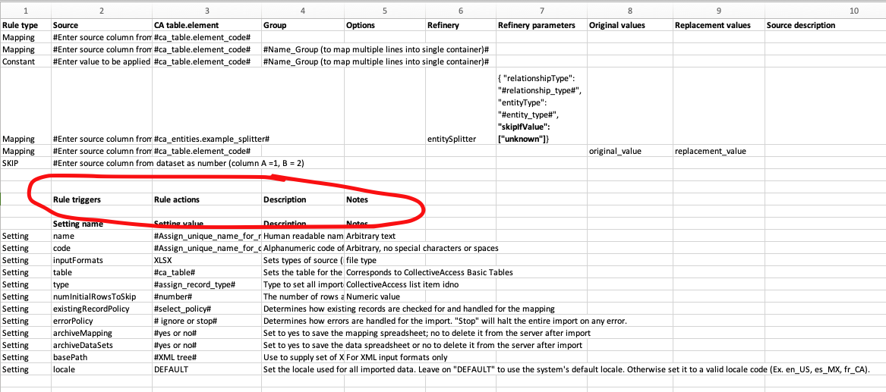

.. _rules:

Rules
========

.. contents::
   :local:
   
Rule description
`````````````````
Rules allow you to set record-level conditionals in your mapping with target actions triggered by true or false outcomes. With Rules, you can manipulate the migration of specific data and/or set metadata based on expression statements. For example, let's say you want to skip a record if a certain element in your data source is exactly equal to a specific value. Rules allows you to set a target action, such as "SKIP," when a match is triggered.

Rules rely on a two part operation outlined in the import mapping. The first component is is called "Rule triggers" and it is an expression statement that results in a quantity that is evaluated by the data importer. The second defines "rule actions" that are performed based on the outcome of the expression.

Let's walk through an example. (See also the in-depth description of :ref:`expressions <expressions>`).

For our example, we are going to skip all records with the phrase "do not use" in the description. To do so we write an expression to match "do not use" in the required field, and then set the action to execute when the expression is true to be "SKIP." For the sake of this example we're importing an Excel spreadsheet and the description is in column 5:

This is how the rule should look in the import mapping:




Set "Rule" as your rule type and add the following to the Rule triggers column:

     (^5 =~ /do not use/)
     
Where ^5 references column 5 and =~ invokes the regular expression operator. In the "actions" column is a simple reference to the action:

     SKIP

Note that you can potentially add several actions to a single rule trigger by separating the actions with returns. For CollectiveAccess versions up to 1.6, the only possible action is "SKIP", which skips the entire record rather than importing it.

From version 1.7 a "SET" action is also available, allowing the injection of arbitrary values into the import source data subject to trigger criteria. These values may then be mapped as if they were actually present in the original source data.

SET actions are more complicated than SKIP, requiring more than just the action name to be defined. To accommodate this, the actions list must be in JSON format for SET. The block is a list of objects, each of which has four keys:

==============  ================================================================================ 
Key  			Description                                                                       
==============  ================================================================================  
action          Name of action - SET in this case
target			The name of the injected value. You can use this name is mappings as you would use any other element in the source data. Eg. if you set this to inventory_yn_value then you will be able to map inventory_yn_value as a source to any CollectiveAccess element.
value			The value to inject into the source data under the target name when the trigger evaluates as true.
else			The value to inject into the source data under the target name when the trigger evaluates as false.                                  
==============  ================================================================================ 


An action list with a single SET action looks like this:

.. code-block:: text
   
   [{
    "action": "SET",
    "target": "inventory_yn_value",
    "value": "yes",
    "else": "no"
   }]