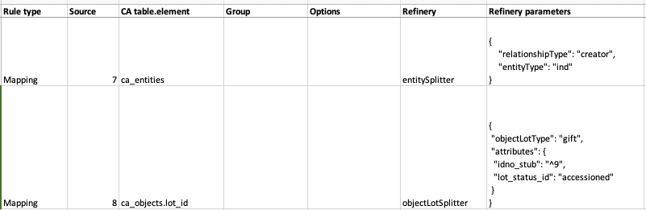

Splitters
=========
.. contents::
   :local:


Import Mapping
--------------

See below for examples of splitters in an import mapping:



CA table.element
`````````````````
Enter the splitter in the Refinery column of the import mapping. Enter the CollectiveAccess table as shown in the chart below.

===============================  ====================================
CA table.element                 Refinery                                                       
===============================  ====================================
ca_collections                   collectionSplitter               
ca_entities                      entitySplitter
ca_list_items                    listItemSplitter
ca_loans                         loanSplitter
NO TABLE                         measurementsSplitter
ca_movements                     movementSplitter
ca_places                        placeSplitter
ca_objects                       objectSplitter                   
ca_objects.lot_id                objectLotsSplitter               
ca_ocurrences                    occurrenceSplitter
ca_tour_stops                    tourStopSplitter
ca_storage_locations             storageLocationSplitter
===============================  ====================================

Refinery Options
----------------
Splitter refineries can either create records or match data to existing records (following a mapping’s existingRecordPolicy) or break a single string of source data into several metadata elements in CollectiveAccess. Splitters for relationships are used when several parameters are required, such as setting a record type and setting a relationship type. Using the entitySplitter, a name in a single location (i.e. column) in a data source can be parsed (into first, middle, last, prefix, suffix, et al.) within the new record. Similarly the measurementSplitter breaks up, for example, a list of dimensions into to a CollectiveAccess container of sub-elements. “Splitter” also implies that multiple data elements, delimited in a single location, can be “split” into unique records related to the imported record. Refinery options are listed below.


attributes
```````````
      Sets or maps metadata for the entity record by referencing the metadataElement code and the location in the data source where the data values can be found

      See below for additonal attribute settings for the entitySplitter and objectRepresentationSplitter

      **Example**

      .. code-block:: none

         {"attributes": {
            "address": {
               "address1": "^24",
               "address2": "^25",
               "city": "^26",
               "stateprovince": "^27",
               "postalcode": "^28",
               "country": "^29"
            }
          }
		 }
    
Additional Properties - Auto-generated idnos
''''''''''''''''''''''''''''''''''''''''''''

      To map source data to idnos, see the 'attributes' parameter above. An exception exists for when idnos are set to be auto-generated. To create auto-generated idnos within any splitters where it’s relevant (i.e measurementSplitter doesn’t support this), use the following syntax.

      ``"attributes": {"idno":"%"}``

      
objectRepresentationSplitter Additional Properties
''''''''''''''''''''''''''''''''''''''''''''''''''

      Sets the attributes for the object representation. "Media" sets the source of the media filename in the data, which is what will match on the actual media file in the import directory. Note: filenames in source data may or may not the include file extension, but source data must match filename exactly. Set the media filename to idno, using "idno". Additional attributes, such as the example, "internal_notes", can also be set here.

      .. code-block:: none

         {"attributes":{
            "media": "^1",
            "internal_notes": "^2",
            "idno": "^1"
         }
         }

      *Applicable refineries*: collectionSplitter, entitySplitter, listItemSplitter, loanSplitter, measurementsSplitter, movementSplitter, placeSplitter, objectSplitter, objectLotsSplitter, occurrenceSplitter, tourStopSplitter

Type
`````
      Accepts a constant list item idno from the list (collection_types, object_types, entity_types, list_item_types, loan_types) or a reference to the location in the data source where the type can be found

===============================  ====================================
Splitter                         Type                                  
===============================  ====================================
collectionSplitter               collectionType
entitySplitter                   entityType
listItemSplitter                 listItemType
loanSplitter                     loanType
measurementsSplitter             
movementSplitter                
placeSplitter                    
objectSplitter                   
objectLotsSplitter               
occurrenceSplitter               
tourStopSplitter                
storageLocationSplitter          
===============================  ====================================


      *Applicable Refineries*: collectionSplitter, entitySplitter, listItemSplitter, loanSplitter

TypeDefault
```````````
 Sets the default type that will be used if none are defined or if the data source values do not match any values in the CollectiveAccess list types (collection_types, object_types, entity_types, list_item_types, loan_types).

===============================  ====================================
Splitter                         TypeDefault                                  
===============================  ====================================
collectionSplitter               collectionTypeDefault
entitySplitter                   entityTypeDefault
listItemSplitter                 listItemTypeDefault
loanSplitter                     loanTypeDefault
measurementsSplitter             
movementSplitter                
placeSplitter                    
objectSplitter                   
objectLotsSplitter               
occurrenceSplitter               
tourStopSplitter                
storageLocationSplitter          
===============================  ====================================
      


      *Applicable Refineries*: collectionSplitter, entitySplitter, loanSplitter, listItemSplitter

delimiter
`````````
      Sets the value of the delimiter to break on, separating data source values

      ``{"delimiter": ";"}``

      *Applicable Refineries*: collection Splitter, entitySplitter, listItemSplitter, loanSplitter, measurementsSplitter, movementSplitter, placeSplitter, objectSplitter, objectLotSplitter, objectRepresentationSplitter, occurrenceSplitter, tourStopSplitter

displayNameFormat
`````````````````
      Allows you to format the output of the displayName. Options are: “surnameCommaForename” (forces display name to be surname, forename); “forenameCommaSurname” (forces display name to be forename, surname); “forenameSurname” (forces display name to be forename surname); “original” (is the same as leaving it blank; you just get display name set to the imported text). This option also supports an arbitrary format by using the sub-element codes in a template, i.e. “^surname, ^forename ^middlename”. Doesn't support full format templating with <unit> and <ifdef> tags, though.

      ``{"displaynameFormat": "surnameCommaForename"}``

   	  *Applicable Refineries*: entitySplitter

dontCreate
```````````

      If set to true (or any non-zero value) the splitter will only do matching and will not create new records when matches are not found.

      ``{"dontCreate": "1"}``

      *Applicable Refineries*: collectionSplitter, entitySplitter, listItemSplitter, loanSplitter, movementSplitter, objectLotsSplitter, objectRepresentationSplitter, objectSplitter, occurrenceSplitter, placeSplitter, tourStopSplitter

elements
`````````
      Maps the components of the dimensions to specific metadata elements

      .. code-block:: none

         {"elements": [
            {
               "quantityElement": "measurementWidth",
               "typeElement": "measurementsType",
               "type": "width"
            },
            {
               "quantityElement": "measurementHeight",
               "typeElement": "measurementsType2",
               "type": "height"
            }
         ]}

      Note: the typeElement and type sub-components are optional and should only be used in measurement containers that include a type drop-down.

      *Applicable Refineries*: measurementsSplitter


      

ignoreParent
`````````````
      For use with collection hierarchies. When set to true this parameter allows global match across the entire hierarchy, regardless of parent_id. Use this parameter with datasets that include values to be merged into existing hierarchies but that do not include parent information. Paired with matchOn it's possible to merge the values using only name or idno, without any need for hierarchy info. Not ideal for situations where multiple matches can not be disambiguated with the information available.

      ``{"ignoreParent": "1"}``

      *Applicable Refineries*: collectionSplitter, entitySplitter, listItemSplitter, loanSplitter, movementSplitter, objectLotsSplitter, objectSplitter, occurrenceSplitter, placeSplitter, tourStopSplitter

interstitial
`````````````
      Sets or maps metadata for the interstitial movementRelationship record by referencing the metadataElement code and the location in the data source where the data values can be found.

      .. code-block:: none

         {
            "interstitial": {
               "relationshipDate": "^4"
            }
         }

      *Applicable Refineries*: collectionSplitter, entitySplitter, listItemSplitter, loanSplitter, movementSplitter, objectLotsSplitter, objectSplitter, occurrenceSplitter, placeSplitter, tourStopSplitter

list
`````
      Enter the list_code for the list that the item should be added to. This is mandatory - if you forget to set it or set it to a list_code that doesn't exist the mapping will fail.)

      ``{"list": "list_code"}``

      *Applicable Refineries*: listItemSplitter


matchOn
`````````
      From version 1.5. Defines exactly how the splitter will establish matches with pre-existing records. You can set the splitter to match on idno, or labels. You can also include both labels and idno in the matchOn parameter, and it will try multiple matches in the order specified.

      "``{""matchOn"": [""labels"", ""idno""]}`` -Will try to match on labels first, then idno.

      ``{""matchOn"": [""idno"", ""labels""]}`` - Will do the opposite, first idno and then labels.

      You can also limit matching by doing one or the other. Eg:
      
      {""matchOn"": ""idno""]} will only match on idno.
      
      {""matchOn"": [""^ca_collections.your_custom_code""]} will match on a custom metadata element in the collection record. Use the syntax ^ca_collections.metadataElement code."
