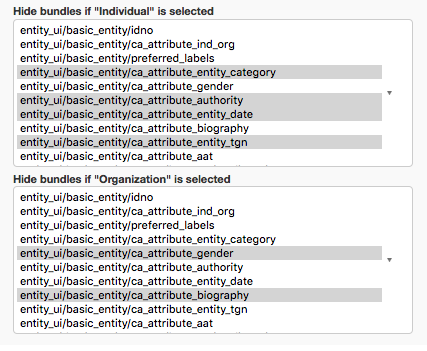

Dependent Field Visibility
==========================

Available from CollectiveAccess Version 1.6, Dependent field visibility is a feature that allows for the hiding of certain Bundles from user interface screens, based on values selected for List metadata elements. Dependent field visibility is disabled by default. 

To enable, set the following in **app.conf**:

.. code-block::

   enable_dependent_field_visibility = 1

Once enabled, a few new settings become available for List metadata elements with render type "Drop-down list" or "Radio buttons.” Note that this will not work with any of the other render modes. 

A new config setting will appear on the metadata element configuration screen for each item in the list. These settings allow you to select the bundle placements to hide when this list item is chosen:

.. note:: Remember to hold the **Cmd/Ctrl key** when selecting multiple items in these lists.

The bundle placements are organized by user interface and by screen. Every user interface that applies to any of the tables for that metadata element will show up.

Navigate to a screen that has the List metadata element, and select one of the items. The system will hide all the items configured on-the-fly in the browser.

.. note:: Existing metadata in the hidden fields/bundles is not lost; the fields are just hidden from the user interface.

Configuration in Profiles
-------------------------

To set up dependent field visibility at installation time (in the installation profile), have the **app.conf** setting enabled (see above). Then, add settings to List metadata elements as follows:

.. code-block::

     <metadataElement code="image_format" datatype="List" list="image_format">
      <labels>
        ...
      </labels>
      <settings>
        <setting name="hideIfSelected_image_gif">standard_object_ui/format/ca_attribute_formatNotes</setting>
        <setting name="hideIfSelected_image_gif">standard_object_ui/format/ca_attribute_dimensions</setting>
      </settings>
      <typeRestrictions>
        ...
      </typeRestrictions>
    </metadataElement>

The setting name is **hideIfSelected_<idno_of_list_item>**. Replace **idno_of_list_item** with the idno of the list item that should trigger the hide action. In the example above, that's **image_gif**. The value of the setting consists of three parts, delimited by a slash:

.. code-block::

   code of the editor UI / idno of the screen / placement code

Since neither screen idnos nor placement codes are enforced to be unique globally, the full combination is needed to identify a particular bundle placement on a specific screen in any given user interface. 

