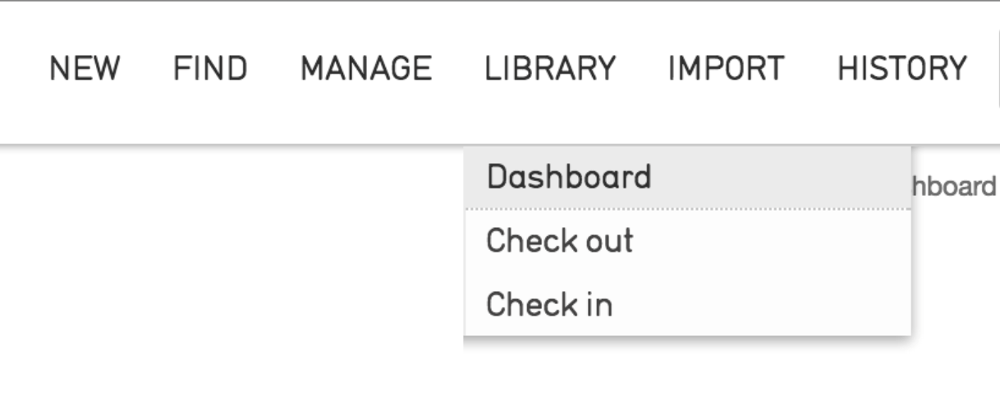
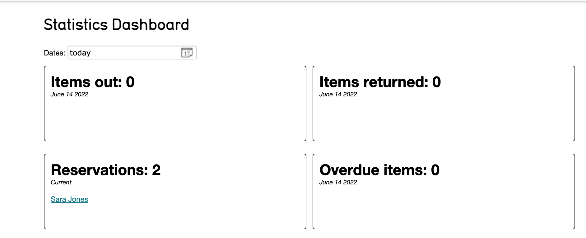
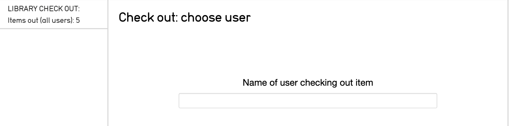

Library Circulation
===================

As of Collective Access Version 1.5, an optional Library Circulation module is included that supports a simple check in and check out workflow.

Set Up and Use
--------------

The module is enabled by setting directives in */app/conf/app.conf* and */app/conf/library_services.conf*.

In */app/conf/app.conf*:

.. code-block::

   #
   # Library-style check-out of objects
   #
   enable_library_services = 1
   enable_object_checkout = 1

And in */app/conf/library_services.conf*:

.. code-block::

   checkout_types = {
	your_object_type_here = {
		default_checkout_period = +7 days,
		allow_override_of_due_dates = 1
	}
   }

The main interface for the library circulation module is the Dashboard in Providence, which provides an overview of circulation activity. The Dashboard also includes a search box so that activity can be rendered for specific days or date ranges.

Once "checkout_types" is set with a valid code from the system list object_types, the Library menu and dashboard will become visible:

Check in and Check out
----------------------

Selecting Dashboard from the Library drop-down displays the following screen, where items for check in and check out are tracked: 

To check out an item to a user, navigate to **Library > Check out**. Follow the on screen prompts, which begin with selecting the user:

.. note:: A user account must be set up under **Manage > Access control > User logins** for materials to be checked out to that account. 

To select items to be checked out, enter a value under the "Item name or number to check out" prompt, and then wait for a drop-down menu to appear. From this menu, you may optionally override the default due date and/or include check out notes.
Check in is simply the reverse of this process.

To place a hold on an item, follow the process of checking out the desired item to the requester. A hold will be created automatically if the item being checked out is already checked out to another account.

Restricting Checkout
--------------------

Individual items can be prevented from being checked out entirely by defining a circulation status list in the system configuration, and restricting items available for checkout to certain circulation statuses. To restrict checkout: 

1. Create a list with the code "object_circulation_statuses" Typical statuses would be "Available", "In-house use only" and "Unavailable".
2. Use the "Circulation Status" bundle (code "ca_object_circulation_status") to set the status for each object. The bundle will also display info on the current circulation state if the item is checked out or reserved.
3. To restrict checkout to certain statuses, "restrict_to_circulation_statuses" in library_services.conf to a non-empty list:

.. code-block::
   restrict_to_circulation_statuses = [available, in_library]

With that configuration set, only those items that are set to "Available" or "In-Library use only" are available for checkout. Unavailable items don't show up in the checkin/checkout autocomplete search. Note that this is a list of list item idnos referring to items in the "object_circulation_statuses" list.

User Interface Tools
--------------------

Several user interface bundles allow cataloguers to manage the circulation of items.

The object checkouts bundle (ca_object_checkouts) shows an item's status as well as the circulation history for that object:

An optional bundle called Circulation Status (ca_objects_circulation_status) can be used to set whether or not an item can be checked out. For more info on how that works, see the Restricting checkout section above.

Browse Tools
------------

There are several browse facets that can be configured to output circulation data in the form of search results.
The "all" facet shows types of checkout categories (available, out, reserved, overdue) and returns objects currently carrying the state of that category. When used with an optional status setting, it can also limit to a specific type of checkout class. This can be useful for quickly browsing on all overdue items.

.. code-block::

   checkouts_all = {
			type = checkouts,
			restrict_to_types = [],
			
			# one of: user, all
			# all = show types of checkouts in facet 
			mode = all,

			# one of: available, out, reserved, overdue
			# Limits facet to a specific type of checkout 
			# status = reserved,
			
			group_mode = none,
			
			label_singular = _("checkout"),
			label_plural = _("checkouts")
		},

The "user" status allows for browsing on a specific user's account. The facet will return all users who have activity matching the criteria set in the status setting.

.. code-block::
   checkouts_user = {
			type = checkouts,
			restrict_to_types = [],
			
			# one of: user, all
			# user = show checkouts by user
			mode = user,
			
			# one of: available, out, reserved, overdue
			# Limits facet to a specific type of checkout 
			# status = overdue,
			
			group_mode = none,
			
			label_singular = _("checkout by user"),
			label_plural = _("checkouts by user")
		}

Display Tools
-------------

To include circulation data in a report, simply use the bundle "Related object checkouts" (ca_objects_checkouts) within a display. The bundle will not output any data until you include a display template. 

The hard coded values used to output circulation data points in templates can be found below.

For Users (ca_users)
--------------------

.. csv-table:: 
   :header-rows: 1
   :file: lib_circ_table1.csv

For Checkouts (ca_object_checkouts)
-----------------------------------

.. csv-table:: 
   :header-rows: 1
   :file: lib_circ_table2.csv

