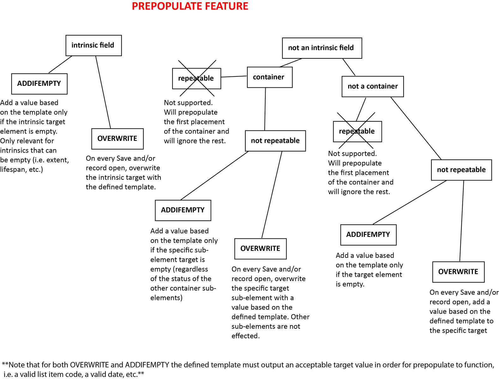

Prepopulate
===========

* `Setup`_ 
* `Prepopulate Rule Settings`_ 
* `Flowchart`_ 

As of Collective Access version 1.5, **prepopulate** automatically prepopulates fields in CollectiveAccess records based on `Display Templates <file:///Users/charlotteposever/Documents/ca_manual/providence/user/reporting/templates.html>`_ and `Expressions <file:///Users/charlotteposever/Documents/ca_manual/providence/user/reporting/expressions.html>`_.

Setup
-----

The core configuration is done in *app/conf/prepopulate.conf*. There are two settings that control when the prepopulate rules kick in: 

1. On record save, **prepopulate_fields_on_save**
2. Each time an editor is opened, **prepopulate_fields_on_edit** 

.. note:: Both settings are turned off by default. Set one or both of these settings to 1 to enable the feature.

The main part of the configuration is a list of rules under **prepopulate_rules**. Each rule should have a unique code, e.g. **test_rule**, in the example block below:

.. code-block:: php

   prepopulate_rules = {
	# -------------------
	test_rule = {
		# what types of records does this rule apply to?
		table = ca_objects,
		#restrictToTypes = [artwork],

		# mode determines handling of existing values in target element
		# can be overwrite, or addIfEmpty
		# See the 'target' setting below and http://docs.collectiveaccess.org/wiki/Prepopulate
		mode = addIfEmpty,

		# What's the prepopulate target?
		# This can be an intrinsic field, labels or an attribute.
		#
		# Note that if you want to target a List attribute, you have to
		# provide a valid list item idno or id for that list as value!
		#
		# See http://docs.collectiveaccess.org/wiki/Prepopulate
		target = ca_objects.title_notes,

		# skip this rule if expression returns true
		# available variable names are bundle names
		#skipIfExpression = ^ca_objects.idno =~ /test/,

		# content to prepopulate
		# (this is a display template evaluated against the current record)
		template = ^ca_objects.preferred_labels (^ca_objects.idno),
	},
	# -------------------
   }

Prepopulate Rule Settings
-------------------------

.. csv-table:: 
   :header-rows: 1
   :file: prepopulate_table1.csv

An example use of "context" configuration:

.. code-block:: php

   related_entities = {
    table = ca_objects,

    # add relationships that do not already exist
    mode = merge,       

    # copy all entities related to objects related to the target record
    target = ca_entities,
    context = related,      
    
    # copy only those entities related with the relationship type "artist"
    restrictToRelationshipTypes = [artist],
    
    # don't copy relationships with specified relationship type codes; 
    #excludeRelationshipTypes = [], 
    
    # copy only entities that are the type "individual"
    restrictToRelatedTypes = [ind],
    
    # don't copy relationships pointing to specified types   
    #excludeRelatedTypes = [],  
    
    # only consider "current" relationships – Eg. current storage location
    currentOnly = 0,    
   },

Flowchart
---------

   
