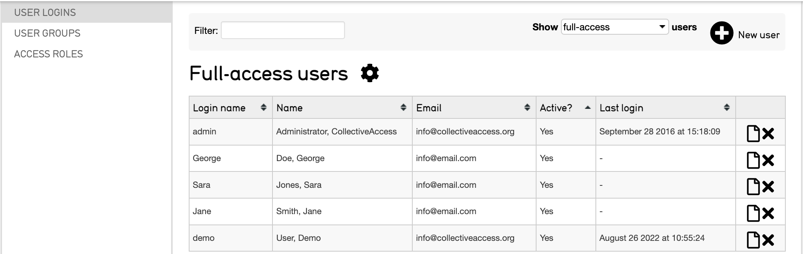
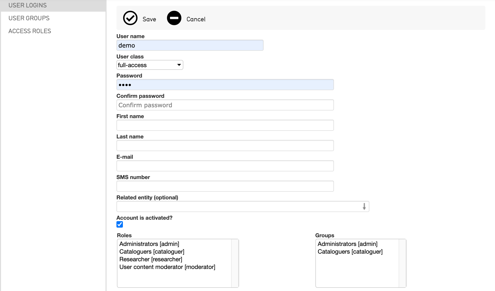
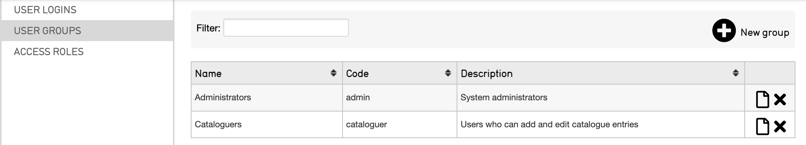
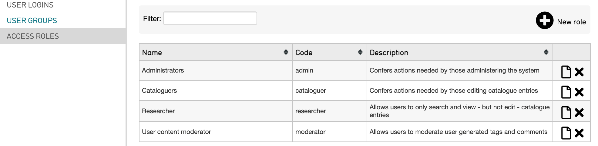
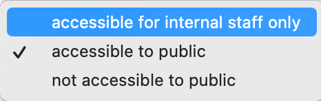

Access Control Settings
=======================

* `Managing Access Control`_ 
* `User Logins`_ 
* `Adding a New User`_
* `User Groups`_ 
* `Access Roles`_ 
* `Record-Level Access`_ 
* `Public Access Settings`_ 

CollectiveAccess employs access control tools to ensure the safety of data and to manage workflow. 

Management of settings for access control are purposefully only available to administrators. Administrators can create logins, determine which users have access to various parts of the site, and assign specific roles to users, such as “cataloguer” or “researcher.” These settings can all be managed in the user interface. 

Managing Access Control
-----------------------

To manage access control settings:

1. Navigate to **Manage > Access Control**, where options for User Logins, User Groups, and Access Roles will be displayed to the far left of the screen: 

   Users in a CollectiveAccess system.

User Logins
-----------

**User Logins** are the first access control setting that can be configured. There are 6 columns displaying user access login names, first and last names, emails, activity, last login information, and a column to edit or delete each user. 

To define settings and other information pertaining to an individual user, select the **page icon** |page| to the right of any user's last login.

To filter users that are displayed, select the **Show users** drop down menu to the left of the plus icon. This menu displays three options: 

* **Full-access**: users have the ability to work both in the front and back end of the system

* **Public-access**: users have front-end access only 

* **Deleted**: an option to be used only in the case of a former user whose user logs you may want to see

Adding a New User 
-----------------

To add a new user, select the **plus icon** next to **New user**. |plus|

A screen will display where you can add information about the new user, set passwords and login names, and provide other information about the user. 

User Groups
-----------

**User Groups** display what groups of users are available within any given system. Similarly to how individual users can be managed, user groups can be added and edited from this screen. 

To edit a group, select the **page icon**. |page|

To add a new group of users, select the **plus icon**. |plus|

Groups lump various users together for the purpose of sharing forms, sets, and displays. A login does not necessarily have to be associated with a single group; however, to share specific information within a certain group of users, a group must be created and populated with those users. 

Access Roles
------------

**Access Roles** are very useful, as they enable certain fields to be visible or hidden from particular users (for example, sensitive fields). Further, users can see particular fields but not have permissions to change data within those fields. There are two key components to access roles: 

1. **Actions**, which defines various types of system privileges for each user
2. **Metadata Access**, which defines whether a user has “no access”, “read-only access” or “read/edit access” on a per-field basis

Access Roles can prevent certain users from deleting records, changing preferences, or using certain plug-ins. Within a CollectiveAccess system the number of Access Roles is unlimited, and users can be assigned as many roles as are appropriate. 

.. note:: To find details about the purposes of the fields in Access Roles as you create or edit these preferences, hover your mouse over a field to get a definition. This holds true for actions throughout the database.

The Access Roles screen contains the name, unique code, and description of the roles available within a given system: 

To edit a role currently listed, and view the permissions set to a given role, select the **page icon.**  To add a new role, select the **plus icon** where information about the new role will be defined. 

.. note:: When a new user account is created from Pawtucket (front-end), the new user is by default given only actions listed under "Pawtucket Actions." These are: Can Download Media, Can Share Objects via Email, Can Share Objects via Facebook, and Can Initiate Replication of Object Media to External Repositories. 

**Record-Level Access**
-----------------------
Access settings can also be controlled on a record-by-record basis. Within a record’s editor screen: 

1. Navigate to **Administrative Metadata** within the record's editor screen. 
2. Navigate to the **Public Access** field. 
3. Choose the options for this record from the drop-down menu. These include: Accessible for internal staff only, Accessible to public, and Not accessible to public. 

These record-level access definitions only apply to the back-end of the database. In other words, they will only restrict, or grant, access to users who are working within the database. To apply restrictions to public access, use a drop-down on the Basic Info page of a record.

Public Access Settings
----------------------

This will limit what visitors to a public website can view, but it won’t affect access within the back-end.

