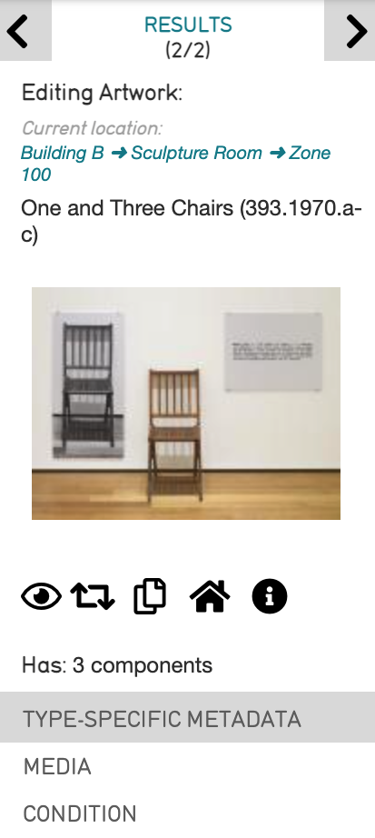
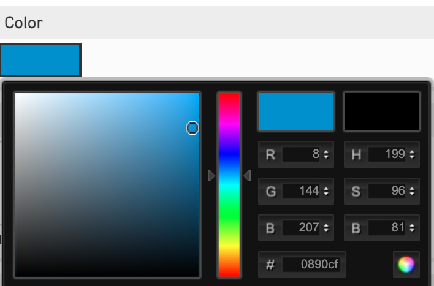
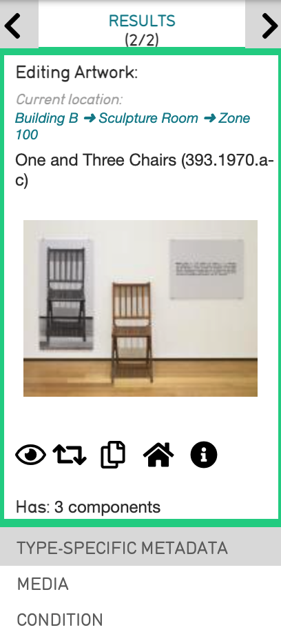
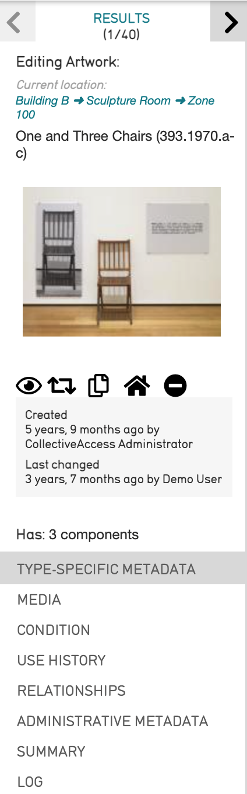

**Color Coding the Inspector**
==============================

* `Customizing the Editor Inspector`_ 
* `Customizing Screens within the Editor`_ 
* `Customizing the Inspector for Record Subtypes`_ 
* `Inspector Window Features`_ 

CollectiveAccess supports the customization of both the look and feel of any cataloging interface. Assigning custom colors and icons to the Inspector window of any record type or record subtype can streamline workflow, as well as ensure clear differentiation and generate easy-to-identify parts of any Editor screen. 

   
   A record's Inspector window. 

Unique colors can be assigned for the main Editors for record types which will extend to all subtypes in the system. Colors can also be assigned to the individual subtypes. If no custom color is assigned, the default color will automatically be assigned. 

These changes can be made directly in the user interface of any CollectiveAccess system. 

**Customizing the Editor Inspector**
------------------------------------

Editor screen colors can be customized through the user interface. To customize the Inspector window in an editor screen: 

1. Navigate to **Manage > Administration** in the Global Navigation bar. This opens the list of available editor screens: 

.. image:: colorcoding1.png
   :scale: 50%
   :align: center

2. Open the Editor you wish to customize by selecting the **page icon** |page| on the far right of each available editor screen. 

3. Select the **Color** field. Select the Color box to open the color-picker tool, and use the arrows to choose the color. 

4. Select any part of the screen to close the color picker tool.

5. Select Save to save the changes made to the Editor. 

6. Navigate to the record's inspector that was updated to view the new color. 

   A record's Inspector window with a custom color.

Customizing Screens within the Editor
-------------------------------------

Individual Screens within a record’s Editor can also be customized. To do so: 

1. Navigate to **Manage > Administration** in the Global Navigation bar. This opens the list of available editor screens. 
2. Open the Editor by selecting the same **page icon** |page|. The list of available screens which can be edited is displayed. 

3. Scroll down to the **Screens** field. Select the screen to be edited by selecting the same **page icon** |page| on the far right. 

4. Scroll to the **Color** field. Select the Color box to open the color-picker tool, and use the arrows to choose the color. 
5. Select any part of the screen to close the color-picker tool. 
6. Save the changes made to the Inspector.
7. Navigate to the Editor screen in the record that was updated to view the new color. 

Customizing the Inspector for Record Subtypes
---------------------------------------------

.. warning:: is this in current ui?

Customizing the Inspector for record subtypes allows for further differentiation between these subtypes. Although Subtypes are configurable and are therefore different for every CollectiveAccess installation, a general, hypothetical example is the Object subtype **Paintings**.

To customize the Inspector for the subtype **Paintings**: 

1. Navigate to **Manage > Lists & Vocabularies** in the Global Navigation bar. This opens the List Hierarchy viewer. 
2. Find the subtype list to use, and select the gray arrow **>** to open the List Item editor (for the example, **Object Types > Paintings** in the List Hierarchy viewer).
3. Scroll down to the **Color** field. Select the color-picker tool, and choose a color.
4. Scroll down to the  **Icon** field. 
5. Save the changes made to the Inspector. After saving the Editor, the icon will appear next to this field.

Inspector Window Features
-------------------------

   The Inspector Window of a record in the CollectiveAccess Demonstration system. Note the icons below the record's image. 

In addition to configuring the Inspector Window, the Window itself also contains five icons from which various features are enabled: 

* |eye| Watch/Unwatch this Record. Selects Watched Items which appear in Manage/My Watched Items. To use a shortcut to view specific records, select the Eye icon, which then turns red.  

* |arrows| Change Record Type. Changes the record type, and discards any unnecessary metadata elements for the new type. This cannot be undone. 

* |page| Duplicate this Record. Duplicates the record, with controls that specify what exactly to duplicate. 

* |house| Set Home Location. Specifies a home location for the record, where the record is usually kept. 

* |show| See More Information About this Record. Collapses or expands the information relating to the record’s edit history, visible in the Inspector panel. 

