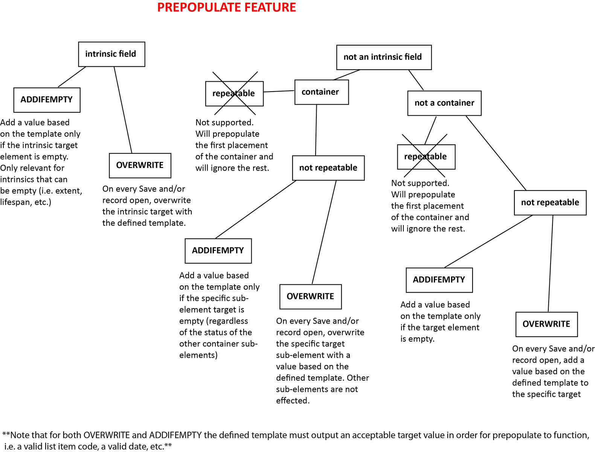

.. _prepopulate_config:

Prepopulate.conf
================

The Prepopulate plugin provides a system for automatically setting data in records during editing using :ref:`display templates <reporting/templates:Display Template Syntax>` and :ref:`expressions`. Common use cases include:

* Replicating data between parent and child records in hierarchies or related records.
* Generating formatted text values using several metadata values and, potentially, context-specific logic. (Formatting various field values into a bibliographic citation, for example)
* Forcing one or more fields to default values based upon the value of another field.

Prepopulate applies configured rules to records as they are edited. Rule typically define a ``target`` to set a value for and a :ref:`display template <reporting/templates:Display Template Syntax>` with which to generate the value. Templates are evaluated relative to the record being edited so all values accessible with respect to that record, including related records and parent and child records in hierarchies are available to the template.  Rules may be constrained to apply to specific tables and, optionally, record types. Application of rules can be made contingent upon evaluation of an :doc:`../../reference/expressions` (which can also reference all  values accessible to the edited record) or the current status of the target metadata element.

It is also possible to configure rules that replicate relationships between records. As of version 1.8, Prepopulate may be configured to replicate between records container metadata elements in whole or in part.

Basic Setup
-----------

All configuration is made in the ``prepopulate.conf`` configuration file. The ``enabled`` directive governs whether Prepopulate is active or not. It must be set to a non-zero value for any Prepopulate-based actions to occur. Two other directives control which user actions trigger application of configured rules when Prepopulate is enabled:

* ``prepopulate_fields_on_edit`` will cause rules to be applied whenever a record is opened in the editor.
* ``prepopulate_fields_on_save`` will trigger application of rules whenever a record is saved.

For rules to be applied ``enabled`` and at least one of ``prepopulate_fields_on_edit`` and ``prepopulate_fields_on_save`` must be set.

The ``prepopulate_rules`` directive contains a dictionary of rules to apply. Each key is a unique alphanumeric identifier for a rule. The precise value is not critical, but it must be unique and should be meaningful. Corresponding values are dictionaries with keys and values defining rule behavior. 

An example ``prepopulate_rules`` dictionary with a single rule with code ``test_rule`` is shown below:

.. code-block:: none

   prepopulate_rules = {
      # -------------------
      test_rule = {
         # what types of records does this rule apply to?
         table = ca_objects,
         restrictToTypes = [artwork],

         # mode determines handling of existing values in target element
         # can be overwrite, or addIfEmpty
         # See the 'target' setting below 
         mode = addIfEmpty,

         # What's the prepopulate target?
         # This can be an intrinsic field, labels or an attribute.
         #
         # Note that if you want to target a List attribute, you have to
         # provide a valid list item idno or id for that list as value!
         #
         target = ca_objects.title_notes,

         # skip this rule if expression returns true
         # available variable names are bundle names
         skipIfExpression = ^ca_objects.idno =~ /test/,

         # content to prepopulate
         # (this is a display template evaluated against the current record)
         template = ^ca_objects.preferred_labels (^ca_objects.idno),
      }
	  # -------------------
   }
   
This rule applies to object records (see the ``table`` setting) of type "artwork" (see ``restrictToTypes``). When evaluated, it will fill the "title_notes" field (see ``target``) with the object record's preferred label and identifier, formatted with the identifier in parens (see ``template``). The rule will be skipped if the object identifier contains the word "test" (see ``skipIfExpression``) or of there is already a value in the "title_notes" field for the object (see ``mode``).

Replicating relationships and containers
----------------------------------------

Most rules generate a text value using ``template`` and copy it to the ``target``, subject to optional restrictions (``mode``, ``skipIfExpression``, ``restrictToTypes``, etc). It is also possible to replicate relationships in Prepopulate using the ``context`` directive. In this case, ``target`` is the type of relationship to replicate and ``context`` defines the source of the relationship. Possible contexts are "related", "parent" or "children". 

An example configuration for replicating relationships using ``context`` follows:

.. code-block:: none

   related_entities = {
      table = ca_objects,

      # add relationships that do not already exist
      mode = merge,

      # copy all entities related to objects related to the target record
      target = ca_entities,
      context = related,

      # copy only those entities related with the relationship type "artist"
      restrictToRelationshipTypes = [artist],

      # don't copy relationships with specified relationship type codes;
      #excludeRelationshipTypes = [],

      # copy only entities that are the type "individual"
      restrictToRelatedTypes = [individual],

      # don't copy relationships pointing to specified types
      #excludeRelatedTypes = [],

      # only consider "current" relationships – Eg. current storage location
      currentOnly = 0,
   }
   
The example above copies all entity relationships to entities of type "individual" on objects *related* to the currently edited object. If the context had been set to "parent" entity relationships on the parent object would have been copied to the currently edited object.

Individual values in a container metadata element can be copied using the standard ``template``/``target`` rules described earlier. To copy an entire container between records without requiring a separate rule for each sub-element use the ``source`` directive to specify the container you wish to copy to the ``target``. Prepopulate will assume the ``source`` and ``target`` containers have identical structure. To map values between different structures use the ``sourceMap`` directive to create a conversion table mapping equivalent sub-elements in each container. 

An example configuration for replicating container values in their entirety from a parent record to a child record using ``source`` and ``sourceMap`` is below:

.. code-block:: none

	dimensions_container_rule = {
			table = ca_objects,
			restrictToTypes = [edition_item],
			
			mode = addIfEmpty,

			target = ca_objects.edition_dimensions,

			# skip this rule if expression returns true
			# available variable names are bundle names
			#skipIfExpression = ^ca_objects.idno =~ /test/,

			# for prepopulation of full containers where the container has the same 
			# format in both the source and target you can copy it directly by specifying
			# a "source" specification. Sub-element codes must match exactly for this to work.
			source = ca_objects.parent.edition_dimensions,
	
			# If sub-element codes don't match exactly you can specify a mapping where source
			# keys are on the left and target keys on the right. This also enables partial copy
			# of containers, as when sourceMap is specified only those keys defined in the map are copied
			sourceMap = {
				edition_display_dimensions = edition_display_dimensions,
				edition_dimensions_height = edition_dimensions_height,
				edition_dimensions_width = edition_dimensions_width,
				edition_dimension_types = edition_dimension_types,
				edition_dimensions_notes = edition_dimensions_notes
			}
		}

Settings
--------

The following settings are available when configuring Prepopulate rules:

.. csv-table::
   :widths: auto
   :header-rows: 1
   :file: prepop.csv

Flowchart
---------

Typical Prepopulate processes are diagrammed below. Note that the mode "overwriteifset" (which is not shown in the diagram) is identical to "overwrite," save that no overwrite is performed for empty values.

