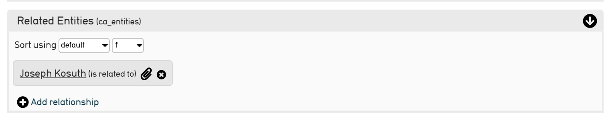
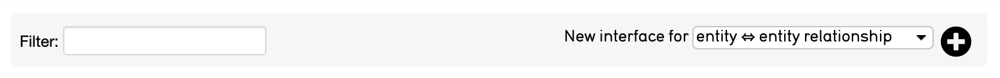
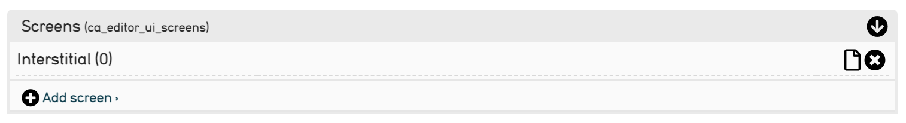
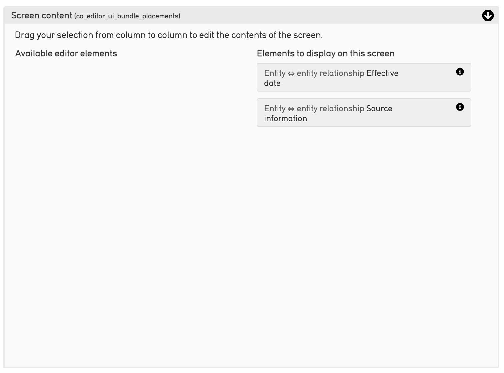
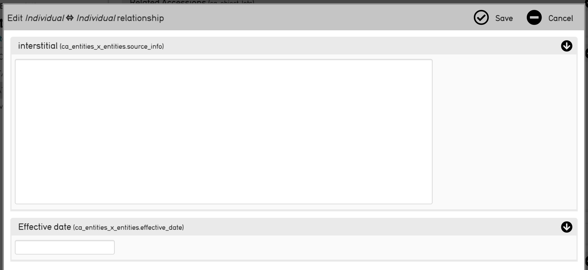
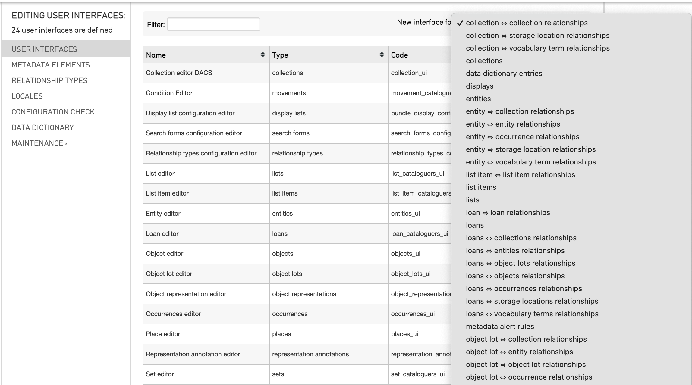
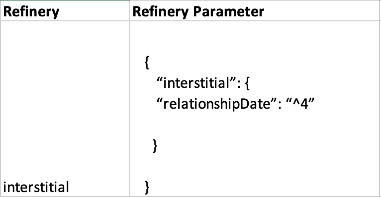

.. _dataModelling_interstitial:

Interstitial Data
=================

.. contents::
   :local:
   
As of version 1.4, CollectiveAccess supports relationship records also known as **interstitial** records. This feature allows cataloguers to describe a relationship beyond simply selecting a relationship type; additional metadata can be added that is relevant to the relationship, but does not affect the relationship permanently. 

The term interstitial refers to a small screen that is attached to a relationship of any kind in CollectiveAccess where additional information specifically pertaining to that relationship can be stored. This screen represents the "small space" between any relationship where relevant data can be added. 

Interstitial data is represented in CollectiveAccess by a paperclip icon |paperclip| that appears next to a given relationship.

When is Interstitial Data Used? 
-------------------------------

Not every relationship in CollectiveAccess needs an interstitial feature. However, this function works well for relationships that change over time, or are impermanent. For example, two entities were married for a period of time, and then got divorced. With an interstitial relationship enabled, the relationship record can now add a date range, narrative text and/or other metadata elements of your choosing to the interstice between these two individuals, specifying the dates of the relationship, and any other necessary metadata. Any two records can carry this interstitial description, so long as metadata and a user interface has been created (see below). 

Interstitial data also works well for an object located in a particular storage location or exhibit location for a certain period of time, that had a defined beginning and end. The object is no longer located there, but the time it spent there is important to the object’s history and should be included in the record. With an interstitial relationship enabled, the relationship record can now add a date range  to the interstice between these two records, specifying the dates of the relationship, and any other necessary metadata. 

Other common examples of relationships that could require interstitial metadata include objects to entities; entities to places, and so on. 

Note that Relationship records are entirely optional, and in fact won't be accessible unless a user interface is defined for the them. 
 
Setting up relationship records in the installation profile
-----------------------------------------------------------

To create a metadata element with an interstitial type restriction in the profile requires adopting some of the syntax used for **relationshipTable** names. Here's how you would add the date range on an entity to entity relationship record:

   ::

      <metadataElement code="relationshipDate" datatype="DateRange">
            <labels>
              <label locale="en_US">
                <name>Relationship date</name>
                <description/>
              </label>
            </labels>
           <settings/>
            <typeRestrictions>
              <restriction code="r1">
                <table>ca_entities_x_entities</table>
                <settings>
                  <setting name="minAttributesPerRow">1</setting>
                  <setting name="maxAttributesPerRow">1</setting>
                  <setting name="minimumAttributeBundlesToDisplay">1</setting>
                </settings>
              </restriction>
            </typeRestrictions>
          </metadataElement>
          
After you've defined the metadata elements for your relationship record, you need to create the user interface. This follows the same syntax as the user interfaces for the main tables, except that the user interface "type" is the same string used in the typeRestriction "table" above:

   ::

      <userInterface code="interstitial_entity_ui" type="ca_entities_x_entities">
            <labels>
              <label locale="en_US">
                <name>Interstitial Entity Editor</name>
              </label>
            </labels>
            <screens>
              <screen idno="basic" default="1">
                <labels>
                  <label locale="en_US">
                    <name>Basic info</name>
                  </label>
                </labels>
                <bundlePlacements>
                  <placement code="ca_attribute_relationshipDate">
                    <bundle>ca_attribute_relationshipDate</bundle>
                  </placement>
                </bundlePlacements>
              </screen>
            </screens>
          </userInterface>
          
Note that these interstitial records are meant to be small and manageable, so only one screen per user interface is supported. If other screens are defined, they simply won't appear.

Setting up Interstitial Relationship Records through the User Interface
-----------------------------------------------------------------------

Setting up a relationship record through the user interface is essentially just like creating a user interface for any other type of record (see `User Interface Administration <file:///Users/charlotteposever/Documents/ca_manual/providence/user/editing/interfaces.html#user-interface-administration>`_). It follows the same steps wherein a metadata element is created, and then added to the user interface.

The key difference is what **Type restrictions** are chosen for the elements, and what **type** is used to create the user interface.

Navigate to **Manage > Administration > User Interfaces**, where user interfaces can be added and edited. 

At the top of the screen, there is an option to add a new user interface for any type of table or relationship in CollectiveAccess. To add an interstitial user interface for an entity-entity relationship, select **entity-entity relationshi** from the drop-down menu: 

Select the plus icon |icon| to add the new user interface for the relationship.

Scroll down to the **Screens** field, and add a new screen. This new screen will be the screen within the relationship that displays the interstitial data. Here, it’s been called Interstitial: 

  
Select the page icon |page| to add preferred labels, type restrictions, and screen content to the interstital data screen.

Adding metadata elements to the interstitial data screen is the same process as adding metadata elements to a user interface as outlined in `User Interface Administration <file:///Users/charlotteposever/Documents/ca_manual/providence/user/editing/interfaces.html#user-interface-configuration>`_. Navigate to **Screen content** to move the metadata elements onto the new screen.

   Move the elements from left to right to display them on the interstitial data screen. 

Editing Relationship Records
----------------------------

Once your metadata elements and user interface editors have been configured, you will notice a small paperclip icon on relevant relationships after they've been saved, or added, the first time:

Selecting the paperclip icon will open the interstitial data screen. It will appear as an overlay:

   The interstitial data screen for an entity-entity relationship in the CollectiveAccess Demonstration system. 

Where interstitial data can be added, and saved. What fields appear on the interstitial screen will depend on what metadata elements were chosen. 

Adding Interstitial Relationships to non-Entity Records
-------------------------------------------------------

As mentioned above, interstital data can be configured for any relationship in CollectiveAccess; it does not apply only to entity-entity relationships. 

To configure interstitial screens for other types of relationships or elements, navigate to **Manage > Administration > User Interfaces**. At the top of the page, select the element for which the new user interface will be created from a drop-down list.

Scroll through this drop-down. Once the element is selected, follow the same steps outlined above. 

Including Interstitial Data in an Import Mapping Spreadsheet
------------------------------------------------------------

As noted above, interstitial data screens can be added by configuring the installation profile (see `Installation Profiles <file:///Users/charlotteposever/Documents/ca_manual/providence/user/dataModelling/Profiles.html>`_ for more), and interstitial data itself can be manually added through the user interface. However, it is useful to know how to include interstitial data in an import mapping. 

In `Refineries and Refinery Parameters <file:///Users/charlotteposever/Documents/ca_manual/providence/user/import/mappings/refineries.html?highlight=refineries>`_, Splitters, Joiners, and Builders can all use the **interstitial** refinery parameter. 

As a refinery parameter, **interstitial** sets or maps metadata for the interstitial movement relationship record by referencing the metadataElement code and the location in the data source where the data values can be found. Its exact function differs for each type of refinery. 

A general example of the Refinery column (left) and Refinery Parameters column (right) in an import mapping spreadsheet would look like: 

   
Where the interstitial data is a date of a relationship, and is being pulled from the source data column 4. 

Examples for all types of Refineries with Refinery Parameters are available to view `here <file:///Users/charlotteposever/Documents/ca_manual/providence/user/import/mappings/refineries.html?highlight=refineries>`_. 