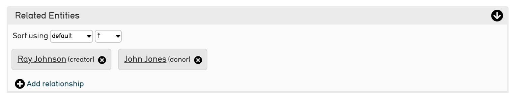
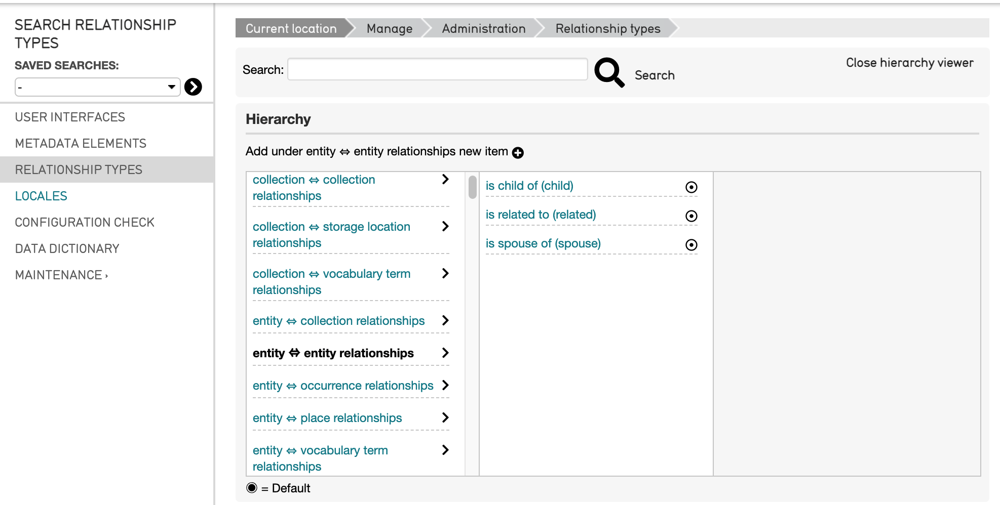
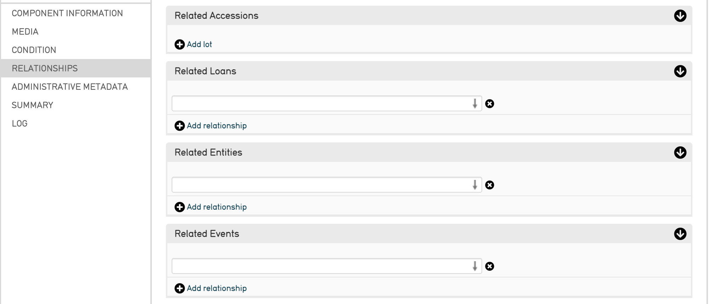
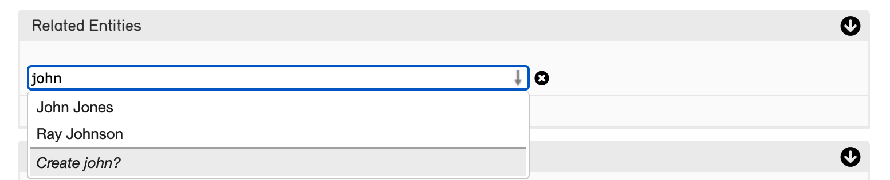
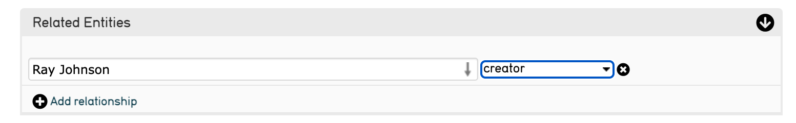

**Relationships**
=================

As a relational database, a core feature of CollectiveAccess is that it can create relationships between records of any type. A relationship’s most basic function is to link records together, creating a bi-directional connection between various kinds of records. Creating relationship records in a database is entirely optional, and in fact won't be accessible unless a user interface is defined for them. However, relationships are extremely useful in situating records within a greater network of interrelated data; they reflect the real-life connections between data. In CollectiveAccess, relationships are indicated using the bi-directional arrow ⇔. Relationships may be created between records in any primary table without restriction. 

Relationships, like other aspects of CollectiveAccess, are configurable. Therefore it is useful to define relationships through relationship types. Relationship types characterize what kinds of relationships records in Collective Access have with each other. While relationships connect records together, relationship types simply define those connections; they are configurable specifiers that distinguish the different kinds of relationships that may occur in a database. 

Any number of relationships can be created between a pair of records, and each relationship can optionally incorporate additional metadata elements, or interstitial data, within a record. This feature allows cataloguers to describe a relationship beyond simply selecting a relationship type. Any two records can carry this interstitial description, so long as metadata and a user interface has been created. Common examples of relationships that could require interstitial metadata include: objects to places; objects to entities; entities to places; or entities to entities. For more on interstitial relationships and examples, see `Interstitial Data <https://manual.collectiveaccess.org/dataModelling/interstitial.html>`_. 

An example of a relationship, with the relationship types defined in parentheses, is shown below:

**Incorporating Relationships**
-------------------------------

Relationships can be incorporated and defined within a data import mapping prior to a data import. 

For pre-determined relationships that will be imported as such, it is necessary to define the relationships and their corresponding types directly in the import mapping. For instructions on creating an import mapping, downloading a starter template, and the necessary steps to incorporate related data, see `Creating an Import Mapping: Overview <file:///Users/charlotteposever/Documents/ca_manual/providence/user/import/c_creating_mapping.html>`_. 

Relationships in a mapping will be defined simultaneously in the `Refinery Column <file:///Users/charlotteposever/Documents/ca_manual/providence/user/import/c_creating_mapping.html#column-6-refinery>`_ and in the `Refinery Parameters column <file:///Users/charlotteposever/Documents/ca_manual/providence/user/import/c_creating_mapping.html#column-7-refinery-parameters>`_. 

**Relationships in the User Interface**
---------------------------------------

To view what relationship types are available in a system, navigate in CollectiveAccess to Manage > Administration > Relationship Types. A list of relationships will be displayed, with their corresponding relationship types. 

Scrolling down on the left side of the list will enable the full list of possible relationship types to be viewed. Selecting a relationship (shown above in bold) will display all possible relationship types that are available within that specific relationship. 

A variety of types are available to help best describe the data in any given database. 

.. note:: If a data import requires related records, then refineries must be used to create relationships between data. For more, see the `Creating an Import Mapping: Overview <file:///Users/charlotteposever/Documents/ca_manual/providence/user/import/c_creating_mapping.html>`_, `Tutorial: Import Mapping Spreadsheet <file:///Users/charlotteposever/Documents/ca_manual/providence/user/import/c_import_tutorial.html>`_, and `Refineries and Refinery Parameters <file:///Users/charlotteposever/Documents/ca_manual/providence/user/import/mappings/refineries.html#import-mappings-refineries>`_. 

**Adding or Editing Relationships after Import**
------------------------------------------------

Choose "Relationships" from the side navigation in any type of record in the database. This will display a page of all the possible relationships between record types available to use. 

In order to state a relationship, a record or records must already exist in the database. For example, when relating an Object record to an Entity, there must already be a separate and existing record for that particular Entity. Note that each available relationship in the Relationships tab contains an arrow icon |icon| which indicates a relationship can be searched and added from that field. 

.. |icon| image:: downarrow.png
            :scale: 50%

To add a relationship to an existing record, simply begin typing into the field of any given relationship as needed. A drop-down list will appear that best matches the typed text, and will display a list to choose from. This list will also include an option to *Create* a record for the new relationship.

Once the correct record to relate is identified, select it. An optional dropdown menu will appear to the right, where the relationship type can be clarified, if needed (for example, when relating Entities, shown below.)

   Relating an Entity.

Save the changes made to the Relationships screen.

It is also possible to create hierarchical relationships between records of various types.

