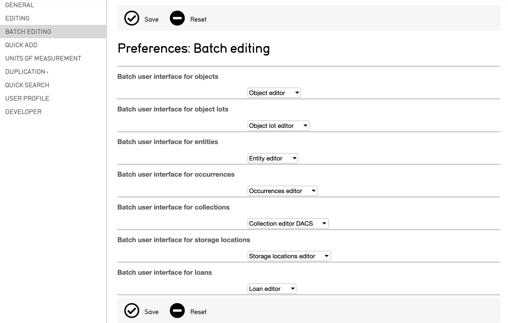
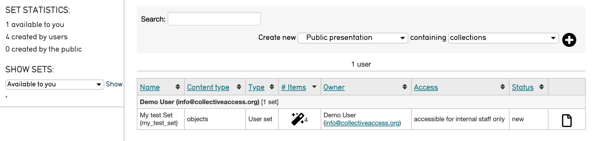
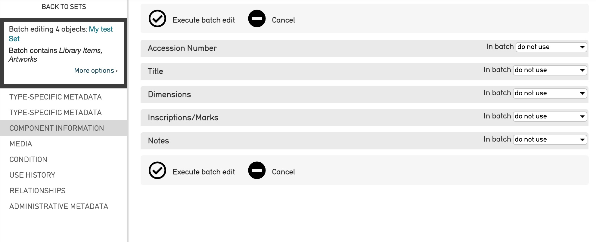
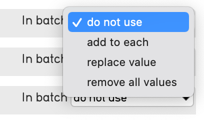
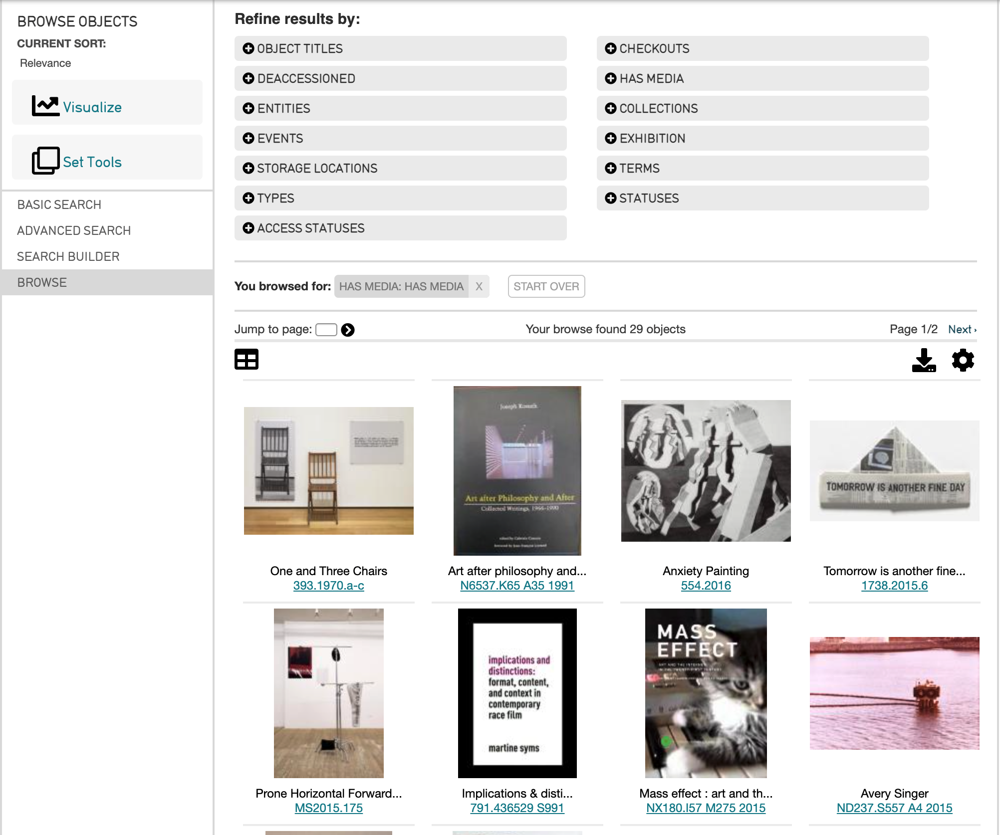
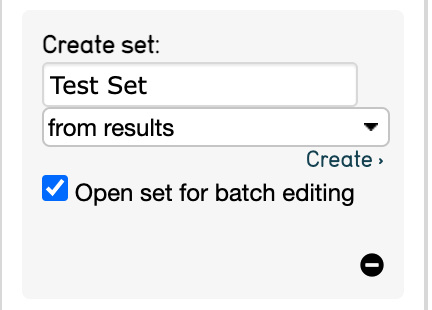

.. batch_editing:

Batch Editing
=====================

CollectiveAccess supports features for making uniform changes to batches of data, saving time and effort when editing records of any type. Batch Editing in CollectiveAccess organizes records into groups, which can then be edited simultaneously; a single edit can be applied to several records at once. Batch edits are commonly performed via Sets, groups of records that can be created to aid your work in a variety of ways. 

Before beginning a Batch Edit, check the settings in Preferences. In most cases, the default setting is the best, or only, option available. However, in some cases, there are alternate settings which can limit the fields appearing on the batch editing screen. 

There are two ways to effectively Batch Edit records in CollectiveAccess:

1. Batch editing using **sets**
2. Batch editing sets using **search results**

In order to batch-edit records, a set must be created and defined. For more on creating a Set and options for Sets, see `Sets <file:///Users/charlotteposever/Documents/ca_manual/providence/user/workflow/sets.html>`_.

Batch Editing Using Sets
------------------------

Once a Set is established, a batch edit can be executed from the My Sets screen. Navigate to **Manage > My Sets**, and select the icon |icon| in the **# Items** column.

Selecting this icon will open the batch-editing interface, where a list of fields is displayed. These fields are all of the metadata elements from that record type's Basic Info screen: 

Beside each of the available fields are the words “in batch” and a drop-down list: 

   
Use this list to specify the type of batch-edit. Choices will vary somewhat, of course, based on the nature of the field. Choosing an “add” or “replace” will be expand the field to add values to all of the records in the batch. "Replace,” will delete pre-existing information in that field throughout the batch of records. Exercise caution when making these sweeping changes.

Select “Execute Batch Edit" to save changes and make a batch edit. 

Batch Editing Sets Using Search Results
---------------------------------------

Sets can also be quickly generated (and subsequently edited) based on a search term. For more information about searching and browsing, see `Search and Browse <file:///Users/charlotteposever/Documents/ca_manual/providence/user/searchBrowse/index.html?highlight=search+browse>`_. 

Use the Browse function to search and find records to add to a Set. For example, Browsing for records that have media: 

When you have completed your search and the results are displayed on the screen, choose **Set Tools** from the left side of the screen. Several tools for creating and batch-editing a set will be displayed: 

Selecting Set Tools will display the option to name the new Set, and to create the Set from all results shown, or, from selected (checked) results only. Also choose whether to open the set for batch editing. 

* **Add checked to set** selects checked records from the search results and adds them to a pre-existing set. Beside each record in your results list you will see a checkbox. Records can be checked individually, or you may select (or de-select) all of them by clicking "toggle checked" (in small print below the "Add checked to set" option.)
* **Create set from results** creates an entirely new set from the search results by selecting "Create."
* **Create set and batch edit results** will create a new set that can be batch edited immediately. Select “Edit.” This last option directs to the batch editing screen. 

Other Batch Editing Features
----------------------------

Batch delete
^^^^^^^^^^^^

Records can be batch deleted just as they can be batch edited. First, follow either of the two approaches outlined above for selecting your to-be-deleted record set. Next, open the batch editor interface. You'll see some text "More options >" in the inspector on the upper left hand corner of the screen. 
Click to open and you'll find controls for batch deleting the entire set.

Batch updating access and status values for representations
^^^^^^^^^^^^^^^^^^^^^^^^^^^^^^^^^^^^^^^^^^^^^^^^^^^^^^^^^^^

As of CollectiveAccess version 1.7, a specialized interface bundle is available that enables setting of access and status values for related object representations. Using this bundle can force the access values of all representations linked to a set of objects to "public." This bundle, called "Media representation access and status" (code ca_object_representations_access_status), is different from the standard "Object representations" bundle (code ca_object_representations), which performs the addition or removal of representations from a batch of objects.

