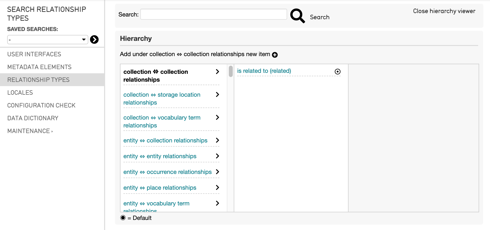
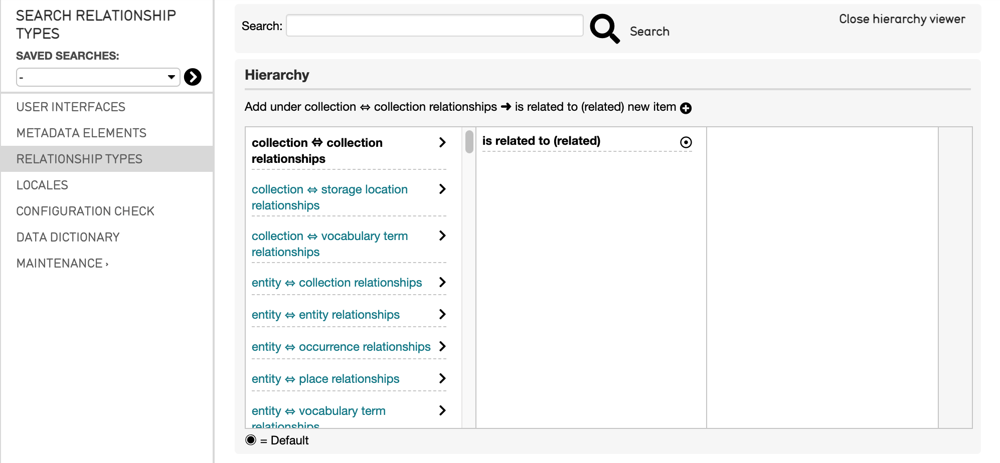
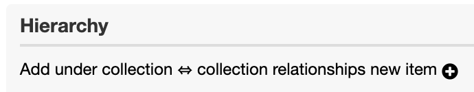
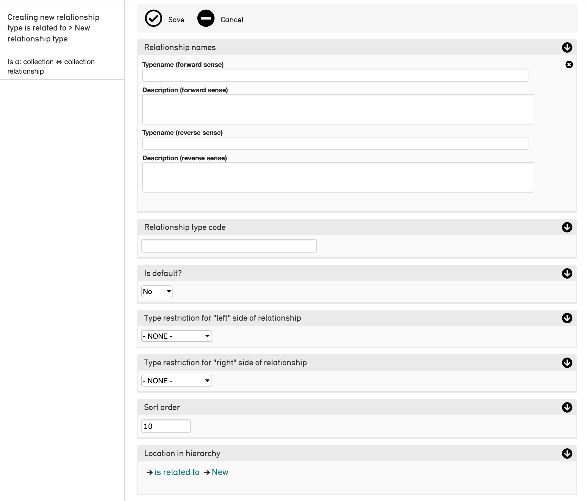

Configuring Relationship Types
==============================

All Relationships in CollectiveAccess are defined by Relationship Types. Relationship Types are configurable to suit a multitude of data needs. All relationships in CollectiveAccess are reciprocal. 

Relationship Types can be managed via the CollectiveAccess user interface. Relationship Types can be created, and also viewed and edited, in the  user interface.

Viewing Available Relationship Types
------------------------------------

To view all possible Relationship Types in a CollectiveAccess system: 

1. Navigate to **Manage > Administration** in the Global Navigation menu. 
2. Select **Relationship Types** from the left sidebar to open the Relationship Types viewer.

The left-most column displays all of the possible relationships available between records in the system. These are not editable, but simply represent different relationships  between the relevant primary tables. For example, the relationship listed between two objects, or between a place and an entity.

Select these relationship headings to view the different Relationship Types that have been defined for the system. The selected relationship will then be **bolded** and the type  will display in the right-hand column: 

.. image:: relationship_hieararchy_types.png
   :scale: 50%
   :align center

Creating Relationship Types
---------------------------

To create a new Relationship Type in the user interface: 

1. Navigate to **Manage > Administration** in the Global Navigation menu. 
2. Select **Relationship Types** from the left sidebar, to open the **Relationship Types viewer**.

3. **Select the Relationship** in the left-hand column to which you would like to add a new type. The relationship will show up in **bold.**
4. **Select the Relationship Type** in the right-hand column to which you would like to add to. The relationship type will show up in **bold.**
5. **Select the plus icon** |plus| next to the message "Add under [relationship] new item," where [relationship] is the relationship for which you would like to add a new Relationship Type: 

6. The **Relationship Type Editor** screen will be displayed, where relevant information for the new Relationship Type can be entered and saved: 

The Relationship Type Editor screen contains the following information to add to the newly defined relationship type: 

* **Typename (forward sense)**: The display name of the Relationship Type. These are often named so that they complete a sentence. For example, in an Entity to Object relationship, one relationship type might be “created.” 
* **Description (forward sense)**: Describe the relationship type here. 
* **Typename (reverse sense)**: This allows you to name the reciprocal relationship of the same two primary tables. For example, “created by.”
* **Description** (reverse sense): 
* **Relationship type code**: This is a unique name that is used to refer to your Relationship Type throughout the system.
* **Is Default?**: This specifies whether this is the default Relationship to appear in the Relationship Type Bundle.
* **Type Restrictions for "left" side of relationship**: Restrict the relationship to a chosen subtype. For the "Birthplace" example, you may want to restrict your Relationship Type to "Individuals," as Organizations often don't have places of birth. This setting automatically generates a list of your configured subtypes for the "left" side of your relationship.
* **Type Restrictions for "right" side of relationship**: same as above, but automatically generates a list of your configured subtypes for the "right" side of your relationship.
* **Sort Order**: Determines the order of the Relationship Types as they appear in a drop-down menu. 
* **Location in Hierarchy**: The location of the relationship type in the Relationship Hierarchy. 

.. note:: If you have not yet installed CollectiveAccess, you can configure Relationships using the installation profile. 