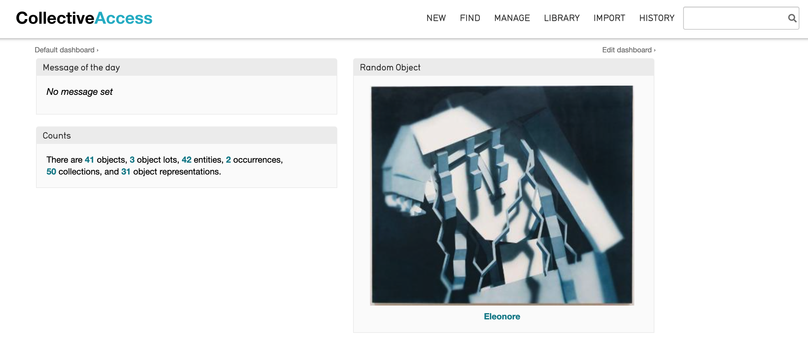
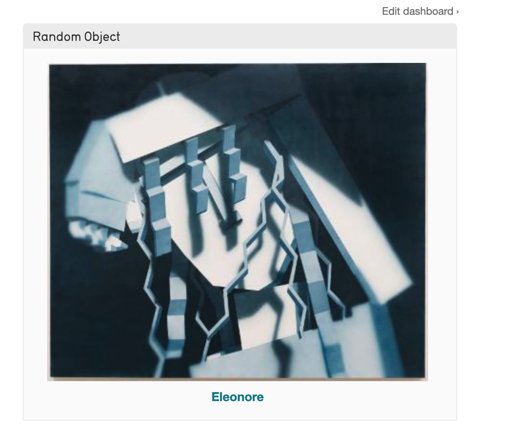
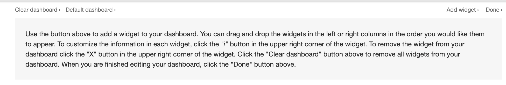
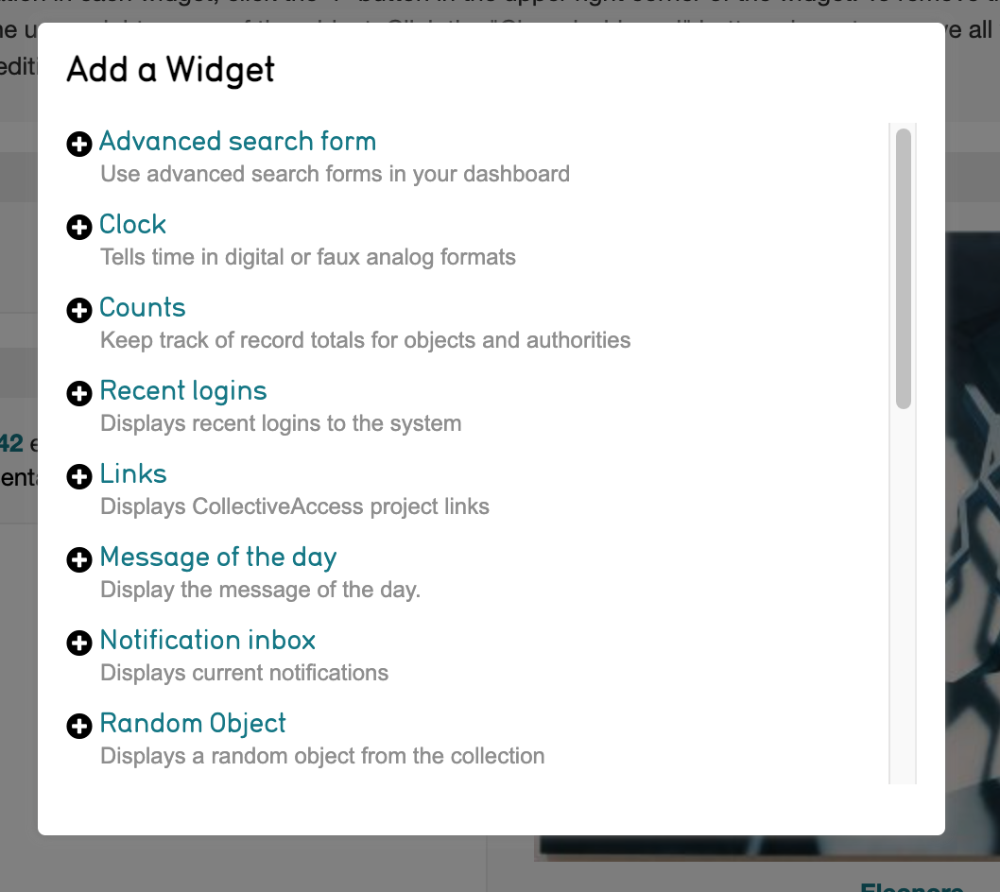
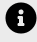
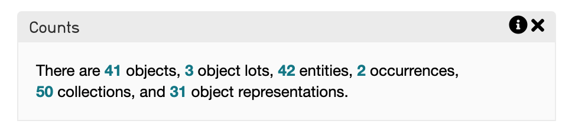
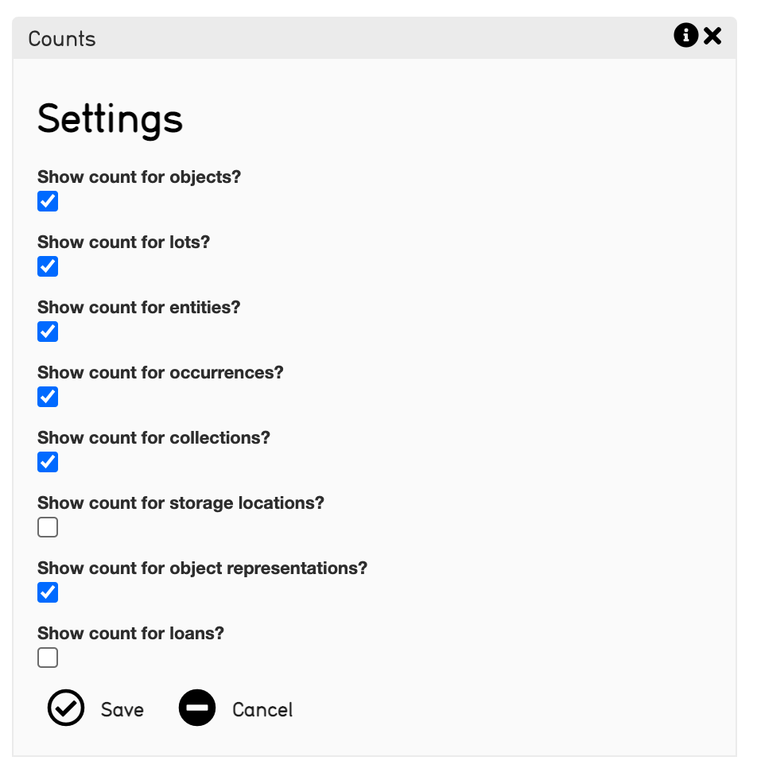
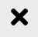

Dashboard Configuration
=======================

* `Adding Widgets to the Dashboard`_
* `Editing the Dashboard`_
* `Widget Settings`_
* `Removing Widgets from the Dashboard`_

CollectiveAccess provides a customizable **dashboard.** The dashboard is the home screen that displays upon login to any back-end system (Providence). 

The main function of the Dashboard is to display the widgets for your system. **Widgets** provide specialized functions, and serve as mini-applications within Providence. The number of widgets in the Dashboard is entirely configurable, and their arrangement is customizable to suit a variety of collections and workflows. Every CollectiveAccess system comes with a specific set of widgets; however, custom widgets can be created, and widgets can be added or taken away from any dashboard. 

.. note:: Widgets can be written and created by any developer. For more on writing widgets, see `Writing Dashboard Widgets <file:///Users/charlotteposever/Documents/ca_manual/providence/developer/writing_dash_widgets.html?highlight=widget>`_. 

Adding Widgets to the Dashboard
-------------------------------

The dashboard in a CollectiveAccess system will usually look like: 

   The dashboard, or landing page, of a CollectiveAccess system. From here users can create new records, search for records, manage administrative information, and import data. 

Editing the Dashboard
---------------------

To edit the dashboard:

1. Select **Edit Dashboard**, located in the top right of the home screen. 

2. Some instructions will appear. Select **Add Widget**, also located in the top right of the home screen, above these instructions:

3. The **Widget Panel** will appear. Scroll through the Widget Panel, which lists all of the available widgets in the system:

4. **Select** the desired widget using the plus icon |plus|. This will automatically drop it to a location on the home screen. 

The position of widgets on the Dashboard can be configured. Once widgets have been selected and added, they will display on the Dashboard. 

To change the location of widgets on the home screen, simply **select and drag** the widget around on the Dashboard. **Drop** the widget in the desired location. 

Once widgets have been configured, select **Done** in the upper right of the screen above the widget instructions. 

Widget Settings
---------------

While still editing the Dashboard, specific settings can be viewed and configured for each widget. To do so, select the **i** icon |icon| located in the top right corner of each widget. 

For each widget, different settings will be displayed that can be customized. For example, the Counts widget on the Dashboard appears like this:

When the **i** icon |icon| is selected, these settings appear that can be customized: 

Select or de-select these settings to change the contents that appear in the widget upon login.

Removing Widgets from the Dashboard
-----------------------------------

Removing widgets from the Dashboard is simple. While editing the Dashboard, simply select the **x** icon |x| located in the to right corner of each widget. 

Select **Done,** and the updated Dashboard will be displayed. 