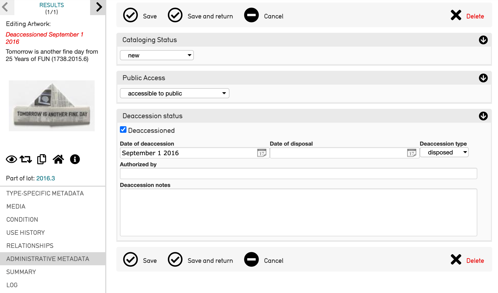
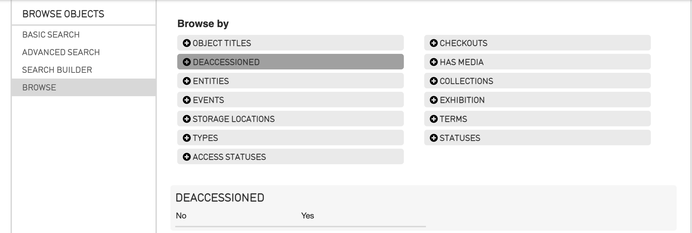

Deaccessions
============

CollectiveAccess can track the deaccessioning process at the item-level, using the **Deaccession Status bundle**. This bundle can be found in the List of Metadata Elements. The Deaccession Status bundle can be placed anywhere in the object editor screen. 

.. note:: If you are writing a profile configuration in XML, the bundle code is **ca_objects_deaccession**. Items can only be deaccessioned if this bundle code is included in the installation profile. 

To deaccession an item: 

1. **Open** the record to be deaccessioned. 
2. Select the **Administrative Metadata** screen. 
3. Navigate to the **Deaccession Status** field: 

4. **Select the deaccession checkbox** located within the bundle. This will flag the object record as **deaccessioned**, and will also expand the bundle so you can add additional information such as the date of deaccession, the "type", and any other qualifying notes. Deaccessioned items will be marked in the object editor screen in the Inspector in red. 

Filter Results by Deaccession Status
------------------------------------

The **Deaccessioned facet** can also be included to filter search results. To do so: 

1. Navigate to **Objects > Browse**.
2. Select the **Deaccession** facet. 
3. **Filter** the results according to whether records have, or have not, been deaccessioned.

