.. _providence-user-interfaces:

User Interfaces
===============
User Interface Administration
=============================

.. contents::
   :local:
   
User Interface Configuration
----------------------------

CollectiveAccess supports a multitude of user interfaces in CollectiveAccess to best suit a plethora of collections needs. Simply put, the user interfaces are the screens where users interact with a given system. 

To view the user interfaces available in a CollectiveAccess system, navigate to **Manage > Administration > User Interfaces**. The total number of available user interfaces that are defined in the system, with the Name of the user interface, Type, Code, and use in the system, will be displayed: 

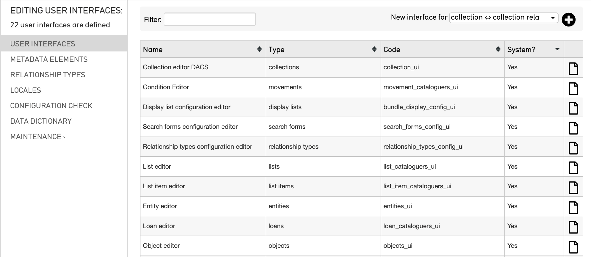

From here, user interfaces can be selected and edited.

Editing a User Interface
------------------------

To edit a user interface: 

1. Navigate to **Manage > Administration > User Interfaces**.
2. Select the **page icon** |page| located on the far right of the screen within each user interface listed. 

3. The **Basic Info** page of the selected user interface includes the as the name and code of the user interface, as well as a list of all of the screens within that interface. Fill in or change any necessary information about the selected user interface.

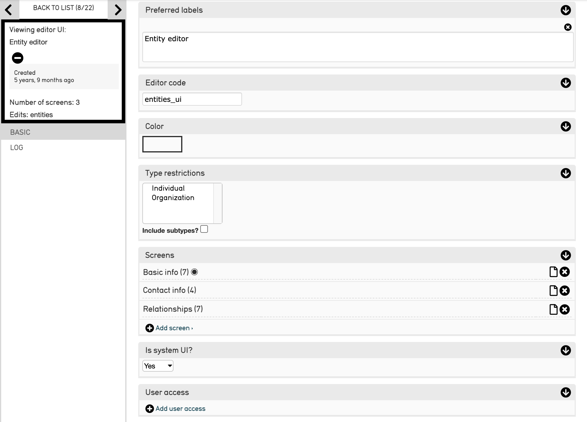

   Partial view of the Entity editor screen in **Manage > Administration > User Interfaces.** 

4. Navigate to the **Screens** element on the Basic Info page. This is the tool for adding new elements, or fields, to the configuration. Note that each user interface will display different screens: 

.. image:: entity_editor_screens.png
   :scale: 50%
   :align: center

5. Select the plus icon |plus| to add a new screen. 

6. **Type in** the name for the new screen. 
7. **Save** the changes at the bottom of the page; the new screen will now appear in the Screens element on the Basic Info page. 

Adding a Metadata Element to a Screen
-------------------------------------

To add a metadata element to a screen within a user interface: 

1. Navigate to **Manage > Administration > User Interfaces**.
2. Select the **page icon** |page| for the appropriate screen, located to the right of each listed screen in the Screen element. 

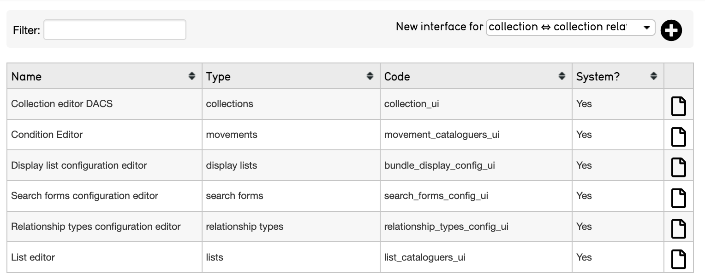

3. Scroll down to the **Screens** field, and select the same **page icon.** |page|

.. image:: entity_editor_screens.png
   :scale: 50%
   :align: center

4. **Scroll down** to the Screen Content field, located on the Basic Info page:

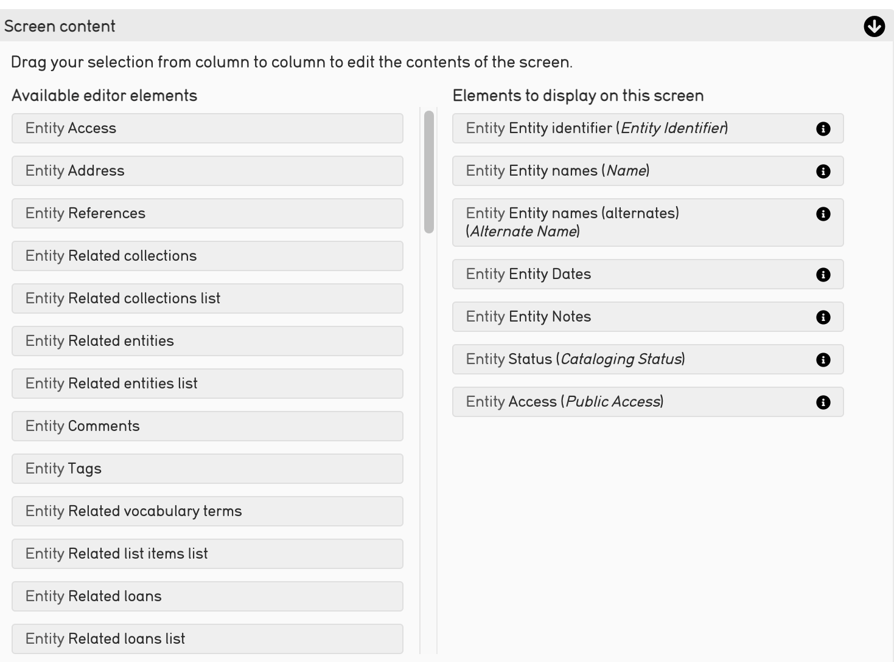

Note that the first column contains **Available Editor Elements** and the second holds **Elements to Display on this Screen.**

4. To add metadata elements, **drag and drop elements** from the first column to the second to add new elements to your screen.  
5. **Save** any changes made to the Screen Content list. The new element will now appear in the appropriate user interface that was edited. 

Not every metadata element in the system is an **Available Editor Element** for every screen. This is because type restrictions are applied to the elements when they are defined; in other words, some metadata elements could only be relevant to entities, and are therefore restricted to that type, and won’t be available for an object interface.

Creating New Metadata Elements
------------------------------

To create a new metadata element, or field, in a user interface: 

1. Navigate to **Manage > Administration > Metadata Elements**. A list of all of the defined metadata elements in the system, each element’s label, code, metadata type, the system Type to which it applies, and its usage in User Interfaces (UI) is displayed:

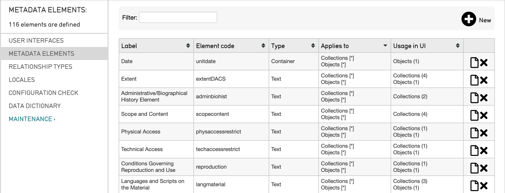

2. Select the **plus icon** |plus| located at the top right of the screen, next to **New**. 

3. **Fill in** the necessary information about the new metadata element. The screen for a new element will look like: 

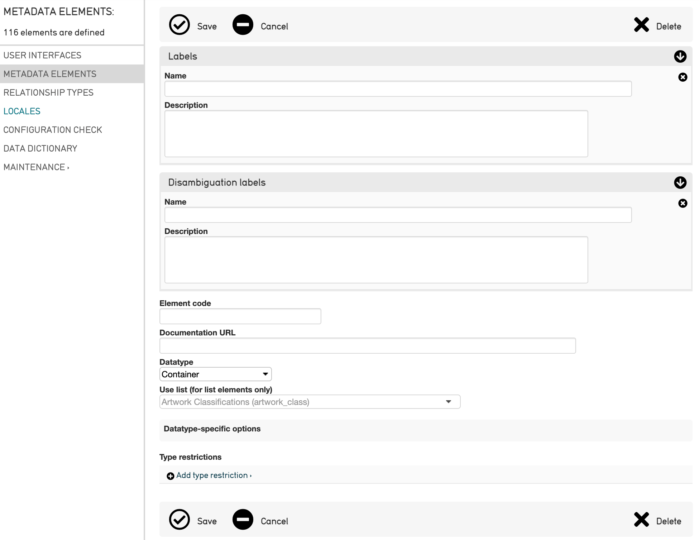

Options to fill in include:

* **Name**: Choose a name for the element that is descriptive and brief.
* **Description**: Describe the element’s purpose, which will show up when it is moused-over in a user interface. 
* **Element Code**: the unique, alpha-numeric identifier for the element. Should contain no spaces or special characters (i.e. “set_description”).
* **Documentation URL**: For using a specific content standard, place a reference in this field.
* **Datatype**:Choose the form of the element from this drop-down.
* **Use list**: If the element is a list, choose from this drop-down of all the different lists defined in “Lists and Vocabularies.” This will append the actual content of the list to the metadata element.
* **Datatype-specific options**: The options in this box will change depending on the selected datatype. Many of the setting fields will be populated with default values, but these can be altered here.
* **Type restrictions**: Define whether or not the metadata element will appear in the list. Further refine this restriction by specifying subtypes. Select **Add type restrictions** to define. 

Table and Type Restrictions
---------------------------

When creating a new metadata element, the maximum and minimum number of attributes that must be associated with the new element, as well as the minimum number of attribute bundles to show in an element form, must be defined. These options appear in selecting the Type restrictions, described in the list above. Options look like: 

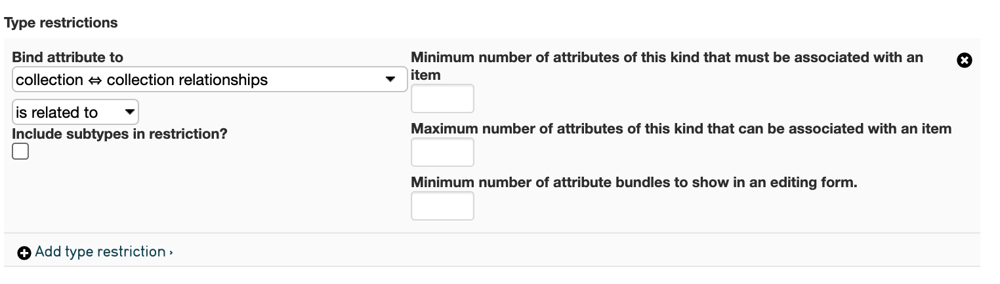

Type restrictions options dictate how subtypes, attributes, and minimums and maximums of attributes are associated with a new metadata element. Minimums and maximums of attributes associated with the metadata element simply determine how many of the metadata elements will appear on the user interface. The Options include:

* **Minimum number of attributes**: Determines the ability to remove this field from a given screen. If set this to “0,” (which indicates that there is no minimum) there will be a small gray “x” to the far right of the field that will allow removal. If you set it to “1,” there must always be at least one instance of the field visible on the screen when it’s opened; if it’s set to “2,” there will be 2 instances present when the screen is opened, and so on.
* **Maximum number of attributes**: Set a maximum number of possible repeating fields.
* **Minimum number of attribute bundles**: Set this field to 0 if the field should appear in the collapsed position when a screen is first opened. Set to 1 if the field should appear open (or greater if you wish the attribute bundle to appear more than once when the screen is first opened).

Screen-Specific Settings
------------------------

Several screen-specific settings exist within a metadata element. 

Sometimes cataloguers find that the options set on a metadata element need to be overridden on specific data entry screens. For example, let's say a general date field is used on both Object and Entity screens. The Object field should be called "Creation date,” while the Entity field should be called "Life dates." To do so:

1. Navigate to **Manage > Administration > User Interfaces**.  
2. **Select** the specific user interface screen to edit using the **page icon** |page|. 

3. Scroll down to the Screens field in the Basic Info page. 
4. Select the **page icon** |page| to the right of the screen to be edited. 

5. Scroll down to the **Screen Content** field. 
6. Select the **i** icon |icon| to edit the bundle. A smaller window will display various settings:

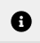

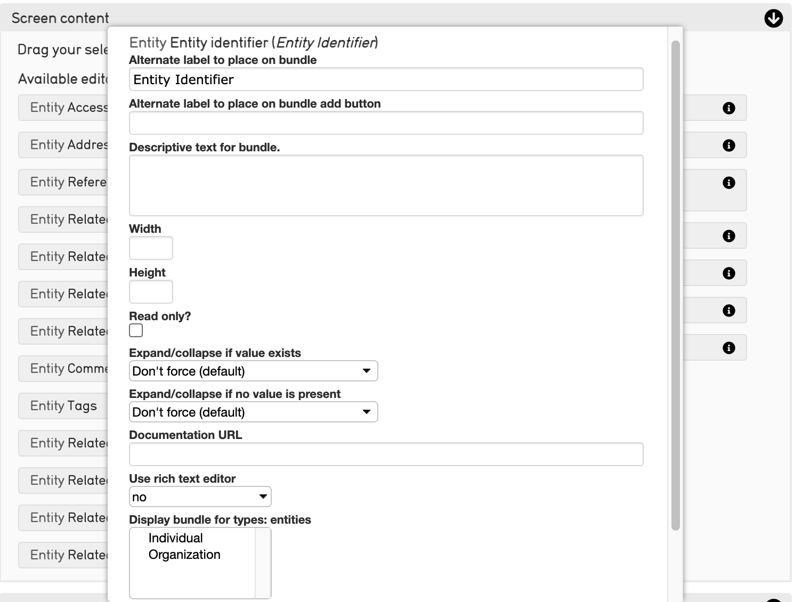

Settings include: 

* **Alternate label**: Change the title of the field on this screen only.
* **Alternate label for add**: Change the language of the "add" button for repeating fields.
* **Description**: Change the description that is visible when this field is moused-over.
* **Width**: Sets a screen-specific field width.
* **Height**: Sets a screen-specific field height.
* **Read only?**: Prevents the field from being editable on the screen.
* **Expand/collapse if value exists**: Controls the expand/collapsed position when there is at least one value present.
* **Expand/collapse if no value is present**: Controls the expand/collapsed position when there is no value present.
* **Sort using**: Sets the sort order of repeating attributes. Any field in a container can be used to sort (ascending or descending). The default sort is creation order.
* **Sort direction**: Ascending or descending.
* **Documentation URL**: A documentation link for the bundle.
* **Use rich text**: When enabled, a formatting toolbar can be used to style text.
* **First item color**: Allows the first relationship (set via sort order and direction) to carry an arbitrary color.
* **Last item color**: Allows the last relationship (set via sort order and direction) to carry an arbitrary color.
* **Do not show delete button**: Removes the delete button from the cataloging screen, when checked.

Screen-Specific Settings For Relationships
------------------------------------------

Relationships have additional screen-specific settings. These can be managed in the same place that screen-specific settings are managed. Note that these settings will *not* show up in all bundles, just those that specifically refer to Relationships.

To add screen-specific settings for relationships: 

1. Navigate to **Manage > Administration > User Interfaces**.
2. Select the **page icon** |page| to select the user interface screen to edit. 

3. Scroll down to the **Screens** field in the Basic Info page: 

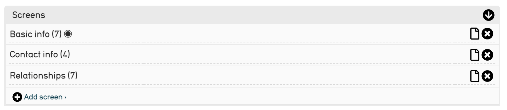

The number of screens available for editing depends on the user interface selected. 
4. Select the **page icon** |page| to the right of the screen to be edited. 

5. Scroll down to the **Screen Content** field. 

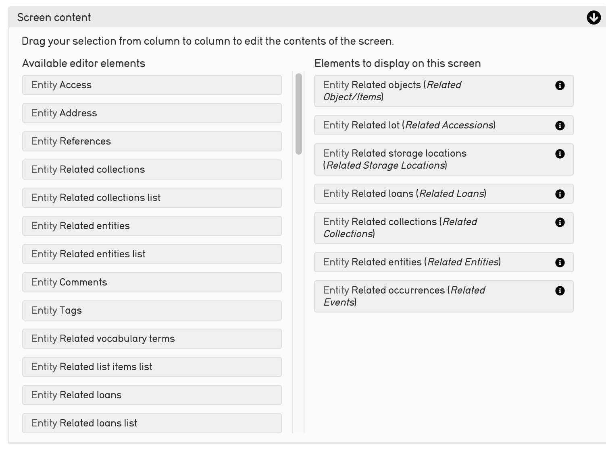

6. Select the **i** icon |icon| to edit the bundle. A smaller window will display various settings.

7. **Scroll down** within these settings to **Restrict to Relationship Types**. 

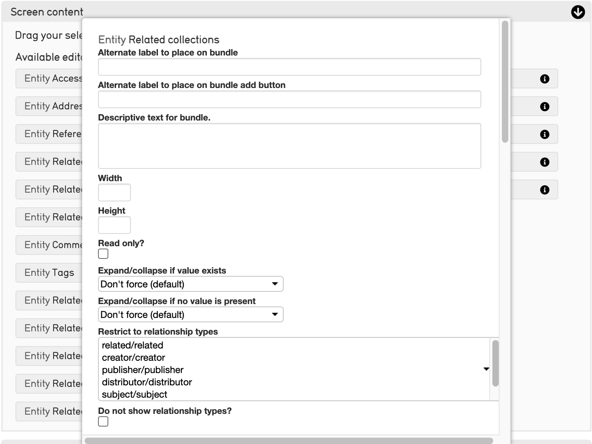

Select from the following options: 

* **Alternate label to place on bundle**: Change the title of the field on this screen only.
* **Alternate label for add**: Change the language of the "add" button for repeating fields.
* **Description**: Change the description that is visible when this field is moused-over.
* **Width**: Sets a screen-specific field width.
* **Height**: Sets a screen-specific field height.
* **Read only?**: Prevents the field from being editable on the screen.
* **Expand/collapse if value exists**: Controls the expand/collapsed position when there is at least one value present.
* **Expand/collapse if no value is present**: Controls the expand/collapsed position when there is no value present.
* **Restrict to relationship types**: Sets the specific limits on which relationship types can be catalogued from this bundle.
* **Do not show relationship types?**: Removes the relationship type from the cataloging screen, when checked.
* **Restrict to type**: Sets the specific limits on which types can be brought up in this lookup.
* **Restrict to search expression**: Sets the specific limits on what can be brought up in this lookup. Can be based on arbitrary metadata if desired. More here.
* **Do not include sub-types in restriction**: Normally restricting to type(s) automatically includes all sub-(child) types. If this option is checked then the lookup results will include items with the selected type(s) only.
* **Sort using**: Sets the sort order of repeating attributes. Any field in a container can be used to sort (ascending or descending). The default sort is creation order.
* **Sort direction**: Ascending or descending.
* **Format of relationship list**: Sets as bubbles or list view.
* **First item color**: Allows the first relationship (set via sort order and direction) to carry an arbitrary color.
* **Last item color**: Allows the last relationship (set via sort order and direction) to carry an arbitrary color.
* **Do not show delete button**: Removes the delete button from the cataloging screen, when checked.
* **Relationship display template**: Layout for the relationship information on the screen (can use HTML). Uses the bundle display template syntax.
* **Documentation URL**: A documentation link for the bundle.
* **Minimum number of relationships of this kind to be associated with an item**: Sets the min number of this kind to be associated with an item. 
* **Maximum number of relationships of this kind to be associated with an item**: Sets the max number of this kind to be associated with an item. 

 

