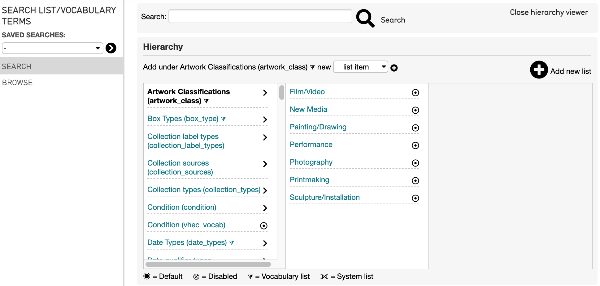
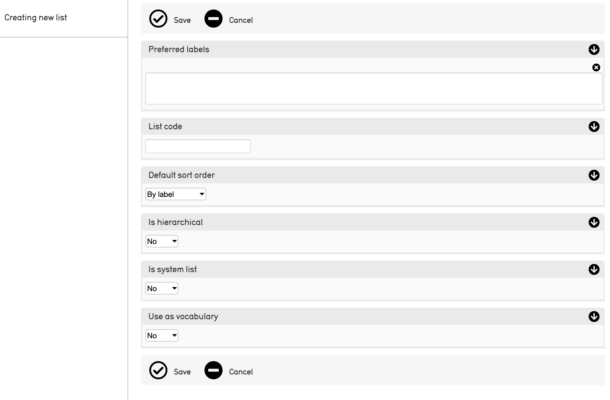
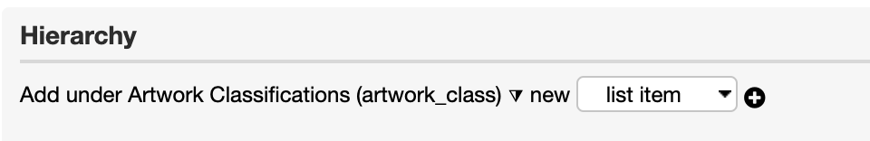
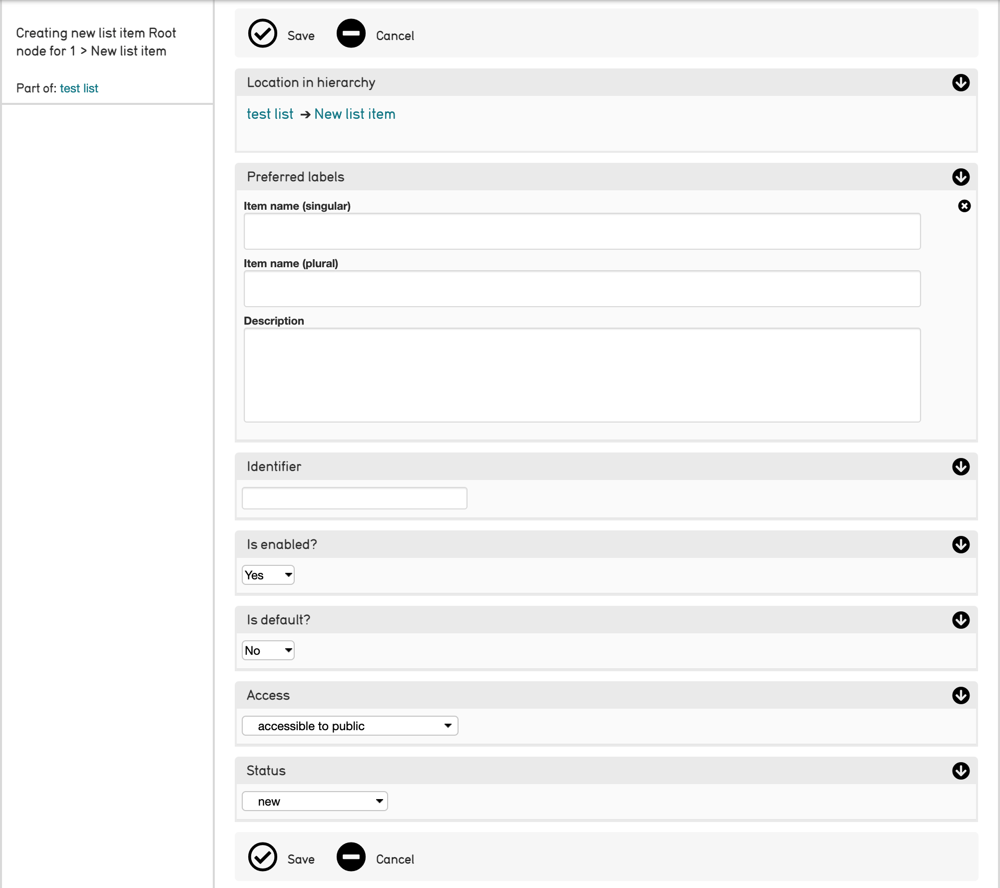

Lists and Vocabularies
======================

Metadata elements in a CollectiveAccess system must be defined before they can be added to a user interface. Metadata elements, the fields that make up record metadata, cannot be created within the context of an editor screen in the user interface. Instead, these elements are selected from a wide-ranging pool of available metadata elements, and added to the appropriate screens at the user’s discretion. Metadata elements are configurable, creating flexible and customizable cataloging options. 

Lists and Vocabularies in CollectiveAccess refers to the metadata element values which are arranged and manipulated within a system (fields). They are, in fact, data points, which can be edited and adjusted through the user interface.

Lists and Vocabularies are part of CollectiveAccess system administration, and can be managed and edited by navigating to **Manage > Lists and Vocabularies**. The Lists and Vocabularies hierarchy will be displayed: 

To navigate this hierarchy, select the dark gray arrows to the right of each metadata element; this will open sub-categories available within each element. 

Creating a New List
-------------------

In any CollectiveAccess system it is possible to design an entirely new list of metadata  elements. Any new list will be similarly managed by navigating to **Manage > Lists and Vocabularies**.

The list itself has a screen, where options are defined for the new list. To create a new list, select the plus |plus| icon to the right of the Lists and Vocabularies Hierarchy, where there is an option to **Add new list**:

A screen displaying options for the new list will appear with the following options to set: 

Options include:

* **Preferred labels**: The display name for the list.
* **List code**: The unique identifier for the list to be used throughout the system.
* **Default sort order**: Specifies the default method to order items in the new list. 
* **Is hierarchical**: Specifies if the new list is hierarchically structured, or a simple flat list. 
* **Is system list**: Specifies if the new list is user defined or installer defined. Almost always set to “no.”
* **Use as vocabulary**: Specifies if the new list will be used as controlled vocabulary for cataloging, or, a simple set of drop-down values.

Once these options are saved, the list hierarchy viewer will display the new list in the leftmost column. To edit basic information about the newly created list, click on its title in the Lists and Vocabularies hierarchy.

Adding Items to a List
----------------------

CollectiveAccess also supports the addition of new metadata element values to an extant list through the user interface. This ensures that metadata is captured effectively and accurately. To do so: 

1. Navigate to **Manage > Lists and Vocabularies**. 
2. **Select** the Lists and Vocabularies element that will be added to. The text above the hierarchy will change to reflect the name of the list you have selected. **List item** will automatically be selected from the drop down: 

3. Select the **plus icon** |plus| to the right of the **list item dropdown**, to add a new list item. 

4. **Create a record** for the new list item. 

By default, the Basic Info screen for this list item will include its place in the hierarchy, preferred names, identifiers, and other information: 

* **Location in Hierarchy:** The new item's location in the list hierarchy. 
* **Preferred labels:** Names for the list item that will be used throughout the system. 
* **Identifier**: Unique identifier for this specific list item. 
* **Is enabled?:** If checked, this item is selectable, and can be used in cataloguing. 
* **Is default?**: If checked, this item will be the default selection for the list.
* **Access:** Determines whether the list item is accessible to the public or not. 
* **Status**: Current state of the list item. 

Be sure to select **Save** upon entering the basic information for the new list item. 