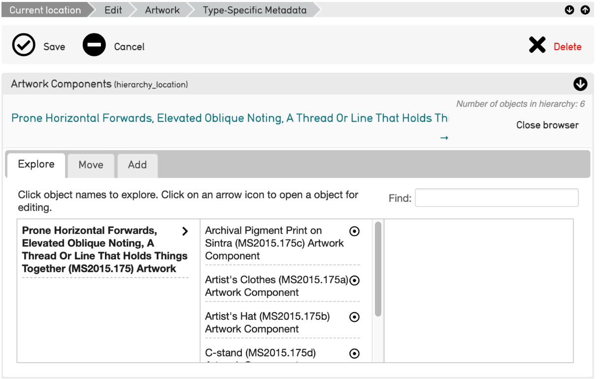
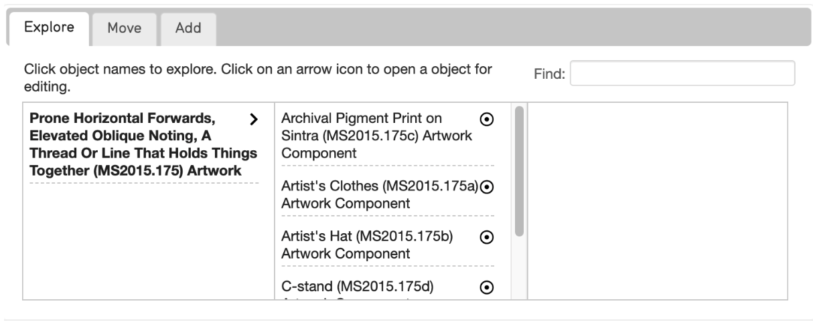
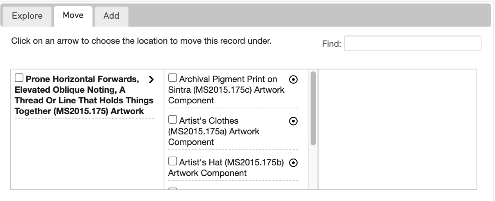
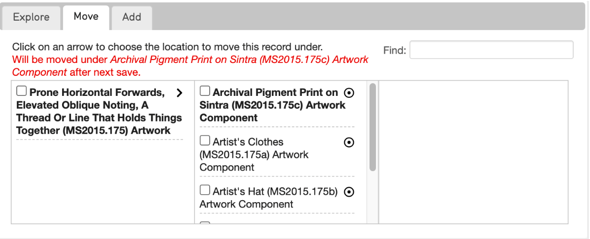
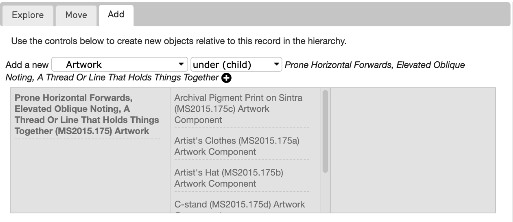

Location in a Hierarchy Bundle
==============================

The Location in Hierarchy Bundle appears within the editor screen for a number of Hierarchical records (such as Collections, Objects, Places, List Items, Entities, and so on). This bundle is different from the Hierarchy Viewer, which appears when searching for Places, or when managing lists (although they function similarly).

The initial view of the Location in Hierarchy Bundle displays the record's hierarchical path in a laundry-list format. If the path exceeds the width of the page, use the arrow buttons to navigate the full record path. 

The Hierarchy bundle will display relevant records in a **parent-child format**, moving from general to more specific, with records (children) located below other records (parent). 

   Example of the Hierarchy Bundle from a record in the Demonstration System. Note that the Artwork is composed of components, which are further displayed in the hierarchy as being underneath the artwork itself. 

The laundry-list style hierarchy path is still displayed at the top of the bundle, while there are a few options within the bundle: **Explore**, **Move**, and **Add**.

Explore
-------

The Explore function in the bundle displays the entire hierarchical structure of a collection, even the paths that do not lead directly to your current record. 

A specific record can be located by entering a term into the "Find" search field. Selecting the gray arrow icons **>** will open any of the records in the hierarchy bundle. This will navigate away from the current page, so please save any changes before selecting another record:

Move
----

The Move function chooses a new location for a specific record within the hierarchy. The "Find" field appears here as well to help locate specific records: 

To choose a new parent record, select the record’s title; it becomes bold and a message in red appears in the hierarchy bundle. Upon saving the page, the selected record will be moved to this new location:

Add
---

The Add function is a shortcut that creates a new child or sibling record relative to the current record. 

To add a new child or sibling record, select the record type and whether the new record will be a child or sibling in the menu. Click the plus icon to create the new child or sibling record that appears after the current record’s title. Save any changes made before creating a new record.

