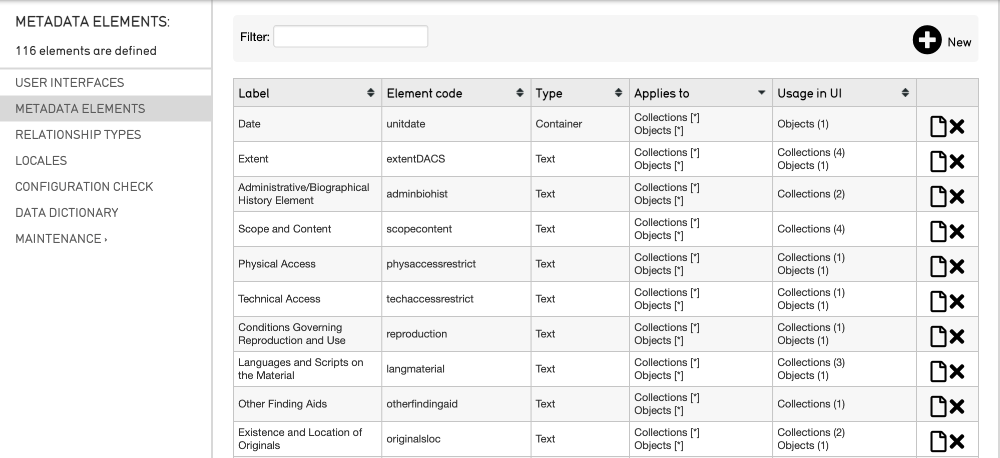
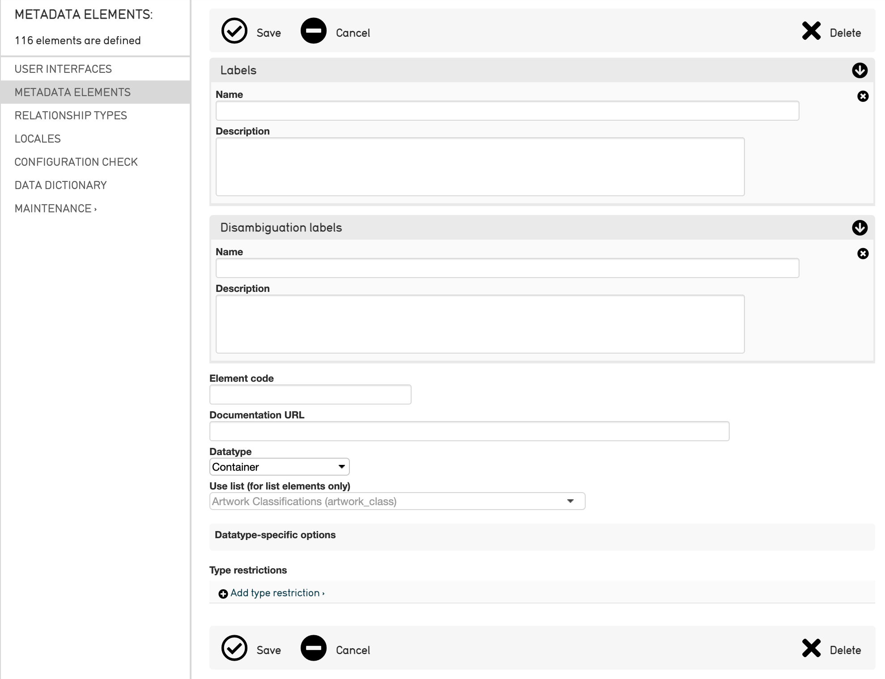

Configuring Metadata Elements
=============================

Metadata elements can be created and edited through the CollectiveAccess interface. 

.. note:: If you have not installed CollectiveAccess yet, or if you would like to install one of the available Metadata Standards, it may be preferable to configure Providence using Profiles. You can then make changes to your system by configuring Metadata Elements individually. For more detailed information about what Metadata Elements are and how they work, please visit API: Metadata Elements and Attributes.

Creating a New Metadata Element
-------------------------------

To create a new metadata element in the user interface: 

1. Navigate to **Manage > Administration**. 
2. Select **Metadata Elements** from the sidebar. This displays a complete list of all of the metadata elements currently available in the system: 

3. Select the **plus icon** |plus| in the upper right corner. This displays the **Metadata Element Editor** which contains the following options for adding a new metadata element:

   The Record for the new metadata element being created. 

Fields to fill in for the new metadata element include:

* **Labels**: Enter a Display Name for the new Metadata Element, and a description of the Metadata Element.
* **Disambiguation Labels**: 
* **Element code**: All Metadata Elements require a unique alpha-numeric code which is used to identify it throughout the system. For examples, see the list of all Metadata Elements in the sidebar; the element codes are listed next to each element. 
* **Documentation URL** : An optional link to documentation about the new metadata element.
* **Datatype**: Determine the type of data that the field will receive (a text box, date range, list, etc). For detailed information about each type, see Attribute Types. Additional configuration options for each datatype become available after the information is saved. 
* **Use list**: Choose from this drop-down all the different lists defined in “Lists and Vocabularies.” This will append the actual content of the list to the metadata element.
* **Datatype-specific options**: Additional configuration options according to the datatype assigned to the new metadata element. These options change depending on the Datatype selected. 
* **Type restrictions**: Define the minimum and maximum number of attributes that must be associated with this metadata element. By setting Type Restrictions for the new metadata element, the Editor will populate a list of subtypes if they exist.
