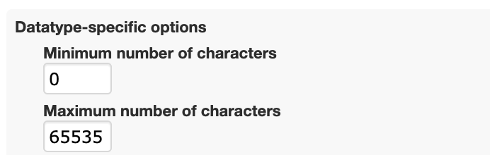

Configuring Metadata Elements
=============================

* `Creating a New Metadata Element`_
* `Datatype-Specific Options for Metadata Elements`_ 

Metadata elements can be created and edited through the CollectiveAccess interface. 

.. note:: If you have not installed CollectiveAccess yet, or if you would like to install one of the available Metadata Standards, it may be preferable to configure Providence using `Profiles <https://manual.collectiveaccess.org/providence/user/dataModelling/Profiles.html>`_. You can then make changes to your system by configuring Metadata Elements individually. For more detailed information about what Metadata Elements are and how they work, please visit API: Metadata Elements and Attributes.

Creating a New Metadata Element
-------------------------------

To create a new metadata element in the user interface: 

1. Navigate to **Manage > Administration**. 
2. Select **Metadata Elements** from the sidebar. This displays a complete list of all of the metadata elements currently available in the system: 

.. figure:: metadata_el2.png
   :scale: 50%
   :align: center

   Metadata elements in a CollectiveAccess system. 

3. Select the **plus icon** |plus| next to **New** in the upper right corner. This displays the **Metadata Element Editor** which contains the following options for adding a new metadata element:

.. figure:: metadata3.png
   :scale: 50%
   :align: center

   Creating a new metadata element.  

Fields to fill in for the new metadata element include:

* **Labels**: Enter a Display Name for the new Metadata Element, and a description of the Metadata Element.
* **Disambiguation Labels**: 
* **Element code**: All Metadata Elements require a unique alpha-numeric code which is used to identify it throughout the system. For examples, see the list of all Metadata Elements in the sidebar; the element codes are listed next to each element. 
* **Documentation URL** : An optional link to documentation about the new metadata element.
* **Datatype**: Determine the type of data that the field will receive (a text box, container, date range, list, etc). For detailed information about each type, see Attribute Types. Additional configuration options for each datatype become available after the information is saved. 
* **Use list**: Choose from this drop-down all the different lists defined in “Lists and Vocabularies.” This will append the actual content of the list to the metadata element.
* **Datatype-specific options**: Additional configuration options according to the datatype assigned to the new metadata element. These options change depending on the Datatype selected. 
* **Type restrictions**: Define the minimum and maximum number of attributes that must be associated with this metadata element. By setting Type Restrictions for the new metadata element, the Editor will populate a list of subtypes if they exist.

Datatype-Specific Options for Metadata Elements
-----------------------------------------------

When configuring metadata elements in the User Interface, there are a few options called **Datatype-specific options** which determine aspects about the field’s presentation in CollectiveAccess. For example, a field’s size, format, and the amount of text it can hold are all configurable and can be set using these options.

To view these options, navigate to **Manage > Administration > Metadata Elements.** The full list of available metadata elements will be displayed:

   Metadata elements in a CollectiveAccess system. 

Note that the options available will differ for each **type** of metadata element. In the full list of metadata elements, these types are available to view in the third column from the left. Some common types include: 

* **Text**: Free text fields. 
* **Containers**: Fields with one or more sub-fields. 
* **Geocode**: Map display of coordinates. 
* **Currency**: Field for currency values. 
* **Media**: Field containing media file(s). 
* **Date Range**: Field for a range of dates (calendar). 
* **List**: Field formatted as a drop-down list. 

Text Field Options
^^^^^^^^^^^^^^^^^^

It may be necessary to change the number of characters in a text field within CollectiveAccess, in order to fit necessary data. And depending on the set up of a CollectiveAccess system, the number of characters for a text field may vary. 

To view the number of characters available for a given text field, navigate to **Manage > Administration > Metadata Elements.** The full list of available metadata elements will be displayed. 

Select the appropriate text field to be changed. For example, to the text options in the Caption field, select the page icon |pageicon| to the right of the Caption element in the metadata element list:

   An individual metadata element. 

Selecting the page icon will display the metadata element’s editor screen, where the name, description, and other details can be viewed, and changed. 

To update or change the amount of text the field can hold, scroll down to the section Datatype-specific options, within which are various settings: 

The first two options are **Minimum number of characters** and **Maximum number of characters**. These are where new values can be input to update the amount of text that can be placed in the field. 

Usually the minimum number of characters is set to 0; the maximum can be any number that will accommodate the data. 

Save the changes, and the field will now have a larger amount of text that can be input. 
