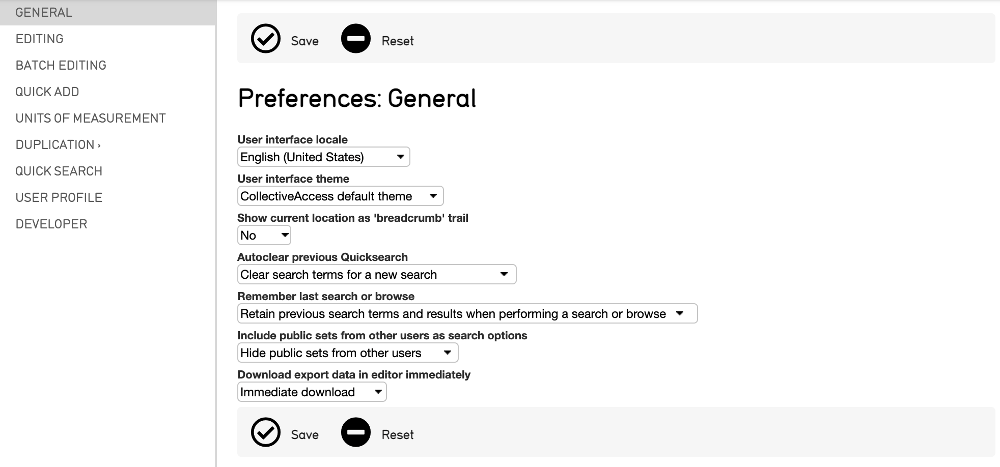
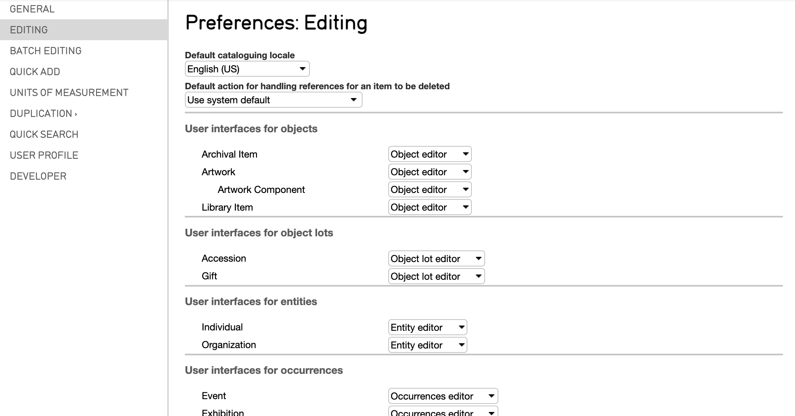
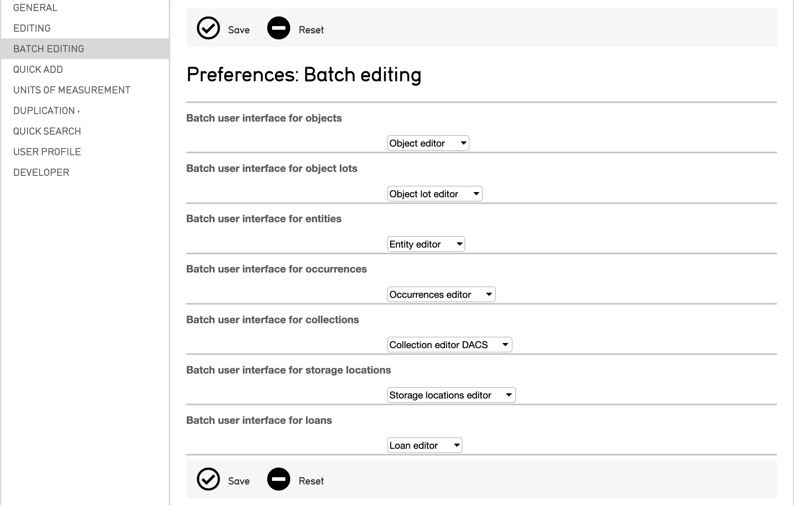
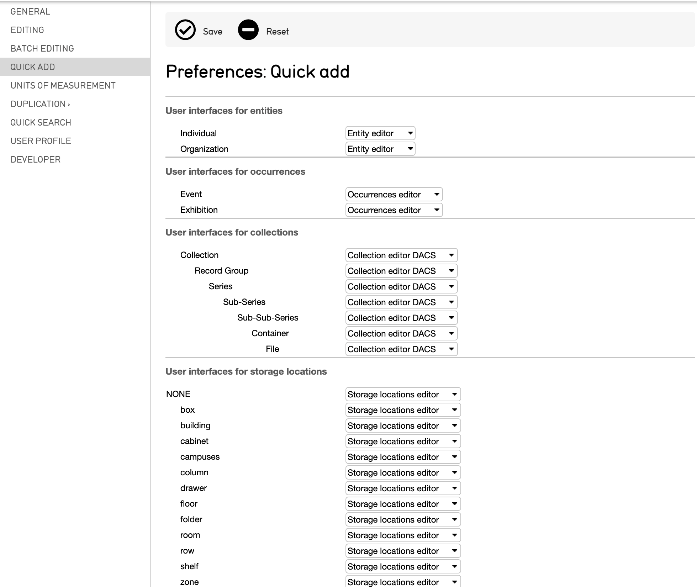
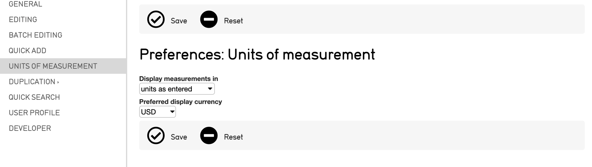
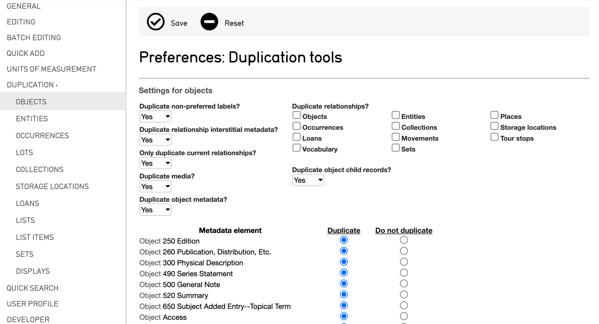
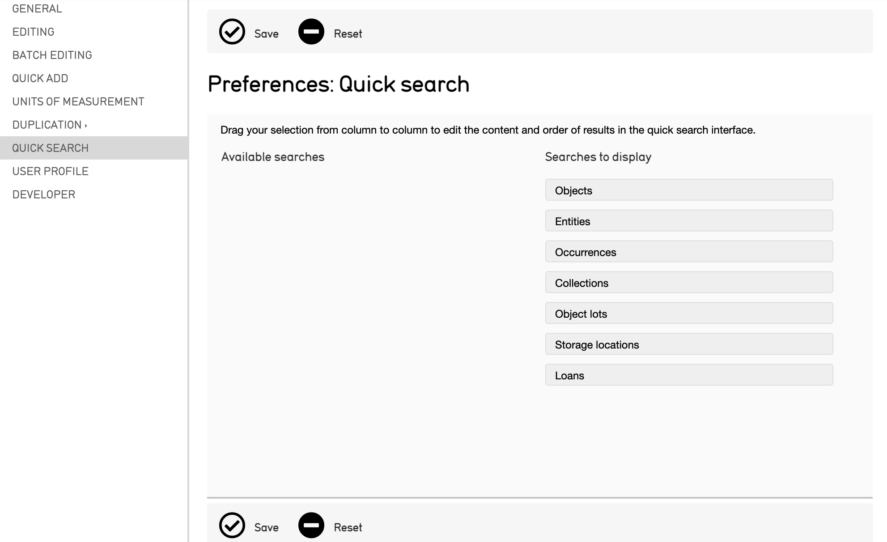
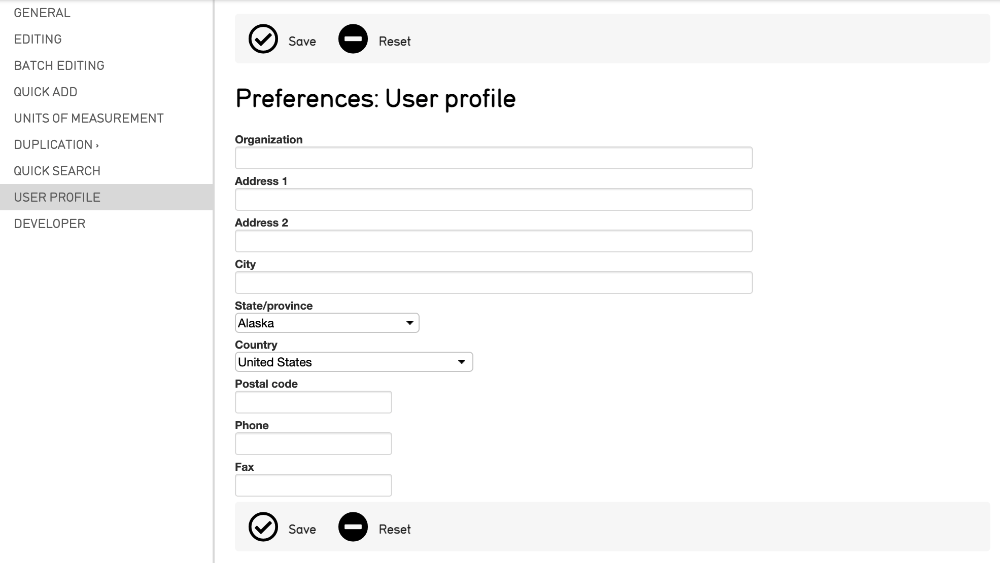

Preferences
===========

Every CollectiveAccess system has editable preferences to help manage, tailor, and streamline the cataloging processes available in a system. Preferences are key to any system as they determine how information is displayed. 

To manage these preferences, navigate to **Manage > My Preferences**, where all preferences will be displayed: 

Supported preferences include General, Editing, Batch Editing, Quick Add, Units of Measurement, Duplication, Quick Search, User Profile, and Developer. 

For new users, CollectiveAccess supports system-wide default preferences. Preferences can be accessed any time by selecting Preferences at the bottom of any user interface in CollectiveAccess. Below, each preference is explained in further detail. 

General
-------

General preferences determine various aspects about the CollectiveAccess system, ranging from languages to search and browse histories. These preferences include: 

* **User interface locale**: A dropdown menu of locales (languages). Determines the language used in menus, informational text and the user interface. This setting will not affect the other languages you have configured for cataloging purposes.
* **User interface theme**: Currently, there is only one theme included in the standard CollectiveAccess installation. However, should you choose to design your own theme, you can select that option here.
* **Show current location as ‘breadcrumb’ trail**: Displays or hides the breadcrumb trail,  the current location and path within the system.
* **Autoclear previous QuickSearch**: Determines whether or not search terms remain available in the QuickSearch field after a search has been completed. 
* **Remember last search or browse**: Determines if the last performed search or browse is kept after navigating away from the results display.
* **Include public sets from other users as search options**: Determines whether sets are marked as public from other users in the search tools set list. 
* **Download export data in editor immediately**: Exported data from a record in the system can be downloaded immediately, or, there are options to rename the file, and upload it to GitHub or ResourceSpace.

Editing
-------

Preferences set in Editing help determine the user interface editors for the different primary tables in a given system (Objects, Object Lots, Entities, and so on). These preferences include:

   Part of the Editing Preferences screen.

* **Default cataloguing locale**: Select the default language for  the system if there are multiple locales set for a system. 
* **Default action for handling references for an item to be deleted**: Select the default behavior for when a record is deleted in the system, including moving those references to another record, or deleting the record’s references altogether.
* **User interfaces for objects**: Selects which Editor to use when editing Objects.
* **User interfaces for object lots**: Selects which Editor to use when editing Object Lots. 
* **User interfaces for entities**: Selects which Editor to use when editing Entities.  
* **User interfaces for occurrences**: Selects which Editor to use when editing Occurrences. 
* **User interfaces for collections**: Selects which Editor to use when editing Collections.
* **User interfaces for storage locations**: Selects which Editor to use when editing Storage Locations. 
* **User interfaces for loans**: Selects which Editor to use when editing Loans. 
* **User interfaces for lists**: Selects which Editor to use when editing Lists. 
* **User interfaces for list items**: Selects which Editor to use when editing List Items. 
* **User interfaces for sets**: Selects which Editor to use when editing Sets. 
* **User interfaces for display lists**: Selects which Editor to use when editing Display Lists. 
* **User interfaces for representation annotations**: Selects which Editor to use when editing Representation Annotations. 

Batch Editing
-------------

Batch Editing is a simple way to make uniform changes to batches of data in CollectiveAccess.  Preferences for Batch Editing are most relevant when there is more than one user interface for a given primary table in the system configuration. When all users share essentially the same UI's, then the settings here will be automatic. If not, they should match the settings applied in the "Editing" tab.

Preferences for Batch Editing include:

* **Batch user interface for objects**: Selects which Editor to use when Batch Editing Objects.
* **Batch user interface for object lots**: Selects which Editor to use when Batch Editing Object Lots. 
* **Batch user interface for entities**: Selects which Editor to use when Batch Editing Entities. 
* **Batch user interface for occurrences**: Selects which Editor to use when Batch Editing Occurrences. 
* **Batch user interface for collections**: Selects which Editor to use when Batch Editing Collections. 
* **Batch user interface for storage locations**: Selects which Editor to use when Batch Editing Storage Locations. 
* **Batch user interface for loans**: Selects which Editor to use when Batch Editing Loans. 

Quick Add
---------

The Quick Add feature enables the set up of a new record when a relationship look-up does not generate any results. Quick Add provides one editing screen, and with Quick Add preferences the relevant user interface can be set. These preferences include: 

   Part of the Quick Add Preferences screen.

* **User interfaces for entities**: Selects which Editor to use when Quick Adding user interfaces for relationships via Entity records.
* **User interfaces for occurrences**: Selects which Editor to use when Quick Adding user interfaces for relationships via Occurrence records. 
* **User interfaces for collections**: Selects which Editor to use when Quick Adding user interfaces for relationships via Collection records. 
* **User interfaces for storage locations**: Selects which Editor to use when Quick Adding user interfaces for relationships via Storage Location records.
* **User interfaces for list items**: Selects which Editor to use when Quick Adding user interfaces for relationships via List Item records. 

Units of Measurement
--------------------

The preferences for Units of Measurement in a record’s editor screen, including currency and measurement units, can be specified here. These preferences include:

* **Display measurements in**: Choose the units to display measured quantities in a record’s editor screen. Selecting “units as entered” will display any measurements in the form in which they were entered into the system; other options are available in the drop down menu. 
* **Preferred display currency**: Determines the preferred currency to use for display in a record’s editor screen. A drop down of supported currencies are available to choose from in the drop down menu. 

Duplication
-----------

Duplication allows for the creation of a new record that has significantly similar metadata to an existing record. In order to avoid merely duplicating records exactly, Duplication preferences dictate exactly which components will be duplicated for a given primary table. Duplication preferences can be set for the following primary tables: Objects, Entities, Occurrences, Lots, Collections, Storage Locations, Loans, Lists, List Items as well as for Sets and Displays. 

   Part of the Duplication Preferences screen, showing settings for Objects.

Each Duplication setting adherest to a primary table in CollectiveAccess, Sets, List Items, Lists, or Displays. Various options exist that determine exactly which metadata will be replicated when duplication is enabled; these can be set by selecting the button under **Duplicate** or **Do not duplicate.**

Settings are included for Objects, Entities, Occurrences, Lots, Collections, Storage Locations, Loans, Lists, List Items, Sets and Displays. 

Quick Search
------------

QuickSearch preferences enable the editing of the content, and order, of search results in the QuickSearch interface in CollectiveAccess. The results are pulled from primary tables in CollectiveAccess.

To set these preferences, each primary table can be dragged and dropped under the proper column, **Available searches** or **Searches to display.**

User Profile
------------

Create a simple user profile by entering relevant user information.

Developer
---------

Developer preferences can be set to show more details about field bundle codes, template debuggers, and query details. 

.. :image:: preferences10.png
   :scale: 50%
   :align: center

These preferences include: 

* **Show query details in search builder interface**: Show or Hide text generated by the search builder interface. 
* **Show template debugger**: Show or Hide template debugger on editor Summary screens within records. 
* **Show bundle codes**: Show or Hide CollectiveAccess bundle codes next to each field in record editor screens. 
