.. _import_c_import_tutorial:

Tutorial: Import Mapping Spreadsheet
====================================

* `Import Mapping Spreadsheet: Column Overview`_ 
* `Settings`_
* `Column 1: Rule Types`_
* `Column 2: Source`_
* `Column 3: CA_table.element_code`_
* `Column 4: Group`_
* `Column 5: Options`_ 
* `Column 6: Refinery`_ 
* `Column 7: Refinery Parameters`_
* `Column 8: Original Values`_ 
* `Column 9: Replacement Values`_
* `Column 10: Source Description`_ 
* `Column 11: Notes`_

This Tutorial goes through each step of an import mapping spreadsheet, using sample data, a sample spreadsheet, and a sample installtion profile. 

Helpful Resources
^^^^^^^^^^^^^^^^^

To follow along with this tutorial, download the following three files:

:download:`Sample Import Mapping Spreadsheet <sample_mapping_tutorial.xlsx>`

:download:`Sample Import Data (Source Data) <sample_import_data_tutorial.xlsx>`

:download:`Sample Installation Profile <Sample_import_profile.xml>`

:download:`Blank Sample Import Mapping Spreadsheet <Blank_starter_import_mapping.xlsx>`

`Import Reference Pages <file:///Users/charlotteposever/Documents/ca_manual/providence/user/import/import_reference.html>`_

`JSON Online Validator and Formatter <https://jsonlint.com/>`_ 

Import Mapping Spreadsheet: Column Overview
-------------------------------------------

Download and open the Sample Import Data (Source Data) and the Sample Import Mapping Spreadsheet. When opened, the Sample Import Data (Source Data) will look like this: 

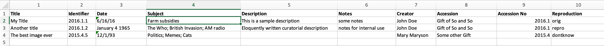

   The Sample Import Data (Source Data). Note the columns numbered 1-10. 

When opened, the Sample Import Mapping Spreadsheet will look like this: 

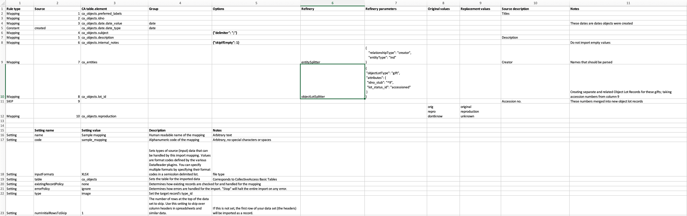

   The Sample Import Mapping Spreadsheet. 

Note that in the Sample Import Data, columns are numbered 1-10 in Excel. These numbers appear in Column 2 of the Sample Import Mapping Spreadsheet. Read on for a basic overview of each aspect of the Sample Import Mapping Spreadsheet and how it relates to the Sample Import Data (Source Data).

Settings
--------

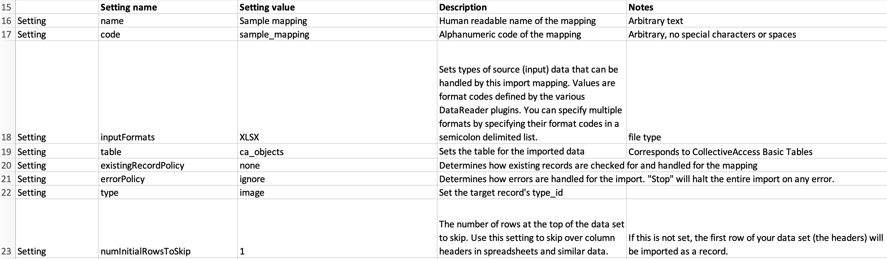

   Settings defined in the bottom part of the Sample Import Mapping spreadsheet. 

Settings are a basic part of every import mapping that define certain aspects of the import, and also determine how the imported data will be treated in CollectiveAccess. In the sample import mapping spreadsheet, the Settings can be found at the bottom of the spreadsheet, pictured above. 

In the Settings of the sample mapping, the name of the spreadsheet file, in arbitrary text and with no special characters or spaces, is provided: **Sample mapping**, and **sample_mapping**. In addition, the input format of the source data is specified in the Settings of any import mapping spreadsheet, telling CollectiveAccess what file format the original data comes in. Since the sample data provided is in **Excel (XLXS) format**, that type has been selected. 

The source data refers to objects, therefore, the Table is set to **ca_objects**; the source data will therefore be imported as object records. Other Settings provided determine how existing records (if any) are checked against the import, how errors in the import are handled, the type, and any rows in the spreadsheet that should be skipped. 

For this tutorial, it is assumed that *no records* have been imported previously into CollectiveAccess; this sample is the first import. Therefore, the **existingRecordPolicy** is set to **none**. The number of rows to skip is set to *1*; looking at the sample import data provided, the very first row of the spreadsheet is not actually data, but includes heading titles that are not needed upon import. Setting numInitialRowsToSkip to 1 tells the importer to ignore that heading row. However, this number is arbitrary, and depends on the format of the source data. Descriptions and other notes regarding these settings are provided in the Settings section for additional clarity. 

Column 1: Rule Types
--------------------

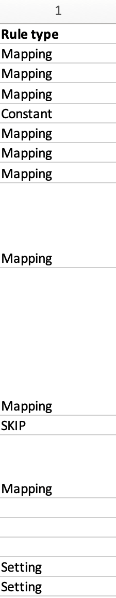

   Rule Type Column in the sample import mapping spreadsheet. Note that these are selected from a pre-existing drop-down menu.

Rule Types are the first column in an import mapping. The rules that are set in this column determine how each row in the mapping spreadsheet will be imported. 

* **Mapping**: The row can be mapped, meaning it will be imported. 
* **SKIP**: The row will not be imported. 
* **Constant** The row will be set to a constant value. 
* **Setting**: The row is a Setting. 
* **Rule**: Rules will be applied to the mapping. For more, see `Rules <file:///Users/charlotteposever/Documents/ca_manual/providence/user/import/rules.html>`_. 

.. note: Only rule types corresponding to specific settings in the import mapping should be set to Setting. For rows that correspond to data, do not use this rule type. 

In the sample import mapping spreadsheet, the rule types Mapping, SKIP, and Constant are used. Since each column from the sample data corresponds to a single row in the import mapping spreadsheet, the same number of rule types must be set as there are columns of metadata. 

The use of SKIP and Constant is arbitrary and will depend on the source data, what will be included in the import, and how. 

Most importantly, in order to import any data into CollectiveAccess, rule types for data that will be imported must be set to Mapping (with a few exceptions; these will be explained and clarified further on in the tutorial). If the rule type is not set to Mapping for any data that needs to be included in the import, the data simply will not show up in CollectiveAccess. 

Column 2: Source
----------------

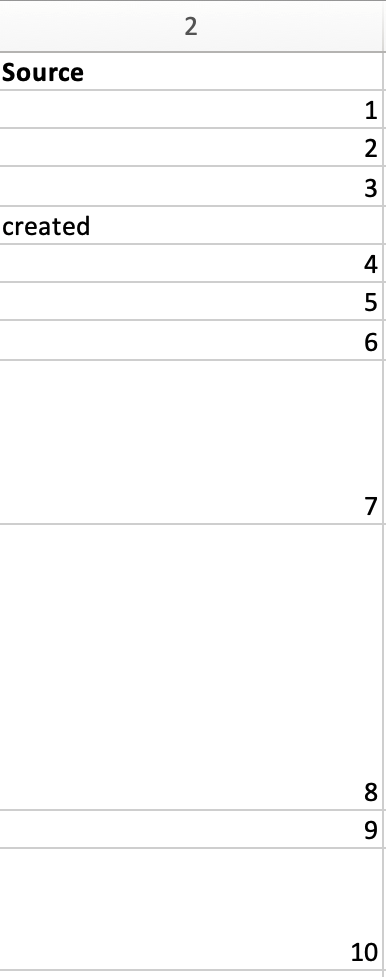

   The Source Column in the sample import mapping spreadsheet. Note that the values are numbers 1-10, and correspond to columns 1-10 in the sample import data. Note the value “created” in row 5 has the rule type Constant in Column 1.  

The second column in the import mapping spreadsheet is where specific source data columns are cited. This column declares the source data’s location in the sample data spreadsheet, forming the first part of the crosswalk. Depending on the format of the source data, this column will look different; since the sample import data is in Excel format, the values in this column correspond to the column numbers from the sample import data (1, 2, 3, and so on); however, if the source data is in another supported file format, values in this column will be different. 

There are 10 columns of data provided in the sample data spreadsheet, and consequently, there are 10 rows of values in the sample mapping. Constant data values are set and defined in this column (only if the rule type is set to “Constant,” such as in row 5 of the import mapping spreadsheet). In this case, the source column, instead of a number from the source data spreadsheet, will be set instead as the value or list item idno from the CollectiveAccess configuration as defined in the sample profile. In the sample import mapping, this value is located in row 5 and is set to “created.” 

.. note:: Source data columns may also be referenced elsewhere in the import mapping (generally in the Options or Refinery columns described below) by prefixing the column number with a caret “^” (for example, “^10”), which indicates to the mapping that the value from column 10 should be inserted. This allows multiple columns to be combined by using Options, and is frequently used within Refineries to create detailed related Entities, Collections, and other more complex parameters. An example of this is seen in row 10 of the import mapping spreadsheet, in column 7. 

Column 3: CA_table.element_code
-------------------------------

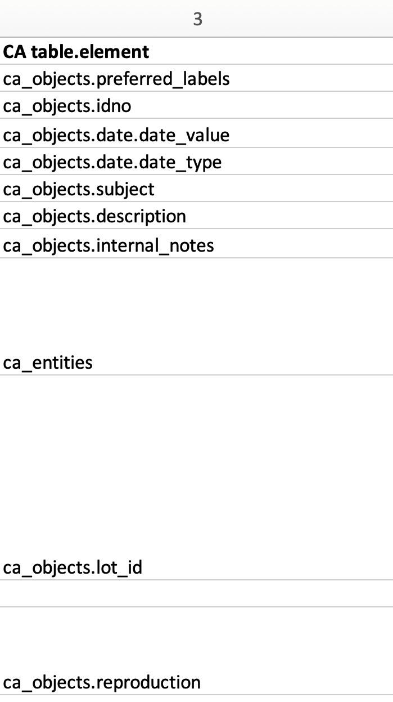

   Column 3 in the sample import mapping spreadsheet. Note the format of the values in this column correspond to CollectiveAccess bundle codes.

The destination, or target, in CollectiveAccess for each column of source data is defined in the third column of the import mapping spreadsheet. This column forms the second part of the crosswalk. 

It is necessary to use a **ca_table.element_code** value in this column, as this declares the specific location where the source data will live once imported into CollectiveAccess. Each code corresponds to a specific metadata field in CollectiveAccess. 

In the sample import mapping spreadsheet, most of these bundle codes begin with **ca_objects**, which refers to the `primary table <file:///Users/charlotteposever/Documents/ca_manual/providence/user/dataModelling/primaryTables.html?highlight=primary+table>`_. This is also defined in the **Table** in the Settings. These codes are explained in more detail `here <file:///Users/charlotteposever/Documents/ca_manual/providence/user/import/import_ref_bundlecodes.html#import-import-ref-bundlecodes>`_. 

In the sample source data, Column 1 contains all Titles for the objects, while Column 2 contains all Identifiers belonging to the objects. In the sample import mapping spreadsheet, Column 1 (Titles: source) will be mapped in CollectiveAccess as **ca_objects.preferred_labels** (Titles: destination). Column 2 (Identifiers: source) will be mapped in CollectiveAccess as **ca_objects.idno** (Identifiers: destination), and so on. Simply match the contents of the source data with the corresponding field in CollectiveAccess. 

Data usually contains references to related tables, such as related Entities, Object Lots, Collections, Storage Locations, and so on. When an import mapping includes references to a table outside of the primary table defined in the Settings (in this example, **ca_objects**), simply cite that table name in this column. For example, Column 7 in the Source column is cited just as **ca_entities** (row 9). 

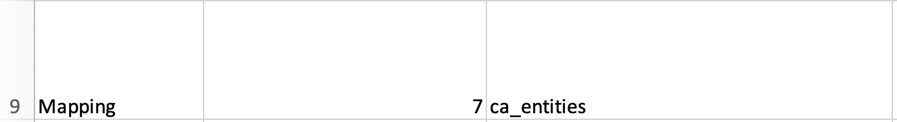

   Column 7 mapped to **ca_entities.** 

For more, see `Using Bundle Codes in an Import Mapping <file:///Users/charlotteposever/Documents/ca_manual/providence/user/import/import_ref_bundlecodes.html#import-import-ref-bundlecodes>`_. 

Column 4: Group
---------------

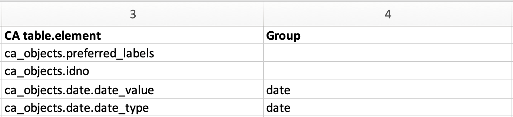

   Columns 3 and 4 of the sample import mapping, showing a custom group made for the Date field.

Column 4 of the import mapping spreadsheet is used for declaring Groups. The presence of Groups is optional, but is required for metadata elements being mapped in a **Container**. A container is a metadata element or field that contains sub-elements; in the sample mapping, this metadata element is Date. Sub-elements defining the date and date type reside within the metadata element Date. Using Groups is a simple way to ensure that all mappings to a Container actually end up in the same Container instance. For more, see `Containers <file:///Users/charlotteposever/Documents/ca_manual/providence/user/import/containers.html#import-containers>`_. 

In the sample import mapping, two sub-elements of **ca_objects.date** are declared as the bundle codes **ca_objects.date.date_value** and **ca_objects.date.date_type**. In order to import to specific sub-elements within a Container, the element codes for both the Container itself, **ca_objects.date**, as well as the code for the sub-element that is your ultimate target, **date_value** and **date_type**, must be cited. 

The Group created for the Date field in the sample import mapping is simply called “date,” but with any import mapping, the name of the group can be custom and arbitrary. To map elements to the same container, however, the name of the Group must match. 

Column 5: Options
-----------------

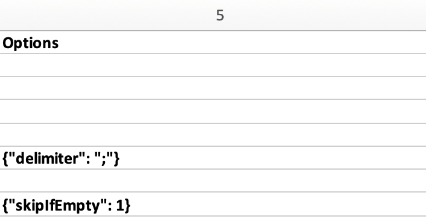

   Column 5 with two Options defined in the import mapping spreadsheet. 

Options are used to set a variety of conditions on the import itself. Options can process data that needs cleaning up, skip empty data cells, or format data with specific templates. Options must be written in code (`JSON <https://www.json.org/json-en.html>`_). In the sample import mapping, two common options are used to set conditions on particular columns of source data being imported. 

Row 6 in the sample import mapping corresponds to Source column 4 in the sample import data. Two records in Source column 4 have multiple subject values in the same cell, separated by semicolons: 

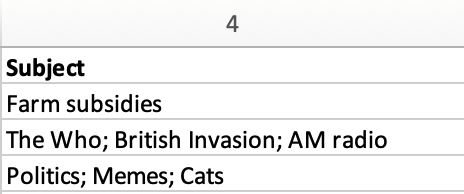

Setting the delimiter option in the import mapping (see Row 6, Column 5) is necessary, as it ensures that these values with semicolons get parsed properly, and imported to discrete instances of the Subject field in CollectiveAccess. Defining the delimiter as a semicolon ensures that the values are separated on the semicolons present in the source data. Without the delimiter option, the entire string would end up a single instance of the Subject field.

Row 8 of the import mapping spreadsheet corresponds to Source column 6 in the sample import data, which contains free text internal notes. However, only two records contain these notes; the other record has an empty cell in this column: 

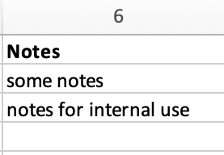

Using the **skipIfEmpty** option ensures that the empty value in this column does not get imported into the Collective Access system. Declaring the number one after the colon in the Option indicates that the cell will be skipped if empty (1= yes, 0= no). 

For a list of common options used in an import mapping spreadsheet, see the table below. For a full list of mapping options, see `Mapping Options <file:///Users/charlotteposever/Documents/ca_manual/providence/user/import/mappings/mappingOptions.html?highlight=options>`_. 

.. csv-table:: 
   :header-rows: 1
   :file: common_mapping_options.csv

Column 6: Refinery
------------------

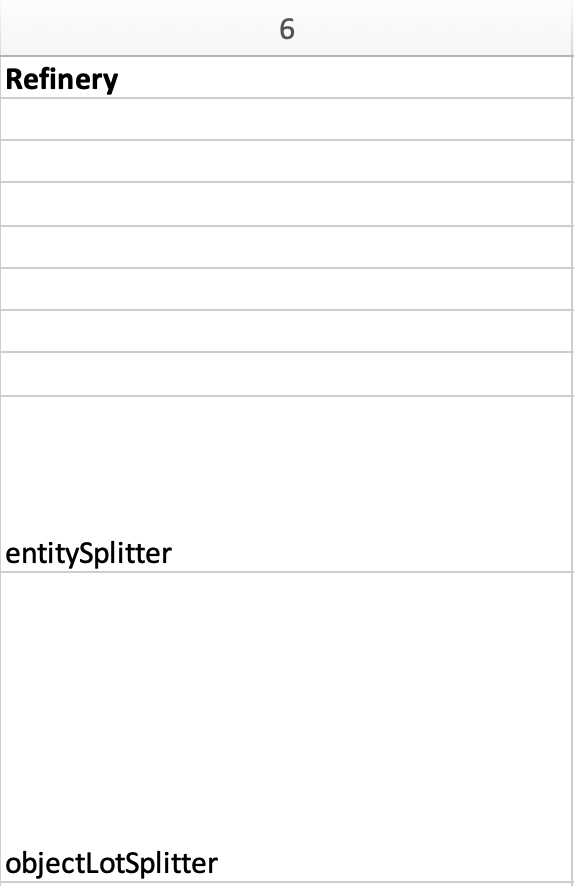

   Column 6 in the import mapping spreadsheet contains two refineries. 

Refineries are used to take a specific data format from the source data, and transform it via a specific behavior as it is imported into CollectiveAccess. Refineries can create related records as well as match on existing records in CollectiveAccess. Refineries are optional, although are commonly used in source data that references other related tables.  

In the sample import mapping spreadsheet, note that Refineries are not used in every row of data (remember that each row represents a column from the source data). They are only present for rows 9 and 10 in the sample import mapping, or columns 7 and 8 from the sample import data. These rows reference two other Tables: Entities and Object Lots: 

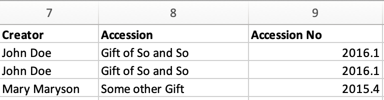

To create new, separate, and related records for Entities and Object Lots, Refineries are needed. 

Columns 7 and 8 in the source data contain values for Creators and Accessions. Note that in the sample import mapping, all records are being imported as **ca_objects** records. But, these two columns do not reference object metadata. By using the Refinery **EntitySplitter** for column 7, separate and related Entity records are made from the Creators column. By using the Refinery **ObjectLotSplitter** for column 8, separate and related Object Lot records are made from the Accession column. 

See the table below for a list of common refineries. For a full list of refineries, see `Refineries and Refinery Parameters <file:///Users/charlotteposever/Documents/ca_manual/providence/user/import/mappings/refineries.html?highlight=refineries>`_. 

.. csv-table::
   :header-rows: 1
   :file: common_refineries.csv

Column 7: Refinery Parameters
-----------------------------

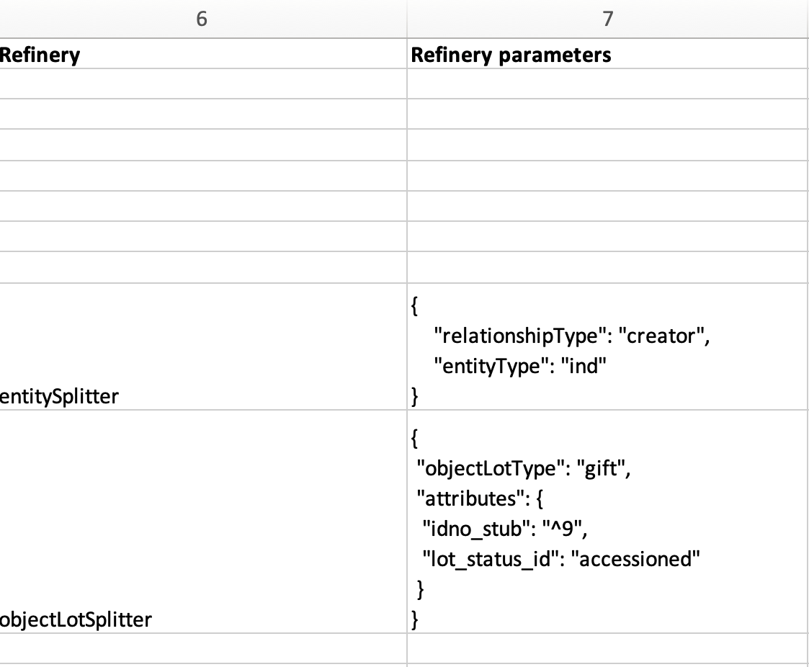

   Columns 6 and 7 in the import mapping spreadsheet showing Refineries and the related Refinery Parameters, written in code. 

Refinery Parameters define the conditions for the refinery being used in the import mapping. Each time a Refinery is used in a mapping, a Refinery Parameter must be used to tell the importer exactly how to manipulate the source data, and create separate records. Like Options, Refinery parameters are written in code (JSON). 

In the sample import mapping, the Refinery **EntitySplitter** indicates that separate and related Entity records will be created from the Creators column in the source data. The Refinery Parameter simply specifies the relationship type that these records will have to other object records in the import (creator), as well as specifies the type of entity being created (individual). See `Using Lists and Vocabularies in an Import Mapping <file:///Users/charlotteposever/Documents/ca_manual/providence/user/import/lists_and_vocab_in_mapping.html#import-lists-and-vocab-in-mapping>`_ for more. 

The Refinery **ObjectLotSplitter** indicates that separate and related Object Lot Records will be created from the Accession column in the source data. The Refinery Parameter specifies that these Object Lot records will be displayed as “gifts,” and will contain the Accession Number from column 9 in the source data. 

See the table below for a list of common refinery parameters. For a full list of refineries and refinery parameters, see `Refineries and Refinery Parameters <file:///Users/charlotteposever/Documents/ca_manual/providence/user/import/mappings/refineries.html?highlight=refineries>`_. 

.. csv-table::
   :header-rows: 1
   :file: common_refinery_parameters.csv

Column 8: Original Values
-------------------------

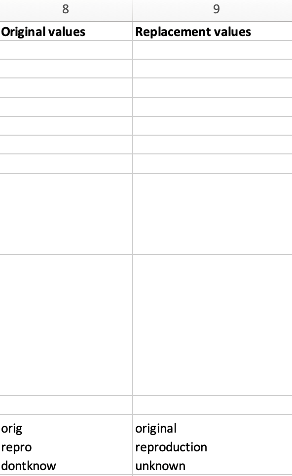

   Original values appear in row 12 of the import mapping spreadsheet. 

Certain values in the source data may need to be replaced with new values upon import. This is a common scenario in data that does not exactly match on a list item code for corresponding values in CollectiveAccess, but needs to match, to be imported correctly. This is an optional column, depending on the format of the source data. 

In the sample import data, Column 10 contains the following values: 

In the sample import mapping, three values are present in row 12. 

However, these values do not exist in a predetermined list in CollectiveAccess. By using original and replacement values, upon import, these values are transformed from “orig” to “original,” from “repro” to “reproduction,” and from “dontknow” to “unknown,” so that these values can match on the list item code for any corresponding values in CollectiveAccess. This ensures important data is kept, but changes its formatting to match that in CollectiveAccess. 

For more on the use of Original and Replacement Values, see `Use of Original Value/Replacement Value Columns <file:///Users/charlotteposever/Documents/ca_manual/providence/user/import/orig_replace_example.html>`_. 

Column 9: Replacement Values
----------------------------

   Replacement values in column 9 of the import mapping spreadsheet. 

This column is where the new values in a corresponding list item code for CollectiveAccess are input, which will be replacing the original values in the sample import data. Multiple values can be added to a single cell (shown above), as long as the replacement values match the original values line by line. Using the Original and Replacement columns is sufficient for transforming a small range of values upon import. 

Column 10: Source Description
-----------------------------

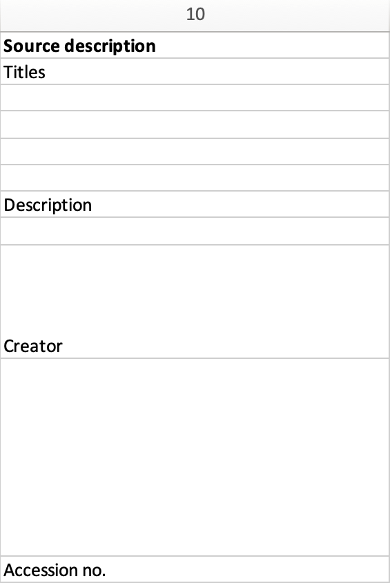

   Source descriptions in the import mapping spreadsheet. 

This is an optional column in the import mapping spreadsheet. Source Description is where a plain text label or name for the original source column can go; this allows for easy reference to which fields are being mapped, and can make workflow easier when creating an import mapping. 

In the sample import mapping, a few of these values have been copied from the sample import data spreadsheet, indicating which rows contain which values from the sample source data. 

Column 11: Notes
----------------

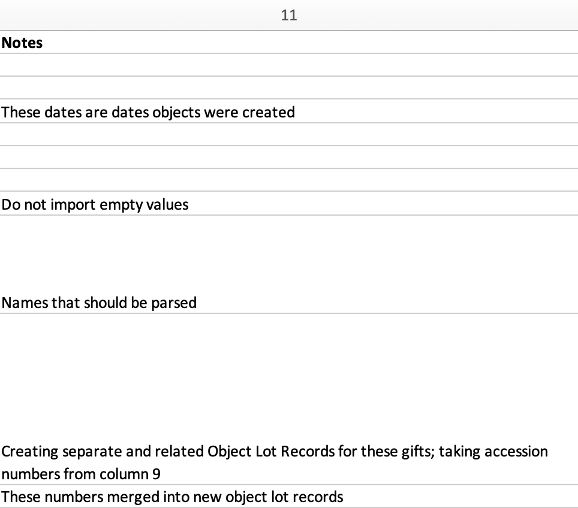

   Notes in the import mapping spreadsheet.

This is an optional column in the import mapping spreadsheet which provides a space to explain how and why a certain line is mapped in the manner that it is. Both Column 10 and 11 in the import mapping spreadsheet can be useful for future reference if a mapping is intended to be used repeatedly, to ensure that the selected mapping matches the source data. In addition, Notes are also useful if mappings are collaborative effort, as they can explain in plain text why certain decisions were made. 

In the sample import mapping, these Notes include short comments clarifying various aspects of the mapping. 

