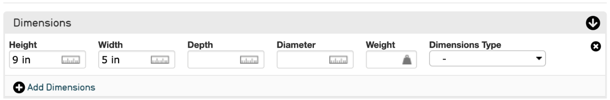

.. _import_containers:

Containers
==========

What is a Container?
--------------------

A **Container** is a metadata element, or field, in CollectiveAccess that contains sub-elements *within it*. Unlike all other attribute types, Containers do not represent single data values; their sole function is to organize attributes into groups for display on the user interface. 

A multi-attribute value set in CollectiveAccess will have a Container serving as the *top* of the attribute hierarchy. Within this Container are sub-elements, falling below the top level of the attribute hierarchy. Other Containers may serve to further group items in the multi-attribute set into sub-groups, displayed on separate lines of a form.

For example, an Address field in CollectiveAccess has separate attributes for Street Number, City, State, Country, and Postal/Zip Code. The top of the attribute hierarchy is “Address,” with the sub-elements Street Number, City, State, Country, and Postal/Zip Code: 

   An Address field from an Entity Record in the CollectiveAccess Demonstration System. Here, "Address" is the Container. 

Dimensions are another common Container in CollectiveAccess, as this field contains sub-elements that specify the measurement itself, unit of measurement used, and can also include weight and the type of dimension in a dropdown list. Within this Container are the sub-elements: Height, Width, Depth, Diameter, Weight, and Dimensions Type.

   A Dimensions field from an Object Record in the CollectiveAccess Demonstration System. Here, "Dimensions" is the Container.

.. note:: Containers may contain different sub-elements depending on the installation profile of your CollectiveAccess System; all of these examples of Containers are taken from the  `CollectiveAccess Demonstration System <https://demo.collectiveaccess.org/>`_. 

Containers in an Import Mapping Spreadsheet 
-------------------------------------------

Individual source data can be mapped directly to these sub-elements within a Container in an import mapping spreadsheet using Groups: 

   Mapping two date fields into a Container called "date." 

Where both fields are mapped to their specific **ca_table_element.code**, and they are grouped together by the Group called "date." 

For Containers, an additional step is required to make sure each element gets mapped correctly. For example, 

For more on the function of Groups, how to use Groups in an import mapping, and how to map source data into specific Containers in CollectiveAccess, please see `Creating an Import Mapping: Overview <file:///Users/charlotteposever/Documents/ca_manual/providence/user/import/c_creating_mapping.html>`_ and `Tutorial: Import Mapping Spreadsheet <file:///Users/charlotteposever/Documents/ca_manual/providence/user/import/c_import_column_overview.html>`_. 

For more on the use of the Rule Type Constant, shown above, see `Using the Constant Rule Type in an Import Mapping Spreadsheet <file:///Users/charlotteposever/Documents/ca_manual/providence/user/import/import_ref_constant_rule.html#import-import-ref-constant-rule>`_. 

