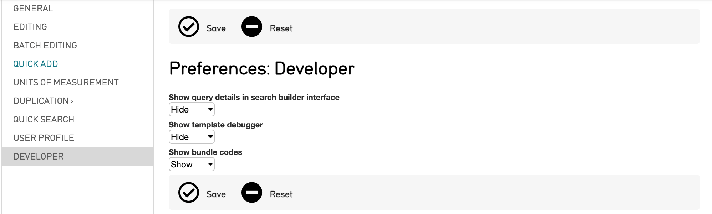
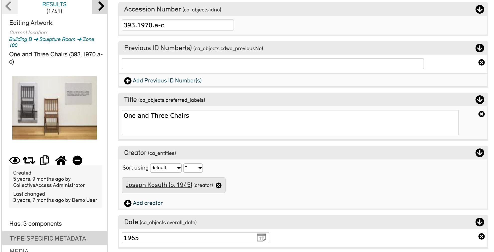

.. _import_import_ref_bundlecodes:

Using Bundle Codes in an Import Mapping Spreadsheet
===================================================

Bundle Codes: CA table.element Codes
------------------------------------

Bundle codes are a necessary part of creating an import mapping. As the second part of the crosswalk, where the data’s destination in CollectiveAccess is defined, they are a key part of making an import mapping work correctly. Codes are mapped in Column 3 of an import mapping spreadsheet.

How are CA table.element codes formatted?
-----------------------------------------

In an import mapping, **CA table.element** codes must be formatted and copied correctly. 
Codes are divided into two components by a period. To the left is the **ca_table**, which corresponds to CollectiveAccess basic tables (see `Primary Tables <file:///Users/charlotteposever/Documents/ca_manual/providence/user/dataModelling/primaryTables.html?highlight=tables>`_). To the right is the **element_code**, which is simply the unique code assigned to any particular metadata element, or field, in a CollectiveAccess configuration.

The table used in the first part of the **CA table.element code**  will likely correspond (in most, but not all cases) to the table you declared in the Setting table of the import mapping spreadsheet.

Some common examples include:

* ca_objects.preferred_labels
* ca_entities.preferred_labels
* ca_storage_locations.preferred_labels

Where **ca_objects**, **ca_entities**, and **ca_storage_locations** are all referencing CollectiveAccess basic tables, and **preferred_labels** is referencing a specific field in CollectiveAccess. Fields will vary based on system configuration and what fields are available. 

There are a few exceptions that require slightly different values to be placed in Column 3. See `Creating an Import Mapping: Overview <file:///Users/charlotteposever/Documents/ca_manual/providence/user/import/c_creating_mapping.html#column-3-ca-table-element>`_ and `Tutorial: Import Mapping Spreadsheet <file:///Users/charlotteposever/Documents/ca_manual/providence/user/import/c_import_tutorial.html>`_ for more. 

To import data of one basic table (like **ca_objects**) while also creating and related records of other tables (like **ca_entities**), use Refineries. For more, see `Refineries and Refinery Parameters <file:///Users/charlotteposever/Documents/ca_manual/providence/user/import/mappings/refineries.html?highlight=refineries>`_.

Finding Bundle Codes
--------------------

It’s possible to find bundle codes in a system that houses existing records, as well as in an empty CollectiveAccess system. To find the necessary CA table.element codes to use in an import mapping spreadsheet: 

1. In CollectiveAccess, navigate to **Manage > My Preferences > Developer.**
2. Under **Show bundle codes**, select **Show**:

3. Select **Save** to save these preferences.

In an empty CollectiveAccess system (with no records imported), navigate to the **New** tab at the top of the navigation bar. Create any kind of new record, hit save, and the bundle codes for each field will be displayed. 

It’s necessary in a blank system to create a new test record and save it, so that all metadata screens will be available. If this is not done, only selected fields will display. 

In a system with prior existing records, navigate to any record’s page. The CA table.element codes will be displayed to the right of each metadata field. 

Selecting the CA table.element code from the record’s interface will copy the code to the clipboard. This makes copying and pasting CA table.element codes easy and efficient, so no mistakes are present in the import mapping spreadsheet. 
