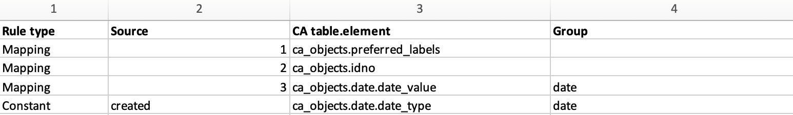
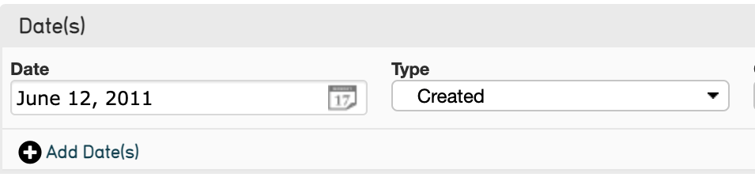
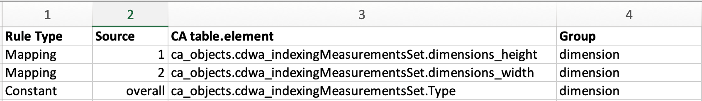
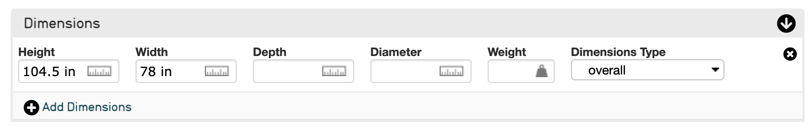

.. _import_import_ref_constant_rule:

Using the Constant Rule Type in an Import Mapping Spreadsheet
=============================================================

What is the Constant Rule Type?
-------------------------------

Rule Types are the first column in an import mapping. The rules that are set in this column determine how each row in the mapping spreadsheet will be imported: the row can be mapped, meaning it will be imported; skipped, meaning the row will not be imported; can be set to a constant value; can be set to rule; or can be set to a setting.

In the sample import mapping spreadsheet, the rule types **Mapping**, **SKIP**, and **Constant** are used. Since each column from the sample data corresponds to a single row in the import mapping spreadsheet, the same number of rule types must be set as there are columns of metadata.

The use of Constant is arbitrary and will depend on the source data, what will be included in the import, and how. Constant sets an arbitrary constant value once the data is imported, usually within a `Container <file:///Users/charlotteposever/Documents/ca_manual/providence/user/import/containers.html>`_. As well as setting the Constant Rule Type in the Rule Type Column (Column 1 in an Import Mapping Spreadsheet), when using Constant, the Source Column (Column 2 in an Import Mapping Spreadsheet) must be set to a text value. Add the value to the Source Column, and the value will be set in the corresponding metadata element for every record that is imported. 

Example of Constant Rule Type: Dates
------------------------------------

The following example assumes that source data contains a date value, as well as a description of the date (a date type). In CollectiveAccess, date types can be expressed through a drop-down menu. 

In the sample import mapping below is an example of using the Constant rule type to map dates: 

   The Constant Rule Type used in the Sample import mapping spreadsheet. Note the text in the Source column, as well as the Group “date” in the Group column. 

Although there is only one date field in the sample source data, **two** mapping rows relating to the date are needed in the import mapping to accommodate the date itself, and the type of date described. 

The date value (the date itself) and the date type (the value “created”) must be mapped separately, because the Date field in CollectiveAccess is a Container with two sub-elements: the date value, and the date type. Therefore, the date (date itself) (Column 3 of the source data) is mapped to the CA table.element **ca_objects.date_value**, while the date type (described by the constant “created”) is mapped to the CA table.element **ca_objects.date_type**. To ensure they get mapped to the same Container, a Group called “date” has been used in Column 4  (see above). 

Anytime Constant is used in an import mapping spreadsheet, a separate row must be created to accommodate whatever is being defined by the Constant Rule, in addition to mapping the “original” value. Often, a Group must also be used to ensure the two values get mapped into the same Container in CollectiveAccess. 

When imported in CollectiveAccess, the date and date type will display within the Date Container like so: 

With the date itself being arbitrary, and Created being set for each date as defined in the mapping spreadsheet by the use of Constant. 

Example of Constant Rule Type: Measurements
-------------------------------------------

Another scenario in which the Constant Rule Type could be used is with measurement fields. In CollectiveAccess, measurements are usually located within a Container; therefore, each measurement must be mapped to that particular element code, similarly to the Date example above. Often there is a measurement type drop-down, which should be set to a constant value. 

Using the Constant rule Type to map measurements into CollectiveAccess would look like the following. 

   An example mapping of dimension fields, using the Constant Rule Type. 

Once imported into CollectiveAccess, the dimension field would look like: 

With the dimensions mapped to Height and Width values in the Dimensions Container, and the dimension type automatically set from the drop-down menu to overall. All three source columns are mapped to the Group “dimension,” ensuring that they appear in the Dimensions field in CollectiveAccess. 

.. note:: The CollectiveAccess type codes and measurement values used in this example come from the CollectiveAccess Demonstration System. To turn on type codes in CollectiveAccess, navigate to **Manage > My Preferences > Developer**. Under **Show bundle codes**, select **Show**, and hit save. Bundle codes will now appear for every field in CollectiveAccess. 

