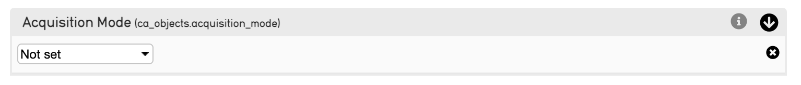
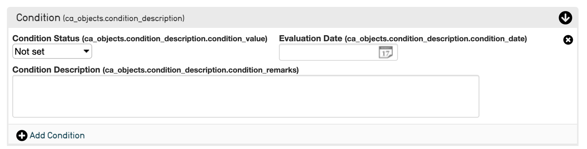
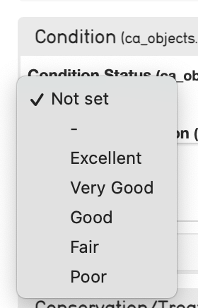
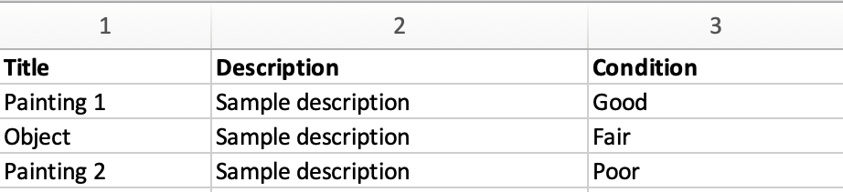
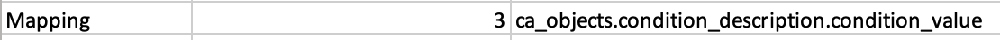
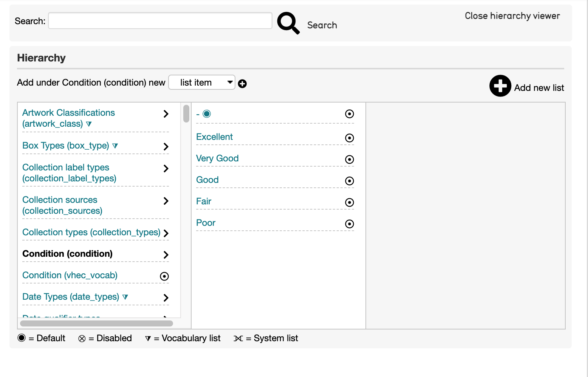

.. _import_import_ref_dropdown:

Mapping to Drop Down Values in CollectiveAccess
===============================================

There are several instances when creating an import mapping spreadsheet where a value in the source data will be mapped to a drop-down list in CollectiveAccess. These fields look like: 

   An example of an Acqusition Mode field in CollectiveAccess that contains a drop-down menu of associated, set values. 

   An example of a Condition Container in CollectiveAccess that contains a drop-down menu of associated, set values for Condition Status. 

While the drop-down lists, when selected, are displayed: 

   Values in the Condition drop-down list. 

.. figure:: acq_mode.png
   :scale: 50%
   :align: center
   
   Values in the Acquisition Mode drop-down list. 

Not all CollectiveAccess systems will have metadata fields that contain drop down values (these can be configured in the :ref:`Installation Profile <installation_profiles>`). Examples of fields that may have drop-down lists available include condition, acquisition mode, and other fields that have a set list of values to choose from. 

Drop-down value lists will have a set number of options to choose from that may describe condition or other variable descriptors about an object or item. These options will be listed in :ref:`Lists and Vocabularies <import_lists_and_vocab_in_mapping>`. 

The field containing the drop-down values will have its own **CA table.element** code, that will be mapped in Column 3 of the import mapping spreadsheet (see :ref:`Creating an Import Mapping: Overview <import_c_creating_mapping>`). 

The Condition Drop-Down List
----------------------------

Condition is a common example of a field that contains a drop-down list, with multiple, set descriptors. These values are pre-determined in the system itself and will vary depending on system configuration. 

Source Data containing condition values might look like: 

To find the appropriate **CA table.element** code for the Condition field in CollectiveAccess, follow the steps outlined in :ref:`Creating an Import Mapping: Overview <import_c_creating_mapping>`) and see :ref:`Using Bundle Codes <import_import_ref_bundlecodes>`. 

Mapping for the condition column would look like: 

Where the source column is 3, and the **CA table.element** is **ca_objects.condition_description.condition_value** taken from the bundle code for the Condition Status field. 

A separate mapping for each value in the drop-down list is not required, nor is using a Constant value. If the values match those listed in CollectiveAccess, mapping to the correct **CA table.element** will automatically populate the drop-down list with the appropriate values. 

As noted above, the field for Condition in CollectiveAccess is formatted as a **Container**, meaning that each element within the Container has a distinct bundle code for which to map source data (see below). For more about Containers, see :ref:`Containers <import_containers>`. 

   The Condition field from the CollectiveAccess Demonstration system. 

In the mapping, the bundle code for the Condition Status is used, which contains the drop-down list. 

Drop-Down Values and Lists and Vocabularies
-------------------------------------------

Drop-down values are present in **Lists and Vocabularies**. To find the above values for Condition, for example, navigate to **Manage > Lists and Vocabularies > Condition**: 

Where the values listed match those in the Condition field drop-down list. 

Drop-Down Values and Original and Replacement Values
----------------------------------------------------

The above example with the Condition field assumes that the values in the source data match those given in the CollectiveAccess field. However, if certain values do not match those in CollectiveAccess, using Original and Replacement Values should be used in an import mapping spreadsheet to create matches between source data values and set drop-down list values. 

For more, see :ref:`Use of Original and Replacement Values <import_orig_replace_example>`. 
