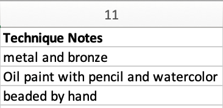

Using formatWithTemplate in an Import Mapping Spreadsheet
=========================================================

**formatWithTemplate** is an `Option <file:///Users/charlotteposever/Documents/ca_manual/providence/user/import/mappings/mappingOptions.html?highlight=options>`_ available to use when creating an import mapping spreadsheet. 

**formatWithTemplate** is, essentially, a display template with which to format values prior to importing those values in CollectiveAccess. Like other Options, Refineries, and Refinery Parameters, this option dictates exactly how source data will be manipulated and imported into CollectiveAccess. 

When to Use formatWithTemplate
------------------------------

**formatWithTemplate** is a useful Option for labeling certain fields in CollectiveAccess to match those in source data, especially for a field like Notes, where some distinction between notes is helpful.

Source data, for example, might contain a column for “Technique Notes” that does not have a correlating field in CollectiveAccess, or, might have other information about the technique of an item in CollectiveAccess. Here’s an example of source data: 

This data can go in a Notes field in CollectiveAccess, however, it would be useful to label this field with the “Technique” heading. 

To do so, **formatWithTemplate** can be used in the Options column (column 5) of an import mapping spreadsheet. The Option is written in code, with quotations, similarly to a Refinery Parameter.  

This would look like:

**{"formatWithTemplate": "Technique Notes: ^11”}**

Where “Technique Notes:” will be the text that appears verbatim in the Notes field in CollectiveAccess, while ^11 references the number of the Technique Notes column in the source data.  

If some of these fields are empty in source data, simply add the skipIfEmpty option:

**{“formatWithTemplate”: “Technique Notes: ^11”, “skipIfEmpty”: 1}**

**“Technique Notes:”** will be the text that appears in the Notes field, while **^11** references the number of the Technique Notes column in the source data. The **skipIfEmpty** option ensures empty cells won’t be imported  for records that do not contain data in this field. 

Placeholder tags may be used to incorporate data into the template. Tags always start with a “^” (caret) character. For column-based import formats like Excel and CSV, the column number is used to reference data (see above).

For XML formats, an XPath expression is used. That would look like:

**{“formatWithTemplate”: “Technique: ^technique_notes”, “skipIfEmpty”: 1}**

While templates are tied to the specific source data element being mapped, they can reference any element in the import data set. 

Combining Multiple Source Data Fields into a Single Notes Field 
---------------------------------------------------------------

For instances where multiple source data fields are being mapped to a single Notes field in Collective Access, formatWithTemplate can also be used. 

