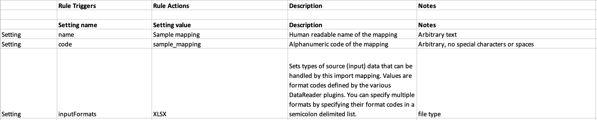
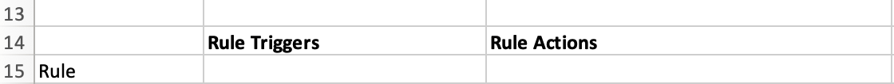
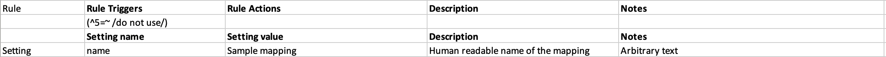

Rules
========

Rules allow you to set record-level conditionals in your mapping, with target actions triggered by true or false outcomes. With Rules, the migration of specific data and/or set metadata can be manipulated based on expression statements. 

For example, let's say you want to skip a record if a certain element in your data source is exactly equal to a specific value. Rules allows you to set a target action, such as "SKIP," when a match is triggered.

Rules rely on a two-part operation outlined in the import mapping: 

* **Rule Triggers:** An expression statement that results in a quantity that is evaluated by the data importer. 
* **Rule Tctions:** Performed based on the outcome of the expression.

For more about expressions, see :ref:`Expressions <expressions>`.

Using Rules
-----------

To include Rules in an import mapping spreadsheet, place a section for Rules directly above the Settings in the import mapping. Above **Setting name**, place the first component of the Rule operation, **Rule Triggers**. Above **Setting value**, place the second component of the Rule operation, **Rule Actions.** Note that Description and Notes are optional. 

   Rule Triggers and Rule Actions placed above the Settings in an import mapping spreadsheet.

Rules, similarly to other parts of the import mapping spreadsheet, require a **Rule Type** to be set. For all Rules, the Rule Type should be set to **Rule**: 

Set **Rule** as the Rule Type, and add the following to the Rule Triggers column:

   ``(^5 =~ /do not use/)``

This will skip all records with the phrase "do not use" in the description, for example. Then set the action to execute when the expression is true to be "SKIP." For the sake of this example, we're importing an Excel spreadsheet, and the description is in column 5. 

Where **^5** references column 5 in the source data, and **=~** invokes the regular expression operator. In the "Rule Actions" column is a simple reference to the action:

     SKIP

Note that you can potentially add several actions to a single rule trigger by separating the actions with returns. For CollectiveAccess versions up to 1.6, the only possible action is "SKIP", which skips the entire record, rather than importing it.

SET actions are more complicated than SKIP, requiring more than just the action name to be defined. To accommodate this, the actions list must be in JSON format for SET. The block is a list of objects, each of which has four keys:

==============  ================================================================================ 
Key  			Description                                                                       
==============  ================================================================================  
action          Name of action - SET in this case
target			The name of the injected value. You can use this name is mappings as you would use any other element in the source data. Eg. if you set this to inventory_yn_value then you will be able to map inventory_yn_value as a source to any CollectiveAccess element.
value			The value to inject into the source data under the target name when the trigger evaluates as true.
else			The value to inject into the source data under the target name when the trigger evaluates as false.                                  
==============  ================================================================================ 

An action list with a single SET action looks like this:

.. code-block:: text
   
   [{
    "action": "SET",
    "target": "inventory_yn_value",
    "value": "yes",
    "else": "no"
   }]