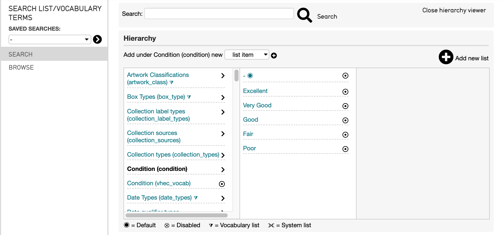
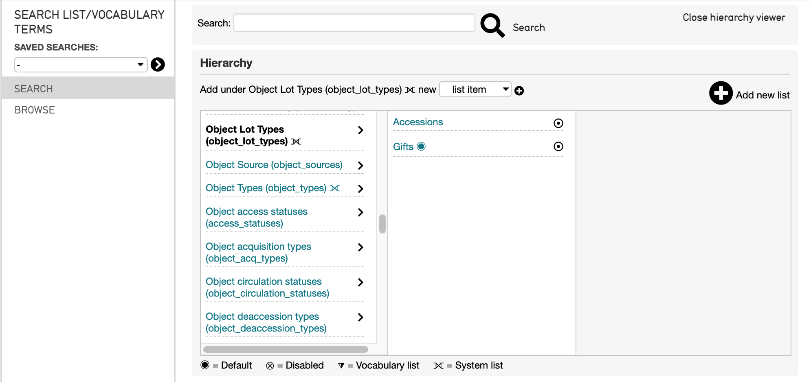
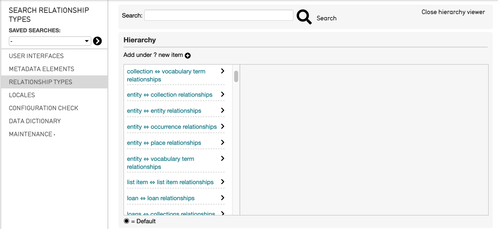

Using Lists and Vocabularies in an Import Mapping Spreadsheet
=============================================================

Lists and Vocabularies are important in determining a number of aspects about a data import. The Lists and Vocabularies in a CollectiveAccess system are often incorporated into an import mapping spreadsheet to define types of relationships, entities, dimensions, and other aspects that can help inform how best to structure the import mapping spreadsheet.

To view the Lists and Vocabularies in a given CollectiveAccess system, navigate to **Manage > Lists and Vocabularies**. The Lists and Vocabularies hierarchy will be displayed: 

Scrolling through the hierarchy, the various terms used in the system will be displayed. By selecting the **>** icon to the right of each heading, the list of relevant terms is displayed:  

Below the hierarchy is a key for the icons used within the hierarchy. These classify each list and vocabulary, and include:

* **Default**: The default setting if no other type is defined in the import mapping. Indicated by |dot|. 

* **Disabled**: The list/vocabulary/term is disabled, and is not used. Indicated by |x|. 

* **Vocabulary list**: The list/vocabulary/term is used as a controlled vocabulary for cataloging. Indicated by |triangle|.

* **System list**: The list/vocabulary/term is used by the system to populate a specific field; these are defined by the system installer. Indicated by |cross|.

Using Lists and Vocabularies in a Mapping
-----------------------------------------

Defining Entity Types
^^^^^^^^^^^^^^^^^^^^^

A common example where Lists and Vocabularies should be used while making an import mapping spreadsheet is for defining Entity Types. 

For source data that contains people or organizations, and will create records and relationships for that source data, it is necessary to look at the Entity Types listed in Lists and Vocabularies to include the correct entityType in the Refinery Parameter column of the import mapping spreadsheet. 

For example, here are the Refinery and Refinery Parameters columns from the Sample Import Mapping Spreadsheet (:download:`Sample Import Mapping Spreadsheet <sample_mapping_tutorial.xlsx>`).

Note that the **entitySplitter** refinery references both a **relationship type** and an **entity type.** Both of these types come from Lists and Vocabularies in the Collective Access system. The objectLotSplitter will be discussed below. 

Finding Entity Types
^^^^^^^^^^^^^^^^^^^^

To determine which entityType to use in an import mapping spreadsheet: 

1. Navigate to **Manage > Lists and Vocabularies.**
2. Scroll down in the hierarchy to Entity Types. 
3. Select the arrow icon > to open the terms list. 
4. Select which type best describes the entity records being created.  

Two available options are listed for Entity Types defined in the system: Individuals (ind) (defualt) and Organization (org). The entity being mapped is an individual (see above, **"ind"**). Note that instead of including **"individual"** in the Refinery Parameter, the shorter code is used, **ind**, to indicate the EntityType. 

To define the **relationshipType**, see below.  

Finding Object Lot Types
^^^^^^^^^^^^^^^^^^^^^^^^

Another common example where Lists and Vocabularies should be used while making an import mapping spreadsheet is for defining Object Lot Types. 

For source data that contains lot records (accessions), and the mapping will create records and relationships for that source data, it is necessary to look at the Object Lot Types listed in Lists and Vocabularies to include the correct Lot type in the Refinery Parameter column of the import mapping spreadsheet. 

Looking at the same two columns from the Sample Import Mapping Spreadsheet, an objectLotSplitter is used to create Lot records from the source data. 

Note that the **objectLotSplitter** refinery references an **object lot type**. This type comes from Lists and Vocabularies in the Collective Access system. 

To determine which objectLotType to use in an import mapping spreadsheet: 

1. Navigate to **Manage > Lists and Vocabularies.**
2. Scroll down in the hierarchy to Object Lot Types. 
3. Select the arrow icon > to open the terms list. 
4. Select which type best describes the entity records being created.  

In the example above, the **objectLotType** is defined as **"gift"**. By going to the Object Lot Types, list, two options are listed: Gift and Accessions. 

Finding Relationship Types
^^^^^^^^^^^^^^^^^^^^^^^^^^

Defining relationship types in an import mapping is the same as defining other types (outlined above) in an import mapping. However, finding the list of relationship types for a given system is slightly different. 

Navigate to **Manage > Administration > Relationship Types.** A full list of available relationship types will be listed in the hierarchy:

Scroll down the hierarchy to choose the relationship that will be created in the import mapping. To do so, think about the relationship between the records being created and the import table found in the Settings of the import mapping spreadsheet. 

For the entitySpliter example above, the relationshipType in the Refinery Parameter is **"creator."** By going to the Relationship Types hierarchy and choosing object-entity relationship 

For more on Lists and Vocabularies, see 