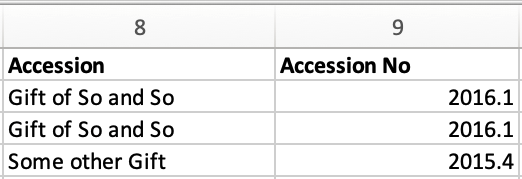
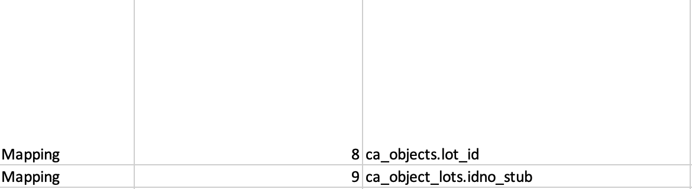
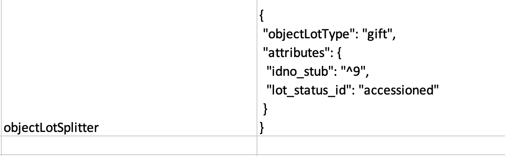

Mapping Object Lot Records
==========================

Unlike mapping other records, mapping Object Lots requires some specifications in order for the import to create separate and related lot records.  

Object Lots require more than just a label and a type defined in the Refinery Parameter column. Lots also have a non-optional **lot_status_id** value, taken from the Object Lot Statuses list in CollectiveAccess (see `Using Lists and Vocabularies in an Import Mapping Spreadsheet <file:///Users/charlotteposever/Documents/ca_manual/providence/user/import/lists_and_vocab_in_mapping.html?highlight=using+lists>`_). The **lot_status_id** must be set to a valid status value, or the lot will fail to insert during import. 

In addition, the **ca_table.element_code** (Column 3 in the import mapping spreadsheet) must be set to **ca_objects.lot_id.** ID Numbers for ca_object_lots don’t map to the normal idno, but rather **ca_object_lots.idno_stub.**

How to Map Object Lots
----------------------

The Sample Import Mapping Spreadsheet (:download:`Sample Import Mapping Spreadsheet <sample_mapping_tutorial.xlsx>`) maps object lot records that will be created and related to the objects being imported. These records are present in the Sample Import Data (Source Data) (:download:`Sample Import Data (Source Data) <sample_import_data_tutorial.xlsx>`). 

The source data lot records appear in columns 8 and 9, showing the type of Accessions, and the Accession numbers, of the objects to be imported: 

To map these lots, set the **Source column** (Column 2 in the import mapping spreadsheet) to the column numbers present in the source data, similarly to how other columns are mapped.

The **CA table.element column** (Column 3 in the import mapping spreadsheet, Column 8 in the Source Data) must be set to **ca_objects.lot_id**, as seen in the Sample mapping: 

In this example, column 9 is mapped to **ca_object_lots.idno_stub**, or the required field for object lot idnos. 

The objectLotSplitter for Mapping Object Lots
----------------------------------------------

In order to create new and related lot records, the use of the objectLotSplitter refinery is necessary, as seen in the sample import mapping: 

Within the Refinery Parameter, note that attributes of the parameter contain references to object lot fields. 

