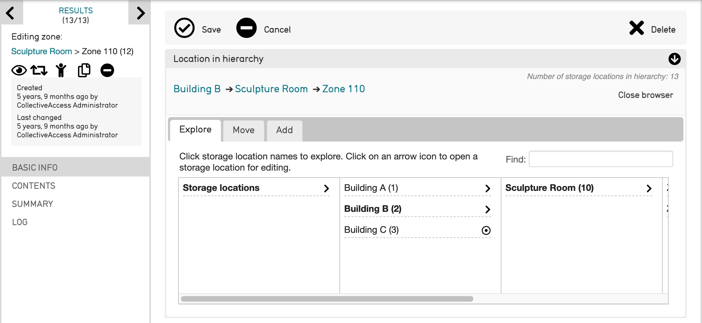
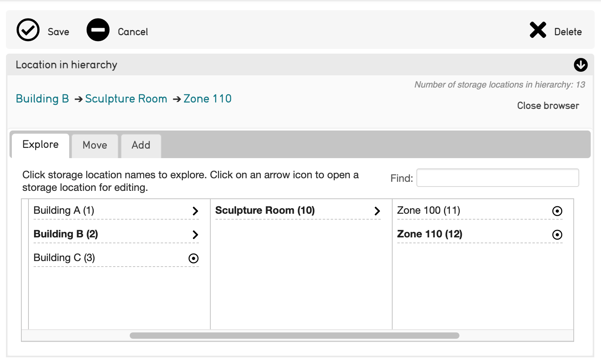

Mapping a Storage Location Hierarchy
====================================

What is a Storage Location Hierarchy in CollectiveAccess? 
---------------------------------------------------------

CollectiveAccess organizes storage locations into an easily searchable hierarchy, separating and sorting appropriate values from most general to most specific. In a system, the Storage Location Hierarchy looks like: 

Scrolling from left to right will display the locations from most general to most specific. 

