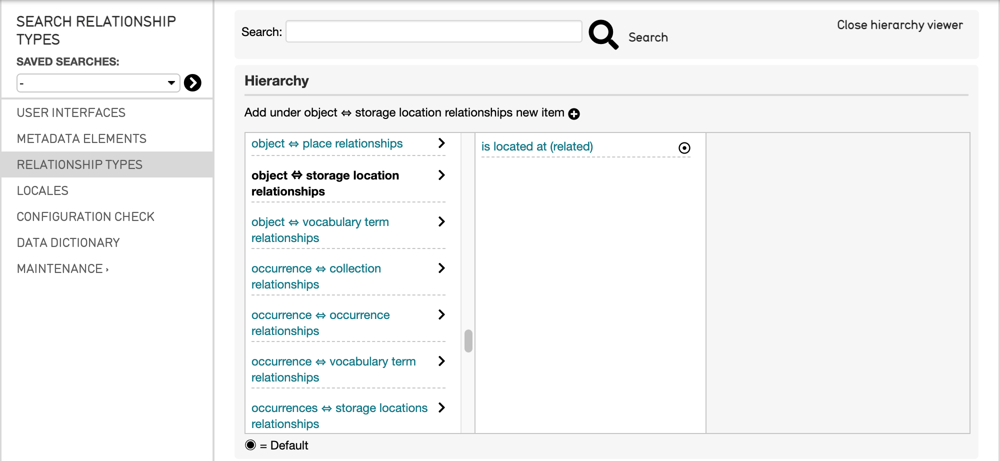
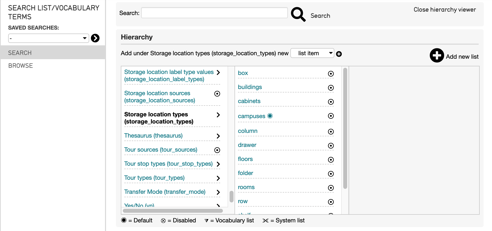
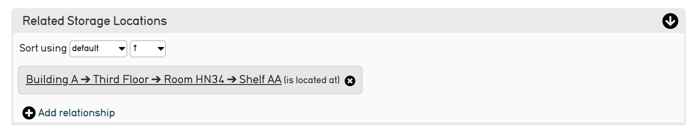

.. _import_mapping_storage_loc_hierarchy:

Mapping a Storage Location Hierarchy
====================================

What is a Storage Location Hierarchy in CollectiveAccess? 
---------------------------------------------------------

CollectiveAccess organizes storage locations into an easily searchable hierarchy, separating and sorting appropriate values from most general to most specific. In a system, the Storage Location Hierarchy looks like: 

   The Storage Location hierarchy viewer in the CollectiveAccess Demonstration system. 

Scrolling from left to right will display the locations from most general to most specific. 

   Scrolling along the hierarchy viewer in the CollectiveAccess Demonstration system. 

For certain source data sets, simply importing a single storage location will not capture the full extent of where an object is stored. For data sets that contain more specific storage location information, such as the shelf, room, floor, or exhibit cabinet where an item is located, using a Storage Location Hierarchy is necessary to fully capture the storage location information, ranging from more general to more specific. 

CollectiveAccess can import single storage locations using the **storageLocationSplitter**; however, it can also import a hierarchy based on multiple locations given in the source data. The format of the hierarchy is defined in the Refinery Parameter for the **storageLocationSplitter** Refinery, in the import mapping spreadsheet. 

See `Refineries and Refinery Parameters <file:///Users/charlotteposever/Documents/ca_manual/providence/user/import/mappings/refineries.html?highlight=refineries>`_ for more. 

How to find storageLocationType and relationshipType
----------------------------------------------------

Using a **storageLocationSplitter** Refinery requires a **relationshipType** and a storageLocationType to be defined in the Refinery Parameter. For example: 

Where the **relationshipType** and the **storageLocationType** in the Refinery Parameter are taken from the CollectiveAccess system. 

To figure out which relationshipTypes and storageLocationTypes are supported in a given system: 

relationshipType
^^^^^^^^^^^^^^^^

Navigate to **Manage > Administration > Relationship Types**. For the example above, which is mapping storage locations *related to* object records, scroll to the **object-storage location** relationship. A list of relationship types for this relationship will be listed by selecting the **>** icon: 

Remember to use the type in parentheses **()** in the import mapping Refinery Parameter. 

storageLocationType
^^^^^^^^^^^^^^^^^^^

To view which storageLocationTypes are supported in a system: 

Navigate to **Manage > Lists and Vocabularies** and find the storage location types list: 

The supported types will be displayed by selecting the **>** icon. For more, see `Using Lists and Vocabularies in an Import Mapping Spreadsheet <file:///Users/charlotteposever/Documents/ca_manual/providence/user/import/lists_and_vocab_in_mapping.html?highlight=using+lists>`_. 

Hierarchical Locations in an Import Mapping
--------------------------------------

There are levels to any storage location hierarchy. Often storage locations are organized from very general (for example, the building or institution name) to more specific (for example, the shelf or room) in a data set. However, within any given data set, various levels of specificity can exist. 

Hierarchical locations displayed in a system might look like:

When multiple locations are imported, they are displayed as a hierarchy, from general to more specific (left to right). 

A mapping for this hierarchy would use the parameter: 

.. code-block::

   {
	"storageLocationType": "building",
	"hierarchicalDelimiter": ",",
	"hierarchicalStorageLocationTypes": [
		"room", "shelf", "box"
	],

	"relationshipType": "current_location"
   }

Where the most general **storageLocationType** is defined as **building** from the list of storageLocationTypes in the system; the **hierarchical delimiter** is set to separate the locations on the comma values from the source data, and a hierarchy is created, from general to more specific, based on the values in the data (floor, room, shelf), with the **relationshipType** set to a constant value of **related.**

To map `Interstitial Data <file:///Users/charlotteposever/Documents/ca_manual/providence/user/dataModelling/interstitial.html?highlight=interstitial>`_ into the storage location, simply add the interstitial parameter into the rest of the parameter: 

.. code-block::

   {
	"storageLocationType": "building",
	"hierarchicalDelimiter": ",",
	"hierarchicalStorageLocationTypes": [
       "floor",
       "room",
       "shelf"
   ]
	"relationshipType": "related",
	 "interstitial": {
       "relationshipDate": "^4"
   }

where the interstitial data is a referenced column of source data. 

In Column 7, the Refinery Parameter should specify the type of storage location, and the relationship type of that storage location to the table defined in the Settings of the import mapping spreadsheet, that will be created upon import. 

Where the **relationshipType** is taken from the available types in the system, and the **storageLocationType** is taken from the available types in the system. 

Note that for this example, it is assumed that the table being mapped is **ca_objects**, and storage locations are being created as *separate and related records*.  

.. note::  To turn on bundle codes, navigate to **Manage > My Preferences > Developer**. Under **Show bundle codes**, select **Show**, then select Save. Bundle codes will now appear for every field in the system. 

