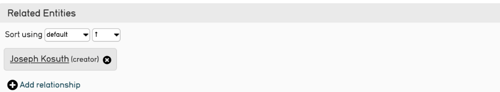

.. _import_mappings_refineries:

**Refineries**
==============
A refinery is a command that creates a record while simultaneously creating a relationship and relationship type associated with that same record. A refinery can also match on an existing record in a database, and create a relationship between that record and the source data. 

A refinery takes a particular data format in given source data, and transforms it through a specific behavior as it is imported into CollectiveAccess. In other words, refineries tell CollectiveAccess *how* to import certain data, such as names, dates, and relationships, through a specific text command. This then determines how the data will be displayed once it is imported. 

A refinery, at a simplistic level, is what it sounds like - it refines an individual data import mapping and allows for greater complexity in data representation. 

.. note:: If a data import requires related records, then refineries must be used. For more on how to implement these in an import mapping, and why, see `Relationships <https://manual.collectiveaccess.org/dataModelling/relationships.html?highlight=relationships>`_ and the `Import Mapping <https://manual.collectiveaccess.org/import/mappings.html>`_ page. 

There are a few types of refineries commonly used in CollectiveAccess:

* **Splitters:** A Splitter creates records, matches records with existing data, or parses apart specific data elements, literally "splitting" apart values, such as first and last names. Splitters can be applied to a variety of primary tables in CollectiveAccess. For more on Splitters, see `Splitters <https://manual.collectiveaccess.org/import/mappings/splitters.html?highlight=refinery#refinery-options>`_ in the Import Mapping tutorial. 

* **Joiners:** A Joiner is used primarily for data that includes names and dates. Joiners are used when two or more parts of a name located in different areas of the data source need to be conjoined into a single record. A dateJoiner makes a single range out of two or more dates in the data source.

* **Builders:** A Builder creates an upper hierarchy above the to-be-imported data. For more, see `Builders <https://manual.collectiveaccess.org/import/mappings/builders.html>`_. 

For a comprehensive list of refineries, see the table below. 

.. csv-table::
   :header-rows: 1
   :file: Refineries_Full_List.csv

Refinery Parameter
------------------

Refineries can't function properly without refinery parameters. Refinery parameters simply define the conditions for the refinery. An example is below: 

+---------+---------+-----------+-----------------------------------------+
| entitySplitter    |{"relationshipType": "creator", "entityType": "ind"} |
+---------+---------+-----------+-----------------------------------------+
To the left (example Column 6) is the actual refinery itself, made up of CollectiveAccess-specific text that is one continuous string. On the right is the refinery parameter, written in JSON. What is this telling the source data to do? 

.. note:: There are no spaces used in writing Refineries. 

The refinery, **entitySplitter**, is telling CollectiveAccess that within the source data there is a name that should be parsed, or, literally "split," or separated (first, last). Therefore, during the import CollectiveAccess will be able to identify what source data falls under this command, and execute it.

The **refinery parameter** is further defining the refinery by stating the type of relationship that the source data should have and the type of entity that is being imported. In this example, the names apply to a single individual (the entityType) and the relationship to the objects is the relationshipType of "creator." 

Once imported into CollectiveAccess, this refinery and its parameter that exists in the import mapping will look like:

Note that Refineries are optional. If source data does not require more complex elements, they are not needed in a mapping. However, Refineries are extremely useful in pre-defining these more complex elements which determine how data is inter-connected, and automatically importing data in the most straightforward, and logical, format. 

For a comprehensive list of refinery parameters for each refinery, see the tables below. 

these come from: `<https://docs.collectiveaccess.org/wiki/Data_Importer>`_

Splitters
---------

entitySplitter
^^^^^^^^^^^^^^

.. csv-table::
   :header-rows: 1
   :file: refinery_parameter_entitySplitter.csv

collectionSplitter
^^^^^^^^^^^^^^^^^^

.. csv-table::
   :header-rows: 1
   :file: refinery_parameters_collectionSplitter.csv

placeSplitter
^^^^^^^^^^^^^

.. csv-table::
   :header-rows: 1
   :file: refinery_parameter_placeSplitter.csv

movementSplitter
^^^^^^^^^^^^^^^^

.. csv-table::
   :header-rows: 1
   :file: refinery_parameter_movementSplitter.csv

objectLotSplitter
^^^^^^^^^^^^^^^^^

.. csv-table::
   :header-rows: 1
   :file: refinery_parameter_objectlotSplitter.csv

objectRepresentationSplitter
^^^^^^^^^^^^^^^^^^^^^^^^^^^^

.. csv-table::
   :header-rows: 1
   :file: refinery_parameter_objectrepSplitter.csv

occurrenceSplitter
^^^^^^^^^^^^^^^^^^

.. csv-table:: 
   :header-rows: 1
   :file: refinery_parameter_occurrenceSplitter.csv

listItemSplitter
^^^^^^^^^^^^^^^^

.. csv-table::
   :header-rows: 1
   :file: refinery_parameter_listItemSplitter.csv

storageLocationSplitter
^^^^^^^^^^^^^^^^^^^^^^^

.. csv-table::
   :header-rows: 1
   :file: refinery_parameter_storagelocSplitter.csv

loanSplitter
^^^^^^^^^^^^

.. csv-table::
   :header-rows: 1
   :file: refinery_parameter_loanSplitter.csv

measurementSplitter
^^^^^^^^^^^^^^^^^^^

.. csv-table::
   :header-rows: 1
   :file: refinery_parameter_measurementSplitter.csv

tourStopSplitter
^^^^^^^^^^^^^^^^

.. csv-table::
   :header-rows: 1
   :file: refinery_parameter_tourStop.csv

Builders
--------

Please see `Builders <file:///Users/charlotteposever/Documents/ca_manual/providence/user/import/mappings/builders.html?highlight=builders>`_. 

Joiners
-------

entityJoiner
^^^^^^^^^^^^

.. csv-table::
   :header-rows: 1
   :file: refinery_parameter_entityJoiner.csv

dateJoiner
^^^^^^^^^^

.. csv-table::
   :header-rows: 1
   :file: refinery_parameter_datejoiner.csv

dateAccuracyJoiner
^^^^^^^^^^^^^^^^^^

.. csv-table::
   :header-rows: 1
   :file: dateaccuracyJoiner_table.csv

