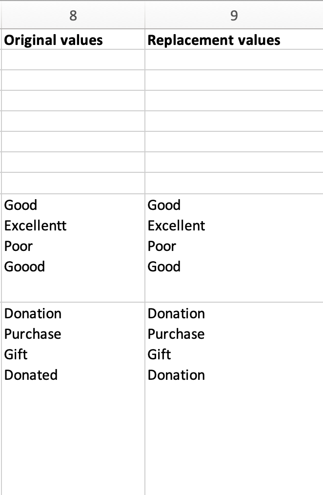

.. _import_orig_replace_example:

Use of Original Value/Replacement Value Columns in an Import Mapping 
====================================================================

Some data sets may contain metadata that will map in CollectiveAccess to a list element. A `list element <file:///Users/charlotteposever/Documents/ca_manual/providence/user/dataModelling/metadata.html?highlight=metadata+elements>`_ refers to fields in CollectiveAccess that are restricted to list form, and this restriction is configurable based on the system’s specific installation profile. An example of a list item might be a drop-down menu with various choices, which will be set to a specific value for each record. Some examples of drop-down menus used in CollectiveAccess (list items) might include: condition values, date type values, and acquisition type values. A list item is useful if metadata is recorded using a group of particular standardized values, which are repeatable for each record in the data. 

Using Original and Replacement values is necessary in an import mapping for list elements that do not match the list values available in CollectiveAccess. This is not uncommon, and is easily remedied. Instead of changing the source data individually, CollectiveAccess can automatically correct the spelling or matching of certain values using the Original and Replacement Value columns in an import mapping.

When mapping to a list element in CollectiveAccess, a few more steps are required than simply mapping to the CA table.element in Column 3. While the CA table.element code must be included in the mapping spreadsheet for the metadata element, Columns 8 and 9 in the spreadsheet are used to transform original values in the source data that may not exactly match the values in the list (drop-down menu) in CollectiveAccess. In these cases, the import mapping spreadsheet will need to find certain values in the source data, and replace them with new values upon import.

List elements differ from standardized vocabulary classifications in that a standardized vocabulary or categories utilized by a specific organization will be included in the installation profile separately; the vocabulary will have its own field in the record’s interface. On occasion, vocabulary categories will need to be included in Original and Replacement Value columns, but a more common scenario is to find and replace values in the data. 

Example: Mapping List Items in an Import Mapping Spreadsheet
------------------------------------------------------------

The two columns of example data shown below are candidates for using the Original Value and Replacement Value columns in an import mapping spreadsheet, assuming that in CollectiveAccess these files will display as a list. Because of the slight variations in the source data, CollectiveAccess will not import all of these values and match them to the list: 

.. csv-table::
   :header-rows: 1
   :file: orig_replace_table1.csv

The **Condition** column contains four values, with slight variations. Similarly, the **Acquisition Method** column contains four values that describe the method of acquisition (note that two values are describing the same method). 

In an import mapping spreadsheet, the use of Original Value and Replacement Value Columns is limited to Columns 8 and 9. To map list items, the **CA table.element code** (Column 3) for the list item is still needed. If the CA table.element code for Condition and Acquisition Method are **ca_objects.condition.condition_select** and **ca_objects.acq_method**, for example, place those values in Column 3 of the spreadsheet. 

Find Original Values 
--------------------

The list of original values is the list of unique values within a given element/field/column in the source data. Methods to derive a list of unique values vary depending upon the data format. For example, to check for unique values within source data in Excel select the entire column whose unique values should be displayed. Navigate to **Data > Advanced**. The **Advanced Filter** will appear on screen; check **“Unique records only.”** This will display all unique values that are in the selected column. However, **do not** save the data in this format, as it will erase all other values. 

Checking for unique values in a column or columns of data can help inform what kind of, and how many, original values and replacement values are needed in the import mapping. If the number of values to replace exceeds a few dozen, it is usually more convenient to break out the list into its own worksheet using the Option `transformValuesUsingWorksheet <file:///Users/charlotteposever/Documents/ca_manual/providence/user/import/mappings/mappingOptions.html#transformvaluesusingworksheet>`_, designed for large transformation dictionaries. 

Find Replacement Values
-----------------------

To find the Replacement Values that will match on and replace the Original Values during import, navigate in CollectiveAccess to **Manage > Administration > Lists and Vocabularies**. Search for the relevant List and Vocabularies term by looking at the header of the column in the source data. What is listed in Lists and Vocabularies will be different for each system, depending on the installation profile. 

For this example, select **Condition (condition_list).** Displayed is the list of available Condition types from the metadata element drop-down menu in the system. This will be visible in each record’s user interface. Then, select **Object Acquisition Types (object_acq_types)**. Displayed is the list of available Object Acquisition Types from the metadata element drop-down menu in the system. This will be visible in each record’s user interface. Keep these available for use in the import mapping spreadsheet. These are the Replacement Values. 

Once unique original values and the replacement values have been found, it is useful to make another Sheet or Sheets in the import mapping spreadsheet for the Original and Replacement Value lists. By doing this, it is easy to then copy and paste these lists into the Original Value Column and Replacement Value Column, instead of typing each value by hand. These sheets may look like: 

.. csv-table::
   :header-rows: 1
   :file: orig_value_table2.CSV

.. csv-table::
   :header-rows: 1
   :file: orig_values_table3.csv

While the Original columns in these Sheets use the unique values extracted from the source data, the Replacement columns use the values you actually want to import into CollectiveAccess. 

Creating separate Sheets to organize these lists is not necessary, but can simplify workflow when creating the import mapping when the list of replacement values is large. Note that it is normal for some values on the replacements list to repeat. The original values list should only include unique terms. If terms are repeated, the replacement for the last occurrence will be used.

Mapping The Original and Replacement Values 
-------------------------------------------

Once the lists of original and replacement values are made, copy and paste the Original Values into Column 8 and the Replacement Values into Column 9 in the import mapping spreadsheet for the specific mapping the replacement values will apply to. Take care that each value list is contained in a single cell on the correct line. Values in the lists should correspond correctly on a line by line basis. 

If you are directly entering Original and Replacement values into the import mapping spreadsheet, you can add additional lines within the cells containing each list using **alt + shift + enter** after each item to embed a newline within the cell. Original values and Replacement values must match line by line in order for CollectiveAccess to apply them properly. 

   The Original and Replacement Values for Acqusitions and Conditions in the import mapping spreadsheet; each value matches line by line.

   

