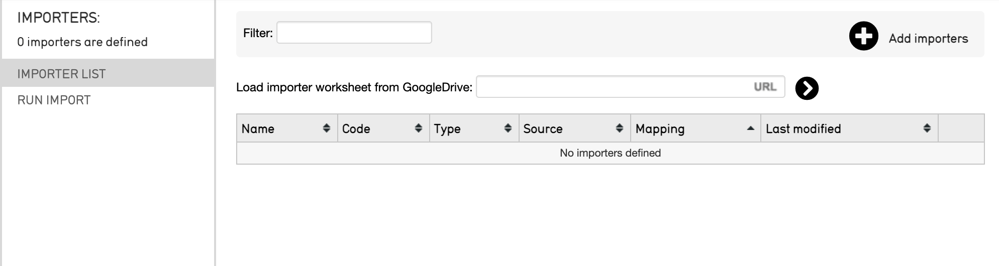

.. _import_running:

Running an Import
=================

Running a Data Import
---------------------

There are two ways to import data into CollectiveAccess:

1. **Directly from the command line (terminal)**. This method is recommended for larger imports, so the import is not tied up by a web browser. 

2. **Through a web browser** within the Providence user interface in CollectiveAccess.

Both options require an import mapping spreadsheet, and source data in a supported data format. 

.. warning:: Import mappings contain code. If code is invalid, the data importer in the user interface will refuse to upload the mapping. Common places where errors can occur in code phrases are with spaces, quotation marks, and spelling. Check code phrases for any inconsistencies; an online code validator and formatter is usually very helpful in catching any errors. 

.. note:: Remember to always back up your database before running an import, as you will likely have to tweak imports multiple times. 

**Basic Steps for Running a Data Import** 
-----------------------------------------

To run a data import in the terminal or through the CollectiveAccess user interface, eight basic steps are involved: 

1. **Create an import mapping spreadsheet.** This can be made in Excel or in Google Sheets, and will serve as a crosswalk between source data and the destination in CollectiveAccess. This step is necessary for either manner in which an import will be executed. See :ref:`Creating an Import Mapping <links here>` for instructions. 
2. **Create a backup of the database** by executing a data dump before running the import.
3. **Run the import** from either the command line (terminal) or the graphical user interface in CollectiveAccess. 
4. **Check the data** that has been imported in CollectiveAccess. Look for any errors or points of inconsistencies. Errors will usually show up in error messages during an import; however, it is necessary to conduct general quality checks in the system. 
5. **Revise the mapping** accordingly. 
6. **Load the data dump** so that the system returns to its pre-import state, or, returns to empty. To import changes successfully, it is recommended to wipe the system clean, so old imports are not confused with new. 
7. **Re-run the import** (see Step 3). Revisions will show up in the new system. 
8. **Repeat Steps 3-7** until satisfied with the data import. 

Steps for importing data from the terminal and importing data from the user interface in Collective Access will be explained below. These steps assume that source data is available in a supported file format, and that an import mapping spreadsheet has been created. 

**Running an Import from the Terminal**
---------------------------------------

Follow the steps outlined below to generate a successful import from the terminal or command line. 

1. **Create a place** where the data and data import mappings are easily accessible, without an inconveniently-long file path. For example, the import material could live in a Providence directory at:

/support/project/mappings and

/support/project/data

2. **Backup your data**. Before importing, back-up your database: 

.. code-block:: php

   mysqldump -u#name -p#password project > ~/project_date.dump

3. **Define an import**. This is done using load-import-mapping option of caUtils:

.. code-block:: php

   cd /path_to_Providence/support
   bin/caUtils load-import-mapping --file=project/mappings/mapping1.xlsx

4. **Run** the import. Once the import has been created, it can be used. Using the utility import-data, give the correct name to -mapping parameter. For example: 

.. code-block:: php
   bin/caUtils help import-data

   bin/caUtils import-data --format=XLSX --mapping=mapping1 --source=project/data/Data.xlsx --log=project/log

.. note::  With the PHP ncurses extension installed, a display will provide moving status indicators including import progress and recent errors.

5. **Check the data** that has been imported into CollectiveAccess.

6. **Modify the import** and rerun the utility if something has gone wrong. To modify your import and rerun the utility, simply restore your database:

.. code-block:: php
   mysql -u#name -p#password project < ~/project_date.dump

7. **Repeat Steps 1-4**, until satisfied with the data import. 

**Running an import from the User Interface** 
---------------------------------------------

Importing data through the user interface in CollectiveAccess is a great option for those unfamiliar with the command line, as it does not involve executing commands. Importing from the user interface simply involves uploading supported files; however, there are a few steps to follow. 

.. note:: From the user interface it is also easy to add, delete, or download import mappings. For this method, it is necessary to have an import mapping and source data available in a supported file format. 

Follow these steps below to run an import from the user interface in CollectiveAccess: 

1. **Navigate to Import/Data**. The CollectiveAccess import feature will be displayed: 

2. **Select the plus sign icon** |icon| in the top right corner. An area with "Drag importer worksheets here to add or update" will appear, where the import mapping spreadsheet to be dragged, or uploaded, into the user interface. 

3. **Drag or drop** the import mapping spreadsheet directly into the user interface, or add the Google Drive link to your import mapping.

4. **Select** the forward caret |caret|. 

5. **Have your source data available**. In addition to the import mapping spreadsheet, it will also be necessary to upload the specific source data set into the user interface during this process, by dragging or uploading from a location on a computer. Have this file (or files) available in a supported format. 
6. **Upload** the source data. 
7. **Configure the necessary settings**. Select the Log Level and Testing Options. For more, see :ref:`Data Importer (UI): Options for Importing <import_ui_import_options>`. 
8. **Run the import** by selecting Execute Data Import. 
9. **Revise** the mapping accordingly. 
10. **Re-import**, repeating Steps 1-6.

more images here

Order of Import
---------------

For data with more than one import mapping spreadsheet (such as Objects, Entities, Lots, and so on), the order in which the mappings are imported is important. Note, however, that this will differ for each data set. 

For some data sets, considering the order for import is less important, as related records are created from a single mapping. When this is not the case, the import order can determine if records are matched properly and will help avoid errors during import. 

Depending on the data set, the order of import will also affect what the :ref:`Existing Record Policy <import_exist_rec_policy>` in the Settings of an import mapping spreadsheet is set to. 

   
