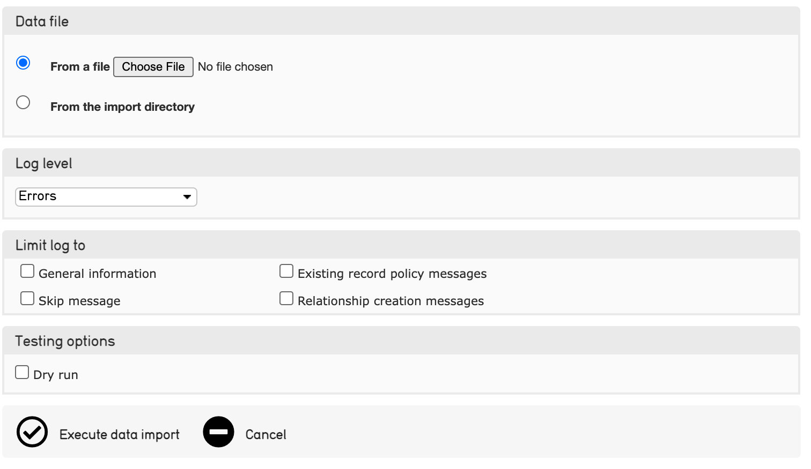

.. _import_ui_import_options:

Data Importer (UI): Options for Importing
=========================================

When executing a data import from the user interface in CollectiveAccess, options are available in the Data Importer that determine the extent of error messages and whether data will show up in the system upon import. 

When doing a data import, it is helpful to receive error messages, and some of these can be configured in the user interface before executing a data import. This reference page assumes that a data import is being executed through the user interface, where various options can be set. 

The Data Importer UI Screen
---------------------------

As noted in `Running an Import <https://manual.collectiveaccess.org/import/running.html>`_, a data import can be executed in CollectiveAccess either through the command line (terminal) as recommended for developers or those versed in code, or, through the user interface in CollectiveAccess. ThOnce an import mapping spreadsheet has been uploaded to user interface displayed via **Data > Import**, and the forward arrow icon |icon| has been selected, this screen will be displayed: 

full image here?

This screen is where certain options for the import can be set. Note that these options do **not** affect the dSetata being imported; they simply generate various levels of error messages, determine if the import is a dry run, or limit the error messages that will be received after the data import is completed. **Logs** refer to the files that contain these error messages. 

The various options are described below. 

Data Format
^^^^^^^^^^^

This menu will automatically contain the input format value that is set in the import mapping itself for the source data format (XLXS, FMPro XMLResult, and so on.) 

Data File
^^^^^^^^^

Select the source data files to be imported. Upload the data file from the computer, or select the data file from the import directory. 

Log Level 
^^^^^^^^^

This setting controls the level of detail displayed in the log for the import. For the most comprehensive log, select **Debugging messages.**

.. csv-table::
   :header-rows: 1
   :file: ui_option_table1.csv

Limit Log To
^^^^^^^^^^^^

This setting limits the level of detail in the log for the import. 

.. csv-table::
   :header-rows: 1
   :file: ui_option_table2.csv

Testing Options
^^^^^^^^^^^^^^^

This setting enables a data import to run without creating any records in the system. 

.. csv-table::
   :header-rows: 1
   :file: ui_option_table3.csv

