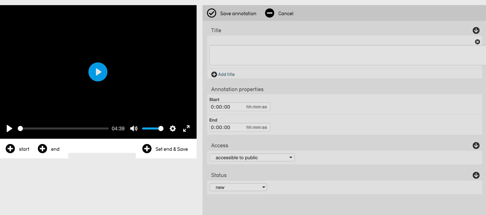

Annotation Editor
=================

The Annotation Editor allows users to create and annotate clips for audio and video. To open the Annotation Editor:

1. Navigate to any media record. 
2. Select the **Media** screen: 

.. image:: annotationeditor1.png
   :scale: 50%
   :align: center

3. Within the Media representations filed, select **Annotations.** 
4. **Create** annotations by selecting from the displayed options. 

Creating Annotations
--------------------

Use the options below to create clips, by setting "Start" and End" points for each annotation. Supply metadata for each annotation and then Save. Saved annotations will appear horizontally at the top of the editor in the carousel. From there they can be opened for further editing, or deleted.

.. csv-table:: 
   :header-rows: 1
   :file: annotation_editor_table1.csv

Annotation Editor
-----------------

Like all editors in CollectiveAccess, the annotation form can be customized with any metadata elements or relationship bundles (to entities, places, etc.) The default configuration includes Title and Annotation Properties (Start and End time codes). To customize the form, go to Manage-Administration-User Interfaces and open the "representation annotations" editor. Follow the link for more information on UI customization.

Clip Carousel
-------------

The image above is the clip carousel. Each feature of the carousel is explained in the table below.

.. csv-table:: 
   :header-rows: 1
   :file: annotation_editor_table2.csv

