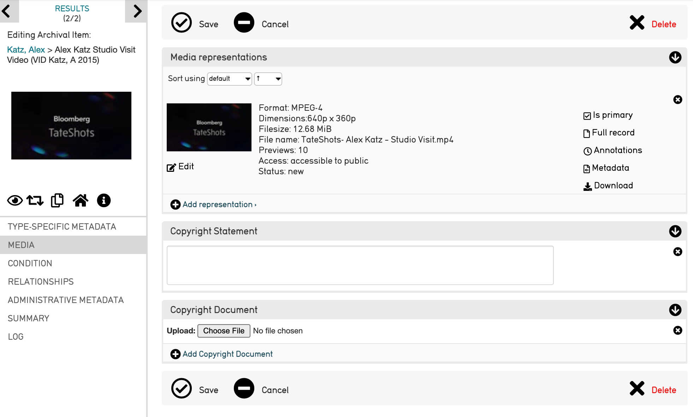
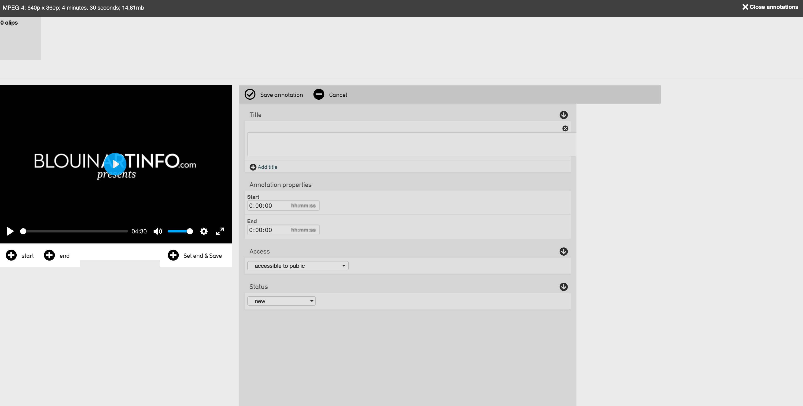
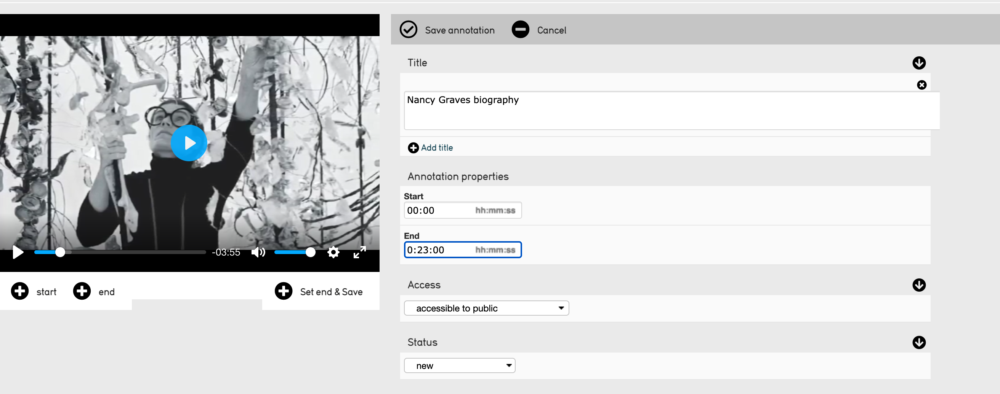
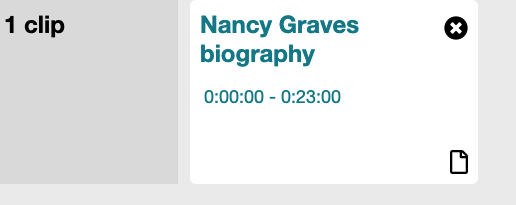
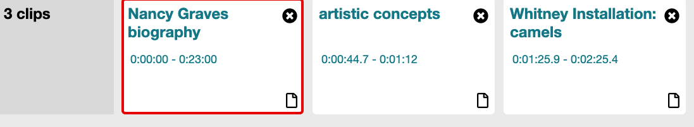
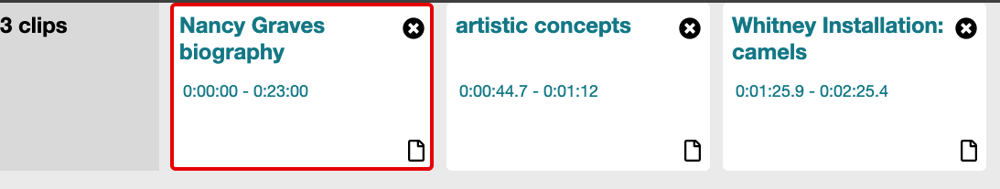

Annotation Editor
=================

* `Creating Annotations`_ 
* `Creating Clips to Annotate`_ 
* `Viewing, Editing, or Deleting Annotations`_ 
* `Clip Carousel`_ 

The Annotation Editor allows users to create and annotate clips for audio and video. The Annotation Editor allows users to create and annotate clips for audio and video. These are useful for marking specific timestamps in an audio or video recording, and annotating with text.

The Annotation Editor allows users to create and annotate clips for audio and video. These are useful for marking timestamps, adn annotating with text. 

The Annotation Editor is only available in CollectiveAccess for audio recordings, videos, or other audiovisual media. 

Creating Annotations
--------------------

To open the Annotation Editor, navigate to any audio/video record. 

Select the Media tab on the left side of the record’s screen: 

From this tab, a number of options are available to the right, within the Media representations field. From here, select **Annotations.**

Another screen will be displayed: 

Note at the top left of the screen, there are **0 clips.** Once clips are created, they will appear at the top of the screen. 

Creating Clips to Annotate 
--------------------------

To create clips to annotate on the Annotation Editor screen, select **start** to the right of the plus icon. |plus|

This will automatically play the audio or video. Select **end** to the right of the plus icon |end| to end the clip. 

This will set both start and endpoints for each annotated clip, whose timestmamps will appear in the metadata. Supply metadata for each annotation by filling out the fields to the right of the audio or video. Like all editors in CollectiveAccess, the annotation form can be customized with any metadata elements or relationship bundles (to entities, places, etc.) The default configuration includes Title and Annotation Properties (Start and End time codes). To customize the form, go to Manage-Administration-User Interfaces and open the "representation annotations" editor. Follow the link for more information on UI customization.

.. note:: Annotations will only become available once a start and endpoint has been selected. Then, the metadata can be customized and the annotated clip created and saved. 

Once the start and endpoints, and metadata, have been selected and filled out, select **save annotation.** Saved annotations will appear horizontally at the top of the editor in the carousel. From there they can be opened for further editing, or deleted.

Once all annotations are made and saved, select **close annotations** at the top right of the screen. 

All options for editing annotations are explained in the table below: 

.. csv-table:: 
   :header-rows: 1
   :file: annotation_editor_table1.csv

Viewing, Editing, or Deleting Annotations
-----------------------------------------

To view annotations that have been made, edit annotations, or delete annotations, navigate to the Annotation Editor screen. 

Each annotation has a small page icon in the lower right corner. Select this icon to edit the annotation. 

Clip Carousel
-------------

The clip carousel is the display of saved annotations that appears at the top of the screen. 

Each feature of the carousel is explained in the table below.

.. csv-table:: 
   :header-rows: 1
   :file: annotation_editor_table2.csv

