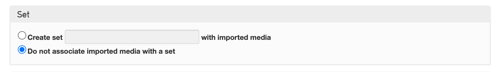
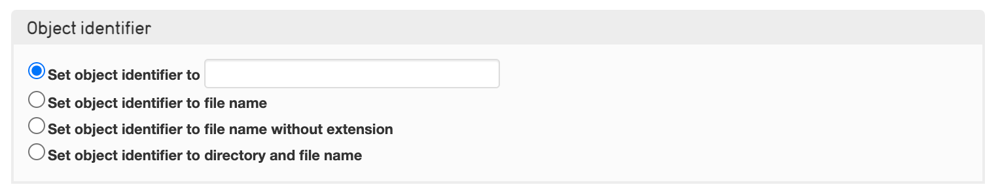
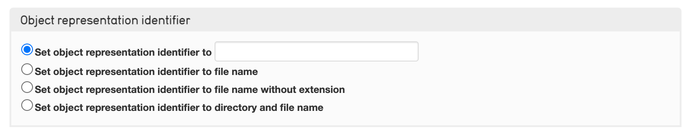
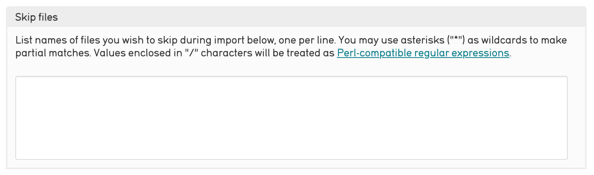
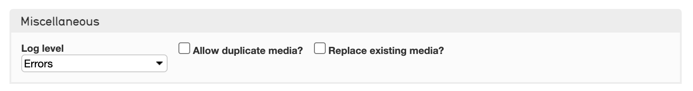

.. media_batch_import:

Batch Media Import
=====================

* `About Batch Media Import`_
* `Batch Import Options`_
* `Advanced Options`_

About Batch Media Import
------------------------

CollectiveAccess supports the upload of entire directories of media at once, also known as **batch importing**. This feature is useful for uploading multiple images or other media files without uploading each file by hand. 

When a directory of media is uploaded, the media importer will do the following:

* Generate new records for each file, which can be completed later by hand, or by using the `Batch Editor tool <file:///Users/charlotteposever/Documents/ca_manual/providence/user/editing/batch.html?highlight=batch+edit>`_. 

* Match each file with existing records in CollectiveAccess

* A combination of both

Batch Importing Media
---------------------

To batch import media: 

Navigate to **Import > Media.** The Media Importer will dispslay:

   A partial view of the Media Importer screen.

Where a variety of options are available to configure the media import. Read on to learn about each option and its functionality. 

Batch Import Options
--------------------

**Target**
^^^^^^^^^^

   Set the import target to the desired primary table. 

Media is stored in CollectiveAccess via media representation records. Each time media is imported into CollectiveAccess, a new media representation record is created. However, these records are almost always associated with other types of records from primary tables such as Objects. 

Use the **Import Target** drop-down (shown above) to set which primary table and type of record the media representations should be associated with (Objects, Entities, Collections, and so on.) 

**Directory to Import**
^^^^^^^^^^^^^^^^^^^^^^^

   The Import directory. 

Check the inspector to find out what server directory is associated with the importer tool. By default, it is set to your installation's /import folder. However, the directory can be changed in `app.conf <file:///Users/charlotteposever/Documents/ca_manual/providence/user/configuration/mainConfiguration/app.html>`_.

A hierarchy browser reflecting the import directory will be displayed. The hierarchy browser contains two settings under Directory to Import: 

1. **Include all sub-directories**: imports the field stored in the sub-directories. If not selected, only files stored in the selected directory will be imported.  

2. **Delete media after import**:  Media will be deleted from the directory after it is imported into CollectiveAccess. 

**Import Mode**
^^^^^^^^^^^^^^^

   Select the import mode. 

Import mode determines how the media will be imported into CollectiveAccess. Choose from the following options in the drop-down menu:

.. csv-table:: 
   :header-rows: 1
   :file: media_batch_importmode_table1.csv

**Type**
^^^^^^^^

   Select the type. 

.. csv-table:: 
   :header-rows: 1
   :file: media_batch_table2.csv

**Set**
^^^^^^^

   Create a set of imported media. 

This menu allows you to associate imported records with a set.

.. csv-table:: 
   :header-rows: 1
   :file: media_import_set_table3.csv

**Object Identifier**
^^^^^^^^^^^^^^^^^^^^^

   Set the identifier for the media being imported.

.. csv-table:: 
   :header-rows: 1
   :file: batch_media_objectid_table4.csv

Object Title
^^^^^^^^^^^^

   Set the object title. 

.. csv-table:: 
   :header-rows: 1
   :file: object_title.csv

**Status and Access**
^^^^^^^^^^^^^^^^^^^^^

This menu simply allows you to set the **status** and **access** fields for both the import target record, as well as the representation record.

.. csv-table:: 
   :header-rows: 1
   :file: batch_media_statusaccess_table5.csv

**Advanced Options**
--------------------

There are several advanced options for a batch media import. They can be found on the same **Import > Media > Settings** page by scrolling down and selecting **Show advanced options >**. 

.. figure:: media7.png
   :align: center
   :scale: 50% 
   
   Advanced Options for media importing. 
   
In many cases, the default settings and basic options are sufficient for a media import. Advanced options include: 

Matching 
^^^^^^^^

By default, matching occurs on filename. This setting manages matching on directory name, or directory name, then filename. Additionally, matching can be limited by type.

Object Representation Identifier
^^^^^^^^^^^^^^^^^^^^^^^^^^^^^^^^

This setting is similar to the object identifier setting, only it applies specifically to the object  representation record, rather than the import target record.

Relationships
^^^^^^^^^^^^^

.. image:: relationships_copy.png
   :scale: 50%
   align: center

Some projects have a very structured way of assigning file names to media. A media file name may not only include an identifier for the file itself, but may also include identifiers for authorities or events that are depicted in the file itself. For projects with Entity, for example, it's not uncommon for a media filename to include the entity identifier in the file, if that media happens to depict the entity. 

The "relationships" setting ensures that the object record associated with the imported image is in fact also related to the entity record. Select the related tables and the relationship type. 

Skip Files
^^^^^^^^^^

Use Perl-compatible regular expressions to filter out files in the media directory that will be skipped. Skipped files may also be listed by the filenames, one per line.

Miscellaneous 
^^^^^^^^^^^^^

Includes three options: 

* **Log level**: This setting controls the level of detail in the log. The log can capture errors, warnings, alerts, informational messages, and debugging messages. Select debugging messages for the most comprehensive log.

* **Allow duplicate media**: Duplicate media files will be skipped. Use this setting to override this.

* **Replace existing media**: The imported media will replace existing media in the system. 

