Reports
=======

* `Reports from Search Results`_
* `Export Tools`_ 
* `Download Media for Reports`_ 
* `Reports of a Single Record`_ 
* `Reports from a Set`_

Reports from Search Results
---------------------------

CollectiveAccess supports the generation of custom reports designed to help workflow and meet the needs of any collections organization. Reports can be made from records of any type in CollectiveAccess. 

There are are two ways to generate a report of multiple records:

1. **Conduct a database Search**. Use the Basic Search, Advanced Search, or Browse functions to retrieve the results that will populate your report. 
2. **Create a Set**. Select a Set name under "Search by Set" in the left-side menu of the Search screen and select Search. This will populate your search results with the items from the chosen Set.

In any display configuration, there are several format options for downloading and printing search results and sets. These include: 

* Tab delimited files
* Comma Delimited files (CSV)
* Printable PDFs (checklist or thumbnails)
* Word processing files (DOCX)
* An Excel spreadsheet (XLSX) 

Export Tools
------------

Generating a report can be done by conducting a database search. For example, a report for a single object can be made from a search result(s). 

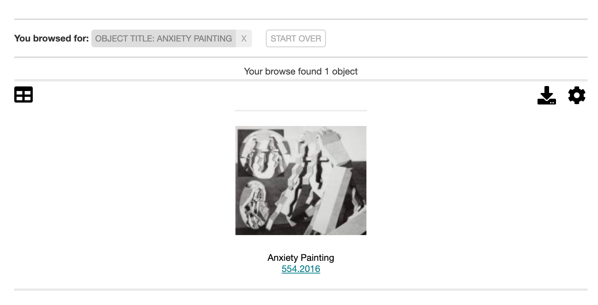

Conduct a search in the databse. When results are pulled, an option exists to the right by hovering over the download icon |export| labelled Export Tools.

Select this icon, and a few options will display in an overlay: 

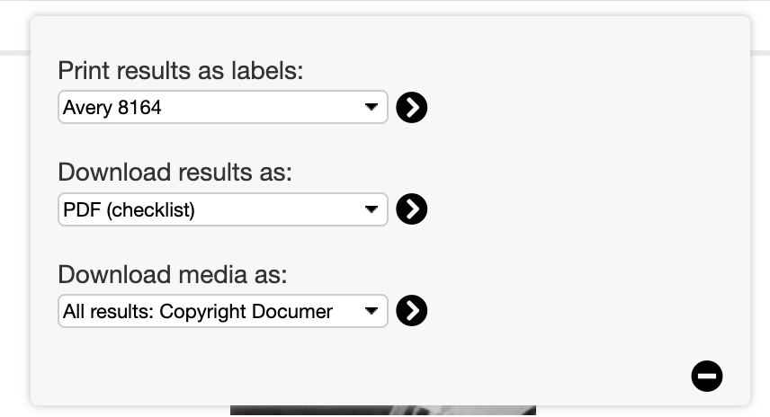

Download Media for Reports
--------------------------

The Download Media dropdown within Export Tools allows media in various sizes to be pulled from all, or selected, results.

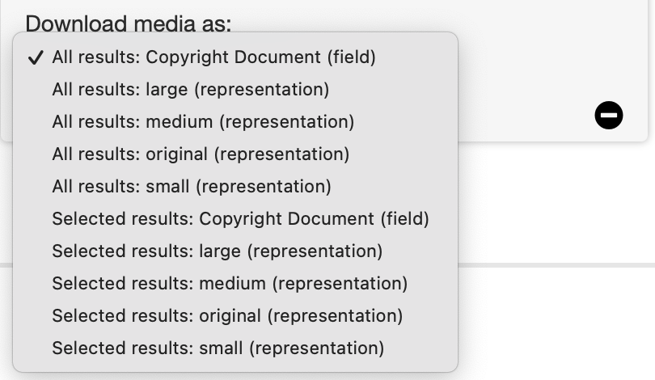

Media can also be downloaded from the media tab of an individual record by selecting the download icon.

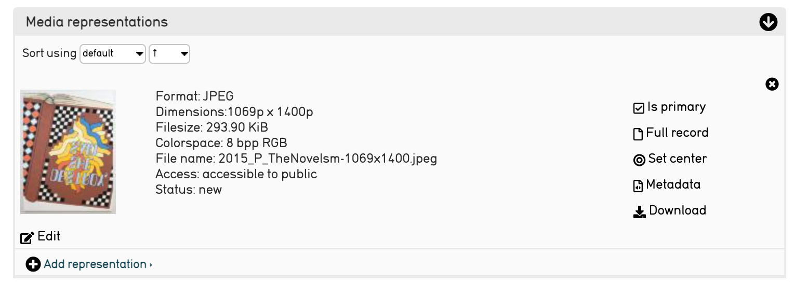

Reports of a Single Record
--------------------------

To create a report of a single record, print a display from the Summary screen. Simply choose a preconfigured display from the drop-down list on the Summary screen of any record.

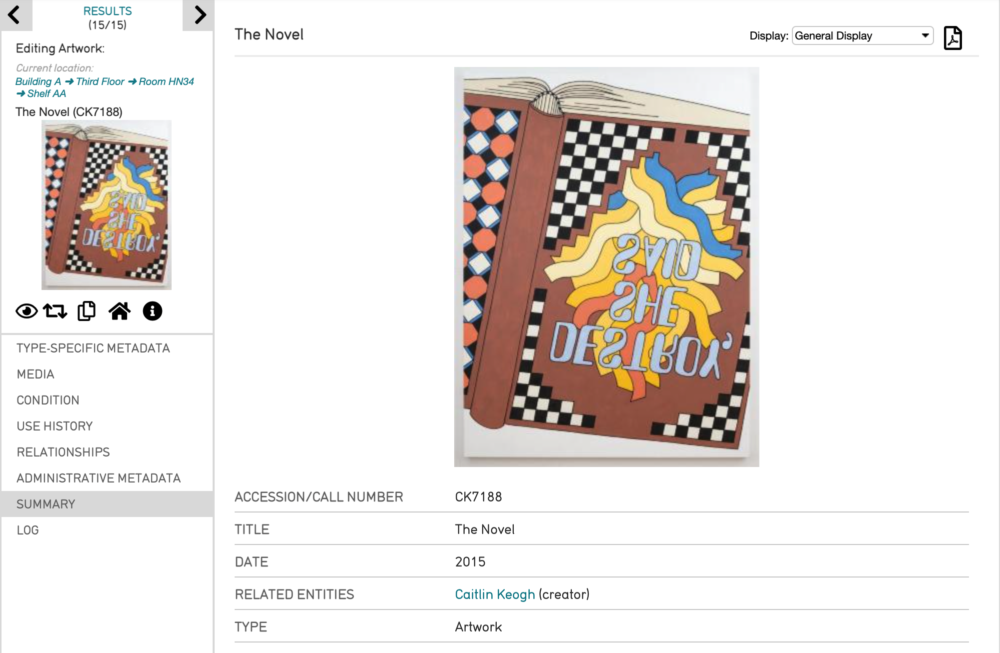

 In order to print, select the white page icon |icon| to the right of the drop-down. A new window will open, containing a printer-friendly PDF of the summary.

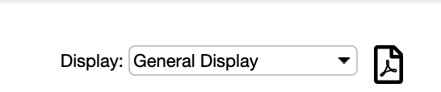

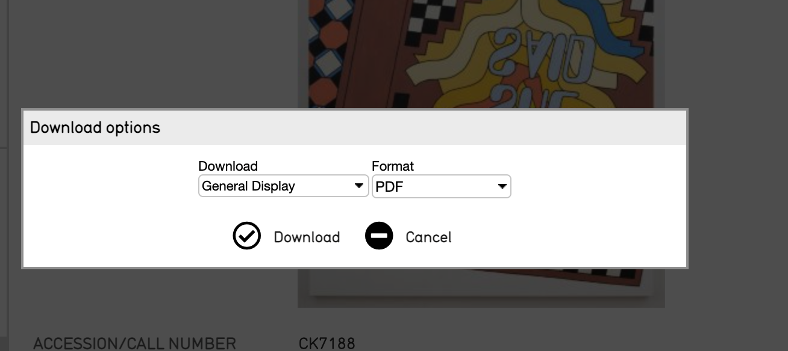

Download options include: 

* **Artwork Display**
* **Collection Finding Additionally**
* **General Display**

Format options include: 

* **Microsoft Word**
* **PDF**

Select Dowload. The PDF will download, and look like: 

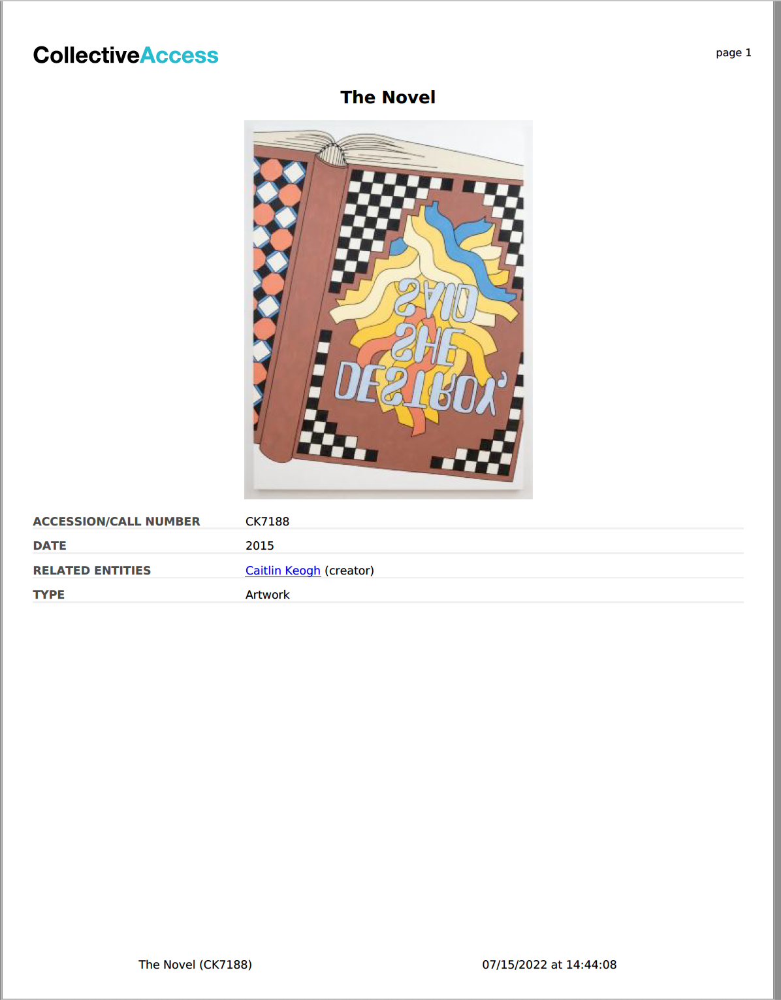

   The report of a single record, with the options **General Display** and **PDF** selected. 

Reports from a Set
------------------

Create a Set of records from the databse. For instructions and more information, see `Sets <file:///Users/charlotteposever/Documents/ca_manual/providence/user/workflow/sets.html?highlight=sets>`_. 

Once the Set is created, navigate to the **Items** screen to add records to the Set. 

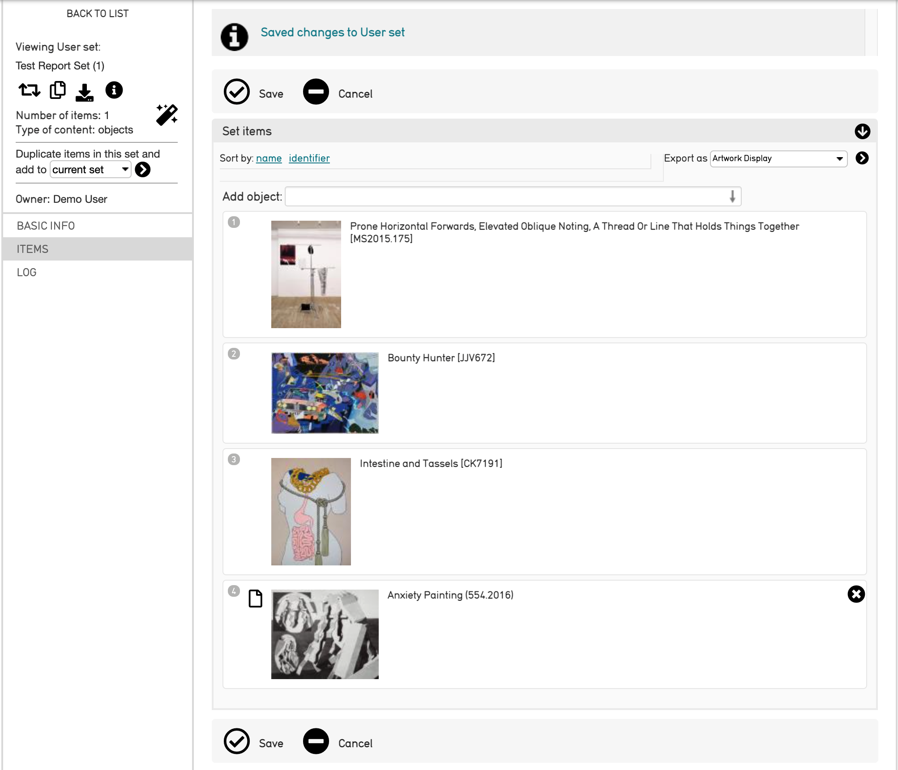

Set items will be displayed in the reverse order in which they were added. To change how Set items are displayed, sort by **name** or **identifier.**

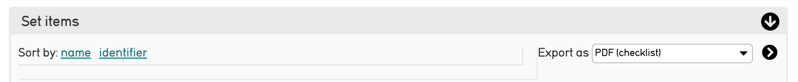

There are also options for which format the Set report will be exported with. Export options include:

* **Artwork Display**
* **Collection Finding Aid**
* **General Display**
* **PDF Checklist**

.. note:: Once all Set items are put into the Set, hit **Save**. If the Set is not saved, the report wil not generate properly. 

Select the arrow icon |arrow| to generate the report once the format and order of records has been configured. 

The Set report will look like:

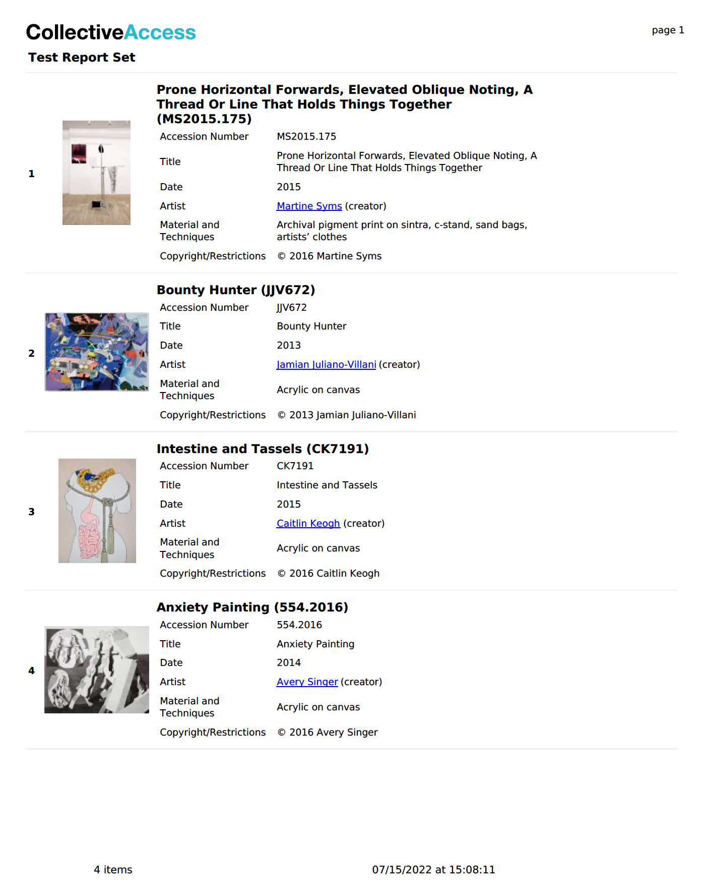

   The Set report exported as an Artwork Display. 

