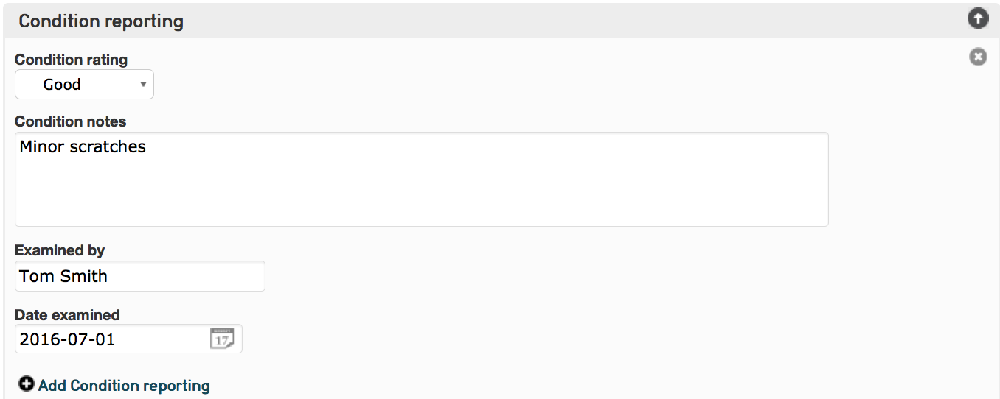
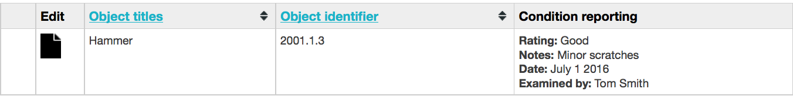

Display Templates: Tutorial
===========================

* `Template Basics`_
* `Configuring the Display of a Container Element`_
* `Display Template: Tutorial`_ 
* `Formatting Related Records on Related Records for Display`_ 
* `Formatting Related Records on Related Records for Display`_ 

To output information from your CollectiveAccess database, it is necessary to utilize display templates. Display templates are a critical element in the design of CollectiveAccess, affecting reports, search and browse result views, data export formats, the editing of interfaces, and finally, front-end Pawtucket views.

The need to format data for output is constant and critical. Designing reports, summarizing custom tombstone information for labels, displaying critical details in an editing interface, and constructing easy-to-read summaries for a web site all require the output of specific information. These functions all retrieve data from CollectiveAccess, formatting it in various ways, and output it to where it is needed, in the format that is needed. 

CollectiveAccess supports more complex output options, such as pulling in data from related records, filtering the set of data to output, varying formatting based upon field values, converting measurements and performing many other useful transformations. However, it must be clearly specified to CollectiveAccess what must be done. Display templates provide a way to do that. Display templates are a compact syntax for describing what data is output, and how it is output.

The following tutorial will provide a foundation in both the theory and application of display templates in CollectiveAccess. The tutorial will touch upon all of the important features of display templates, and options to output data in various formats. 

To output a custom selection of fields for a record, the fields can be lined up in order; this process is detailed in the Displays page. This results in a simple list of values that is very easy to create, but not terribly flexible. Configuring Display Templates allows for more flexibility when generating custom reports and other output processes. 

Template Basics
---------------

The simplest template is just a bit of text:

.. code-block::

   Hello world!

This template results in the literal display of that text. 

To insert data pulled from CollectiveAccess, include a placeholder for that data. Placeholders always start with the ^ (caret) character, followed by the specifier for the data you wish to insert. For example, if you are writing a template to display data for object records and a metadata element named description is part of your object record, then the specifier for that element is ca_objects.description, where ca_objects is the code for the type of record you're pulling data from (objects) and description is the metadata element code. In a template, a placeholder is formed using the specifier prefixed with a ^ to distinguish it as something to be processed rather than output as text. A template to output our object description preceded by a field title would be:

.. code-block::

   Description: ^ca_objects.description

Configuring the Display of a Container Element
----------------------------------------------

While creating a Display, the output for a Container element in a user interface may not appear how it should in a report. Each value in the Container is output as a list delimited by semicolons. An example of a Condition Container is displayed: 

By simply adding the "Condition Reporting" element to your Display (for instructions on how to do this, please see Displays), without configuring a template, the output would be:

.. code-block::

   Good; Minor scratches; Tom Smith; 2016-07-01

Display Template: Tutorial
--------------------------

To format this bundle shown above for Display in a report, it is necessary to use a display template to configure the data into a proper format. 

For each line of code, the simplest possible template would simply be:

.. code-block::

   <b>Rating:</b> ^ca_objects.condition_reporting.condition_rating 

Where **<b>** ensures that "Rating:" appears in bold, **^ca_objects.condition_reporting.condition_rating** pulls the value from this field, and ** ** adds a line break before the next template. 

However, there is an issue with this more simple display: "Rating:" would print out regardless of whether or not there is actually data in the ca_objects.condition_reporting.condition_rating field.  To account for this, it is important to use **<ifdef>** (“if defined”). 

Wrapping the template in <ifdef> ensures that the template will only output if there is actually data in the placeholder value. This makes sure that the data output looks good, and uniform, if there is data in just one, two, three, or all of the container field’s sub-elements. To do so:

.. code-block::

   <unit>
   <ifdef code="ca_objects.condition_reporting.condition_rating"><b>Rating:</b> ^ca_objects.condition_reporting.condition_rating </ifdef>
   <ifdef code="ca_objects.condition_reporting.condition_notes"><b>Notes:</b> ^ca_objects.condition_reporting.condition_notes </ifdef>
   <ifdef code="ca_objects.condition_reporting.condition_report_date"><b>Date:</b> ^ca_objects.condition_reporting.condition_report_date </ifdef>
   <ifdef code="ca_objects.condition_reporting.condition_examined_by"><b>Examined by:</b> ^ca_objects.condition_reporting.condition_examined_by </ifdef>
    
   </unit>

In the event that the Condition Reporting container element is a repeatable container, or, there are multiple Condition Containers located in the record’s screen, the **<unit>** tag must be used to ensure that each Container is separated (see template above). 

Without the **<unit>** tag, the output would print every Rating value followed by every Notes value, followed by every Date value, and so on. The **<unit>** tag guarantees that each Container is evaluated as a single group of data. This will generate a neat, final template for display. The output for display would look like: 

.. note:: For more information about formatting with **<ifdef>** and **<unit>** tags, please see Display Templates.

Formatting Metadata from Related Records for Display
----------------------------------------------------
 
By default, a relationship bundle such as related entities or related occurrences, may display only the preferred label for the related records, or perhaps the label, idno, and the relationship type. 
For example, for a particular display, the name, life dates for each entity, and relationship type between the entity and the primary record is needed. Therefore, other attributes from the related record must be specified. 

Custom templates can be created to pull as many attributes from a related record as needed. A template that would give you the above needed fields and relationships would look like:

.. code-block::

   <1>^ca_entities.preferred_labels.displayname<1> <ifdef code="ca_entities.life_dates">[Life dates: ^ca_entities.life_dates]</ifdef>(^relationship_typename) 

By default, a relationship bundle is relative to the relationship itself. When additional attributes such as Entity life dates or address, are added, it's always evaluated once for each relationship to the object. This can be seen in the template in conjunction with <unit> to pull container attributes from the related record.

Formatting Related Records on Related Records for Display
---------------------------------------------------------

For an Objects display, it might be necessary to display the related Object Lot record, in addition to the Entities that are related to the Object Lot record. These Entities are indirectly related to the Object record itself. 

To format this information for display, the relativeTo option must be used. The relativeTo option allows the template to shift its focus from the primary record or relationship to the related record. The template would look like: 

.. code-block::

   <1>^ca_object_lots.preferred_labels</1>
	 
	^ca_object_lots.idno_stub
	 
   <unit relativeTo="ca_entities" restrictToRelationshipTypes="donor"><b>Donor:</b> ^ca_entities.preferred_labels.displayname</unit>

The template is evaluated against the Object x Lot relationship. By shifting relativeTo to ca_entities, the related Entities on the Lot record will be pulled into the Object display template. This would display the Lot title, identifier, and the related entity.

