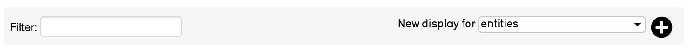
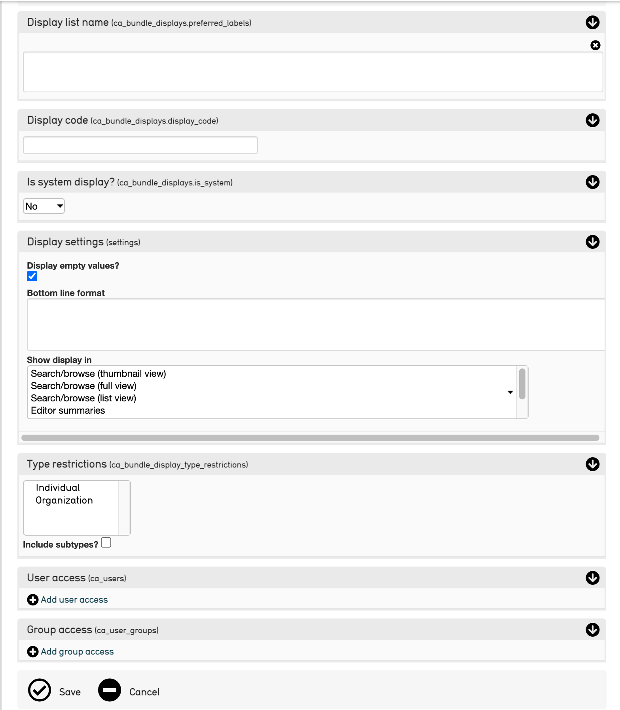
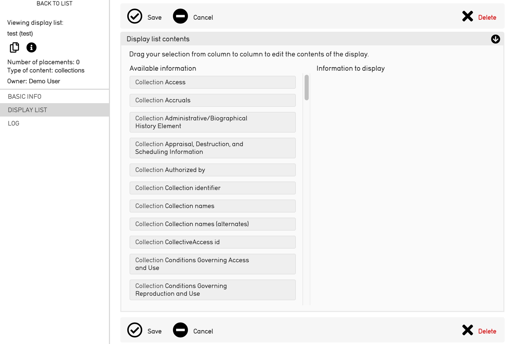

.. reporting_displays:

Displays
=====================

* `Creating a New Display`_
* `Add Contents to a Display`_
* `Advanced Displays`_
* `Filter Using Expression`_ 
* `Bottom Line Format`_
* `Functions Within Containers`_
* `Currency Conversion`_
* `Using Bottom Line Functions with Multiple Metadata Elements`_

Displays, also known as bundle displays, specify exactly which fields from a record are displayed in search results or a Summary page in CollectiveAccess. These can be customized, from what fields are present in a record’s screen to how many times a field appears on that screen.

Once custom displays are created and configured, several workflow options are available to output the data as displays are essentially synonymous with reports. Users can batch-edit data in spreadsheet format, export the data to tab or comma delimited files, or generate a PDF.

**Configuring Displays**
------------------------

**Creating a New Display**
--------------------------

1. Navigate to **Manage > My Displays**.
2. **Select a record type** from the "New Display for" drop-down menu in the upper right corner of the screen. 

3. **Select** the plus sign + icon |plus| to create a new Display. 

4. **Input** the basic information about the new Display. This information will look different depending on the selected record type: 

* **Display list name**: The display name for the display. 
* **Display code**: The unique identifier for the display to be used throughout the system.
* **Is system display?**: Set the display to be available or restricted to all users as part of the system-wide display list. 
* **Display settings**: Display list values to show even when nothing is entered. 
* **Type restrictions**: 
* **User access**: 
* **Group access**: 

5. **Save** the options set for the new Display. 

**Add Contents to a Display**
-----------------------------

Once the Display has been created and saved, contents can be added to the Display. To add contents:

1. Navigate to the **Display List** screen to the far left in the Inspector window.

2. Display list contents will be displayed in the form of two columns. The left column contains all available display items (elements that can potentially be shown in search results and summaries). The right column contains specific elements chosen for the Display:

3. **Drag elements** from the left column to the right, into Information to Display. 
4. **Save** the elements that were dragged from the left column to the right. A new Display with dragged elements has been created. 

Advanced Displays
=====================
 
New features for displays allow users to control what data is shown and analyzed in reports, results, and summaries. In addition to the tools listed below, there is also a powerful syntax used in CollectiveAccess to control how data is output in displays. This covers cases such as formatting repeating containers, conditionally hiding and showing data, and many more use cases.

**Filter Using Expression**
---------------------------

It's possible to use expressions to control viewing displayed data. To do so, use the if rule. 

To only output the display if "current" is selected from the type drop-down in a repeating credit line container, the display template would look like this (with different codes):

.. code-block:: php

   <unit relativeTo="ca_objects.credit_line"><if rule="^credit_type =~ /current/">^ca_objects.credit_line.credit_text 
        (^ca_objects.credit_line.credit_type)</if></unit>
        
**Bottom Line Format**
----------------------

The "Bottom line format" essentially allows users to display functions at the bottom of list views for search and browse results. Only certain metadata elements accept functions.  The following support bottom line formats: DateRange, Currency, Length, Weight, TimeCode, Integer, and Numeric.

Several functions are accepted:

.. csv-table:: 
   :header-rows: 1
   :file: advanced_display_table1.csv

Currently bottom lines are not displayed on single record Summaries, nor are they included in report downloads (PDF, Excel).

To include a bottom line function in a display, navigate to **Manage > My Displays**. Edit the specific bundle that will be the target of the function. Include the function code(s):

.. code-block:: php

   (i.e ^MIN) 

in the Bottom line format box.

**Functions Within Containers**
-------------------------------

To include bottom line formatting when a to-be-functioned value is within a metadata element container, include the specific subfield within your bottom-line function.

For a dimensions container that includes Length, Width and Height subfields, determine the combined Height by targeting the subfield code:

.. code-block:: php

   ^SUM:height
   
.. note:: There is no need to specify the full container path (i.e. ca_objects.dimensions.height) because it's implied by the bundle.

**Currency Conversion**
-----------------------

Under **Preferences > Units of Measurement**, a user can set a default currency for displays. Using daily data from the European Central Bank, CollectiveAccess auto-converts values between currencies. With this tool, it is possible to include in a single function values entered with different currency units, resulting in a single value in the desired target currency. Note that the Attribute Type Currency must be used for relevant metadata elements in order for this feature to function.

For example, CAD (or Canadian Dollar) is selected in **Manage > My Preferences > Units of Measurement**. If a Current Insurance Value field is added with the ^PAGESUM function, you'd see this in a search result set:

 .. warning:: 2 old images here
 
If the "Display currency conversion" checkbox is unchecked, the parenthetical conversions will disappear, but the bottom line total conversion will remain.

.. note:: The auto-conversion feature is currently supported for displays but not UI editor screens.

**Using Bottom Line Functions with Multiple Metadata Elements**
---------------------------------------------------------------

From CollectiveAccess version 1.7, bottom line values can be displayed, calculated using more than one metadata element in a display. This is useful when to display the total value of several currency fields in a display, or display the maximum value from any numeric field in a display.

Multi-element bottom line templates are attached to the display itself rather than to a specific element, using the Bottom line format display setting. The template works similarly to those for a single element; however, a semicolon-delimited list of elements must be specified to operate over following the function tag and separated using a "%" character. For example:

.. code-block:: php

   Total for all funds: ^SUM%fields=ca_object_lots.breslauer_fund;ca_object_lots.tbff_fund;ca_object_lots.akc_fund;ca_object_lots.sue_allen_fund; ca_object_lots.pine_tree_fund;ca_object_lots.general_fund;ca_object_lots.idno_stub

All bottom line functions are supported. Note that all of the elements listed after a function must be of the same type. Unexpected results may occur if elements of differing types are included in a list. Many functions can be specified as needed in a single template, and each function may have its own list of elements to operate on.

