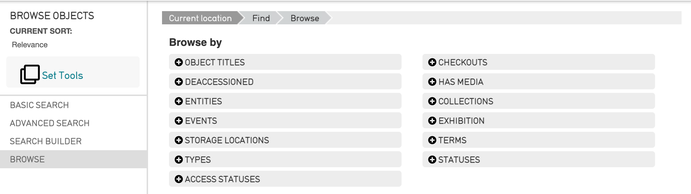
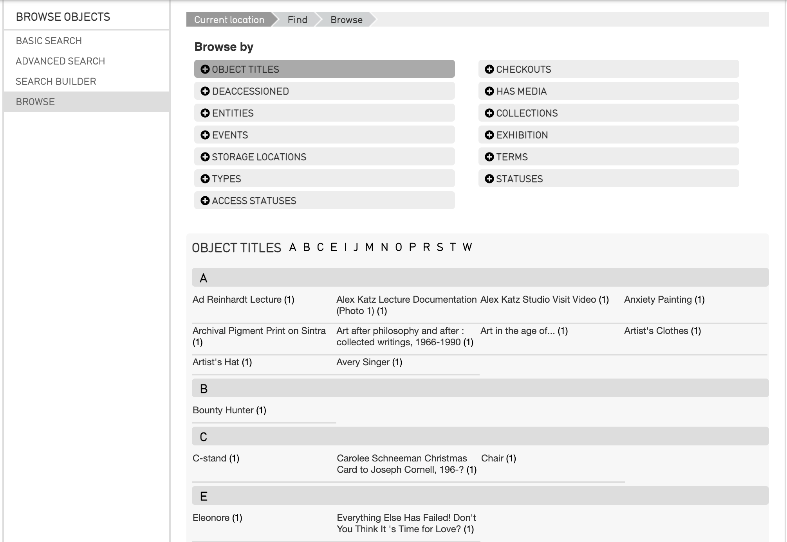
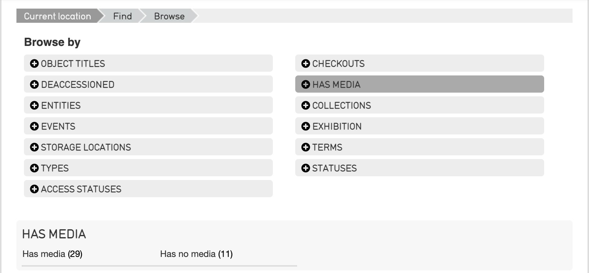
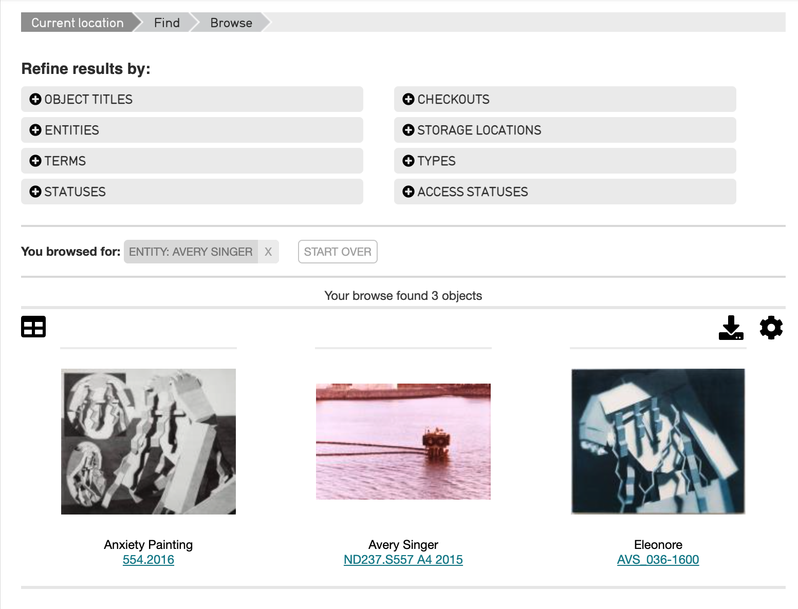
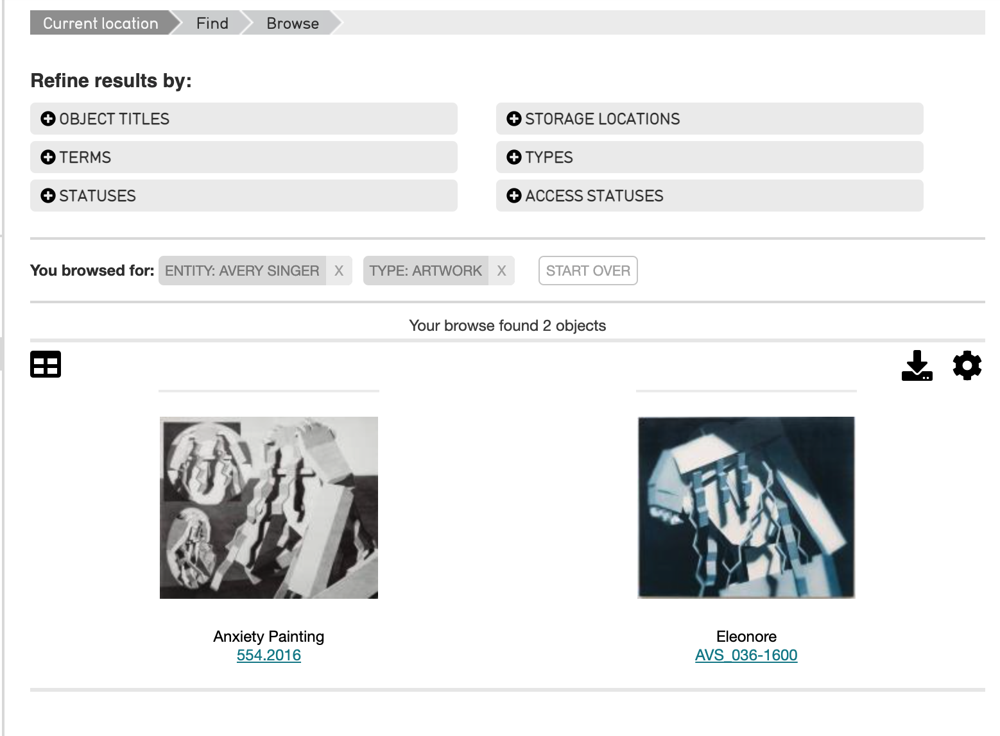
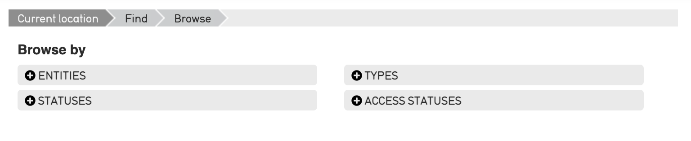
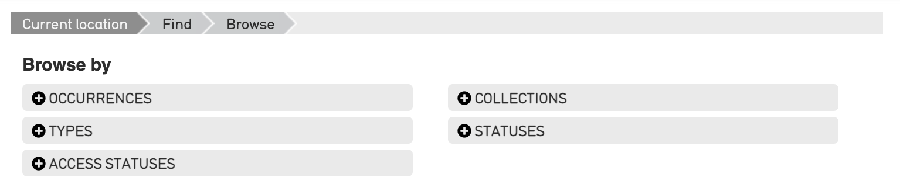

.. browse:

Browsing
========

* `Browse Facets`_
* `Browsing Using Facets`_
* `Browsing with Multiple Facets`_
* `Facets for Primary Tables`_

The Find interface includes a Browse search utility accessible from any primary table available in the system. For example, by navigating to **Find > Objects**, the Browse utility for objects will display:

This is the fourth Search option in the local navigation bar, after Basic Search, Advanced Search, and Search Builder. Browse is a method for viewing all records of a specific type (of your choosing) in the database and allows you to sort and filter records based on designated attributes.

Browse Facets
-------------

   
   The Object Titles facet from the CollectiveAccess Demonstration System.

The Browse search allows a search to be conducted through facets, or terms. These facets will filter items within the CollectiveAccess system, depending on what is selected.

.. note:: Facets can be configurable, and will differ from system to system. For more on how to configure these in an installation profile, see `Browse.conf <https://manual.collectiveaccess.org/providence/user/configuration/mainConfiguration/browse.html?highlight=facet>`_. 

Browsing Using Facets
--------------------

Choose a facet from the Browse window (such as Object Titles, Entities, Special Events, etc.) by selecting the plus icon |plus| to the left of each facet. 

Once selected, all records related to that term will display. For example, selecting the **Object Titles** facet will display all Object Titles in the system, arranged alphabetically: 

While selecting the facet **Has Media** displays a few more options: selecting **Yes** or **No** will display objects with, or without, media associated with them: 

At the top of the screen, the facet that was selected will be displayed: 

.. image:: 
   :align: center
   :scale: 50%
   
With the option to start over on the right. Selecting **Start Over** will bring the Browse window back to where all facets are listed. 

Browsing with Multiple Facets
-----------------------------

If a browse can be further refined by more than one facet, more options for grouping browse results will appear once an initial browse facet is chosen. 

Browsing by a specific entity will pull the object records associated with that entity. To further refine this search, simply select another facet from those available under **Browse by**, shown below.  

Searching by **Entities** and **Types**, for example, could pull the following result: 

Note that each facet used to browse will display at the top under **You browsed for.**

To modify or change your Browse terms, click the [X] symbol to remove the attribute and select a new one from the control bar. 

Facets for Primary Tables
-------------------------

What primary tables are available in CollectiveAccess will depend upon a system's configuration (see `Primary Tables and Intrinsic Fields <https://manual.collectiveaccess.org/providence/user/dataModelling/primaryTables.html?highlight=primary+tables>`_). However, browsing by facets is available for each primary table. 

The facets available for browsing will be different for each primary table. The examples above use **Find > Objects**; therefore, the facets are object related. However, the **Find > Browse** function can be utilized for each primary table. 

   The facets available for browsing Object Lot records in the CollectiveAccess Demonstration system.

   The facets available for browsing Entity records in the CollectiveAccess Demonstration system.

