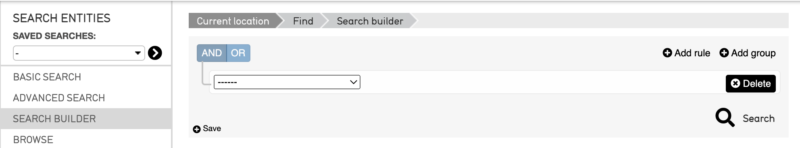
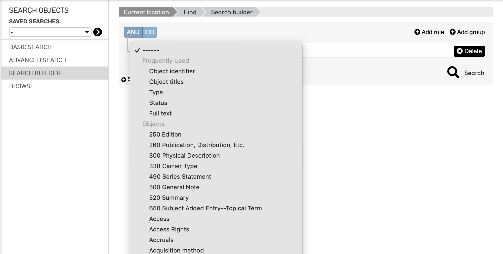

.. _search_builder:

Search Builder
=====================

* `Using the Search Builder`_
* `Search Builder for Primary Tables`_

**Search Builder** is a method of generating advanced and specific searches within records in CollectiveAccess. The search builder screen contains a full list of all metadata elements used in a specific CollectiveAccess system, which can be selected, with different options to further narrow the search within that metadata element. Search Builder is an ideal tool for searches that will be used to generate custom reports or checklists, as what elements are included or excluded can be completely customized. 

Using the Search Builder
------------------------

   The Search Builder in the CollectiveAccess Demonstration system.

Selecting **Search Builder** from the four Search and Browse options on the left side of the screen will display the Search Builder interface, which displays a drop-down menu: 

More here 

Search Builder for Primary Tables
---------------------------------

Similarly to the Browse function, the Search Builder is available to search with for each primary table in CollectiveAccess. And, the drop-down list displayed will differ, depending on the primary table from which the Search Builder is being used. 

Options exist to Save the search builder that was created. 

More here

Add Rule
--------

More here

Add group
---------

Groups allow for multiple Elements to be put together into collapsible units that create dynamic yet complex search forms.

More here 