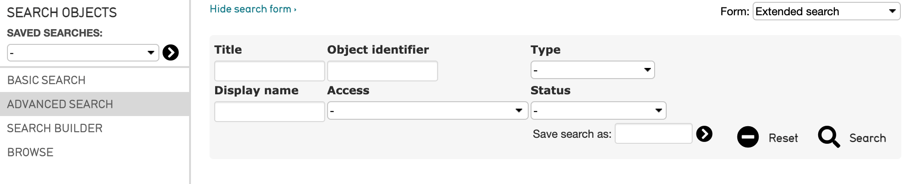

.. search_forms:

**Advanced Search Forms**
=====================
Advanced Search is a query tool that allows searching on multiple fields across different tables, from a single form. CollectiveAccess Advanced Search Forms can be customized using the Advanced Search Form Builder, and there is no limit as to how many different forms can be used within the system. 

Advanced Search offers several different ways in which a result can be generated, searching on a Title, Object Identifier, Record Type, Access Setting, Display Name, or Record Status. 

The Advanced Search function in CollectiveAccess offers customized search forms, and it is possible to create complex forms, simple forms to access unique data, or a general-purpose form for any collection management project.

To perform an Advanced Search, navigate to any primary table under the **Find** tab. A drop-down menu will display the supported search options: 

* Basic Search
* Advanced Search
* Search Builder
* Browse

Select **Advanced Search** from this drop-down. The Advanced Search form will be displayed:

Search by Title, Display name, Object Idenifier number, Access status, Type, and Status. Save an Advanced Search, or Reset the search form.