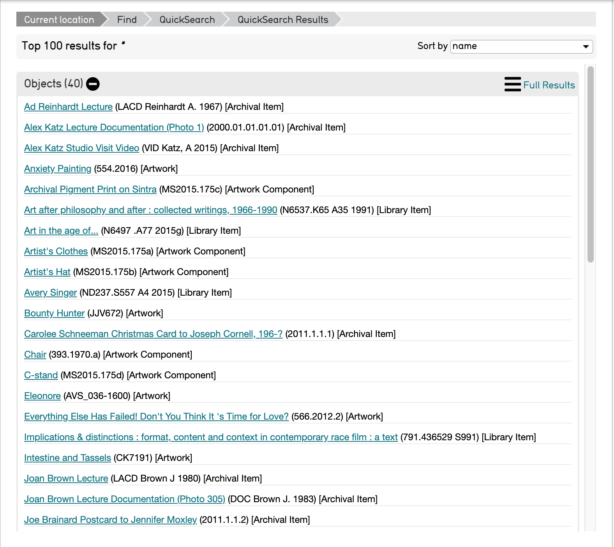
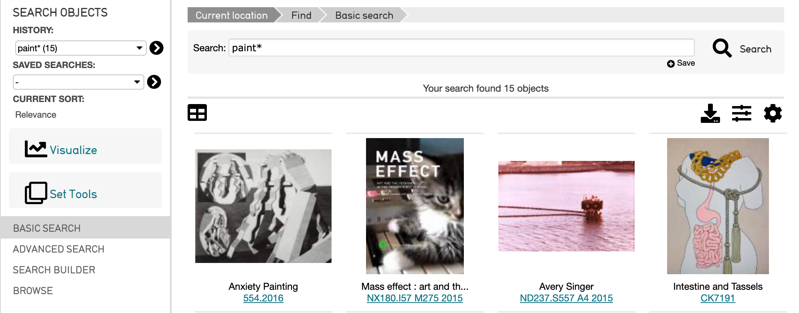
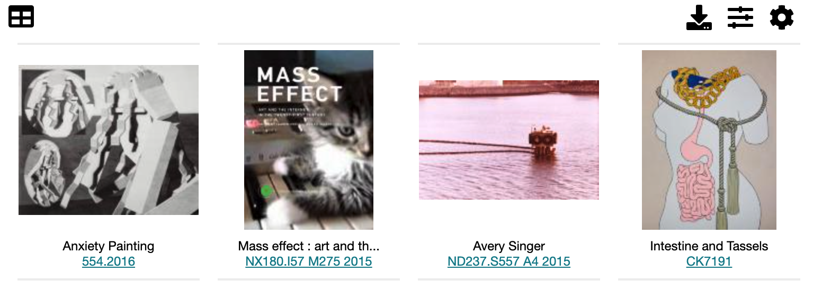
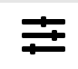
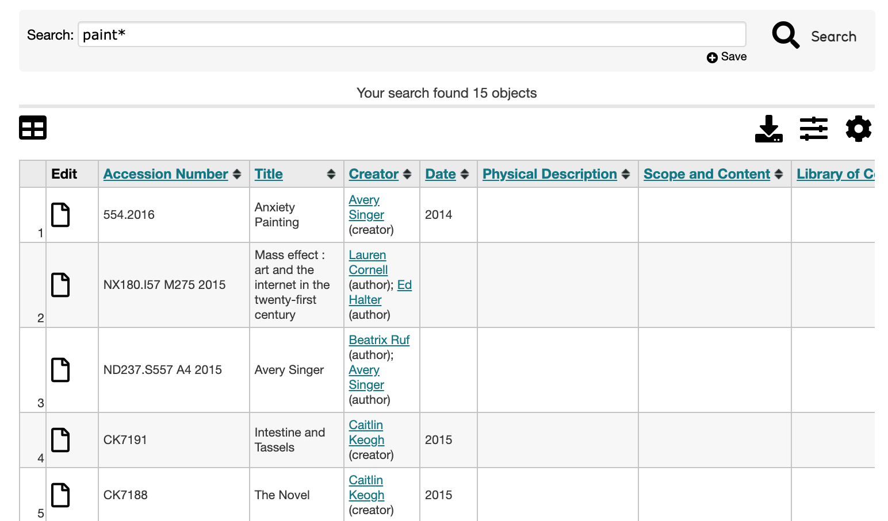
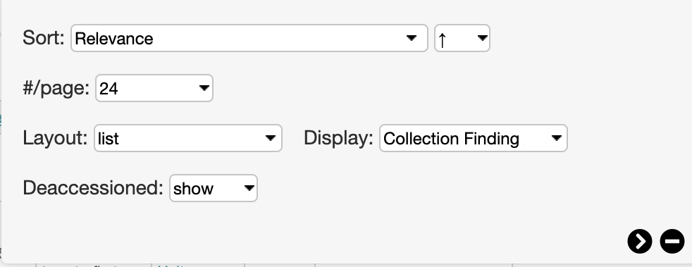

QuickSearch
===========

* `Using QuickSearch`_
* `Basic Search Result Options`_

Basic Search
===========

Using QuickSearch in CollectiveAccess runs a full-text query across the entire database, and organizes results according to primary tables. 

QuickSearch is located at the top right of any CollectiveAccess user interface, as a blank search bar. The results of a QuickSearch provide a database-wide context for any search query. The top 100 results for a search query are displayed. QuickSearch will process queries with single words, numbers, or phrases. 

Using QuickSearch
-----------------

   The QuickSearch bar in CollectiveAccess. 

The Asterisk Wildcard: * 
^^^^^^^^^^^^^^^^^^^^^^^^

As noted above, the results of a QuickSearch provide a database-wide context for any search query. Searching with *****, the asterisk wildcard, will bring up the first 100 results across all primary tables. 

Note that results are sorted by primary table. Each table displays 100 of the most relevant results and each record is listed with its Title and Identifier. To see full results, select the **full results** icon |full|. 

To narrow a search using the wildcard, simply enter part of the search term, and replace the ending with the asterisk *****. 

In addition to the wildcard, valid searches can be single words, entire phrases, or numbers. 

Basic Search Result Options
---------------------------

Search results generated by Basic Search or `Browse <https://manual.collectiveaccess.org/providence/user/searchBrowse/browse.html>`_ can be configured to display in a few different ways. 

These options are available underneath the search bar. 

4 options are available: 

* |edit|: Edit the search results in a spreadsheet format. Selecting this icon will display a spreadsheet which can then be edited on the screen. 

* |export|: Export tools with options to print results as labels, download results, and download media. 

* |refine|: Refine search results by selecting filters. 

* |display|: Options for the display of search results. Configure how search results are sorted, the number of results per page, the layout of results (thumbnails, full, list). Also decide if deaccessioned items are shown, and other display options.

The examples above show the search results displayed as thumbnails. However, results can be displayed as a list as well: 

To do so, select the |display| icon. A small options window will be displayed:

Under **Layout**, select **list.** 