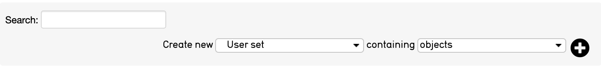
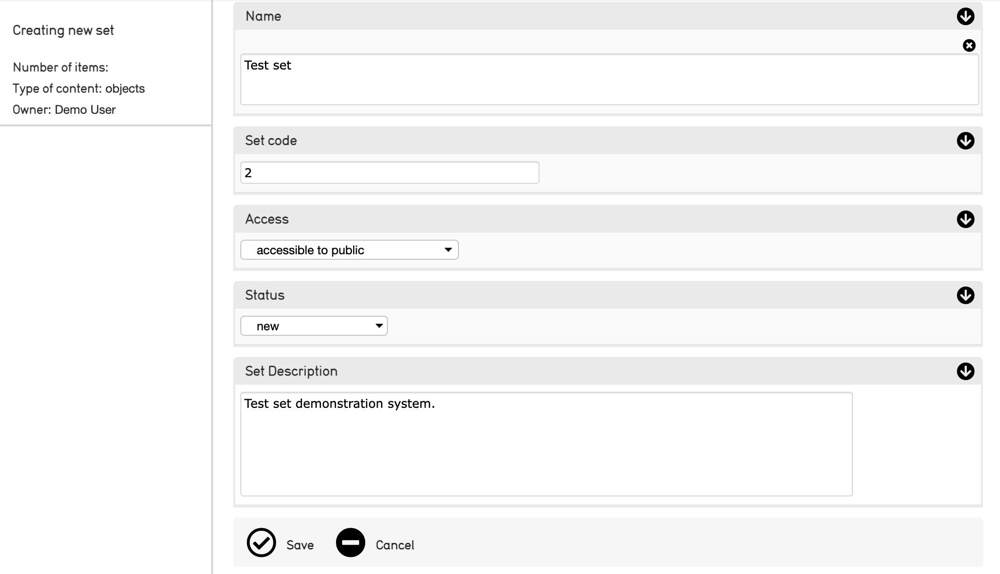
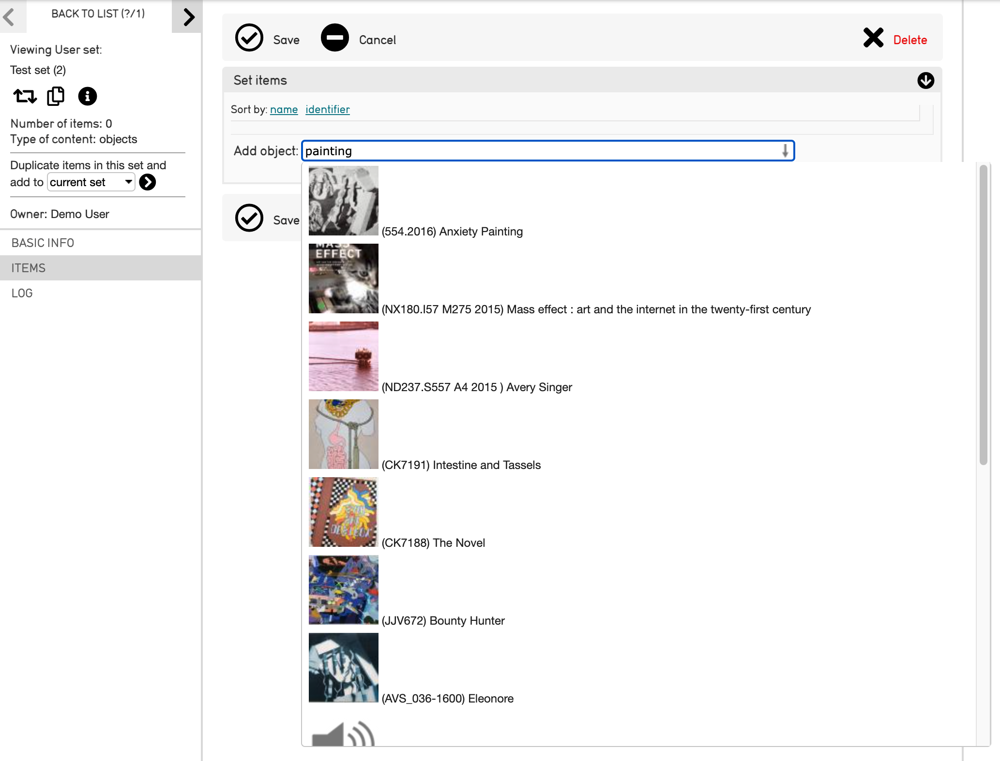
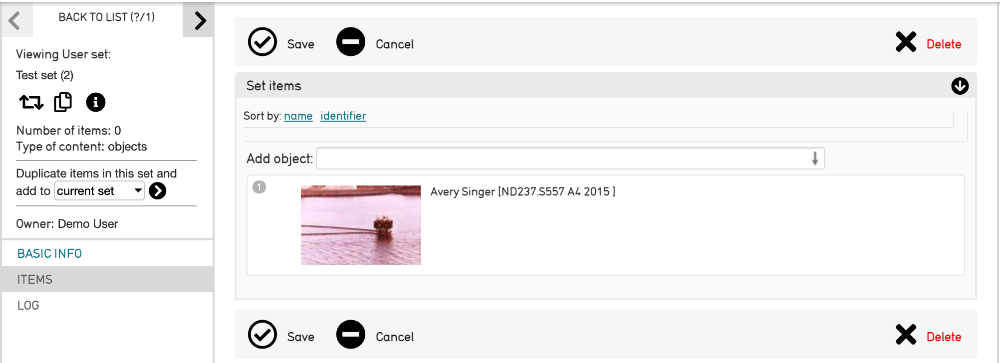

.. workflow_sets:

Sets
=====================

**Sets** are ordered groupings of any record type created by the user for a specific purpose. Sets are ad-hoc groups of records for internal features such as a working checklist for an upcoming exhibition, or a set of Entities for which biographical information is needed. Sets are typically temporary groupings, and thus not meant for collection-level cataloging.

A **Set Item** is a record assigned to a Set. Set Items can take additional cataloging, allowing for the contextualization and annotation of records within an assigned Set. Sets can contain Set Items, where each record contains Set-specific captions and links. 

**Creating Sets** 
-----------------

CollectiveAccess can generate unique Sets to help organize and manage records for a multitude of purposes. To create a Set: 

1. **Navigate** to Manage > My Sets > All Sets. 
2. **Specify** the kind and content of the new set: 

	
The **Create new** dropdown contains two straightforward options for a new set:
	
* **Public presentation** will publish a set to the public website, or front-end 			        		database (Pawtucket).
	
* **User set** will create a set only for use in the back-end database (Providence).
	
The **Containing** dropdown contains a list of what types of records will be added to the new set based, on the primary tables available in CollectiveAccess. 

	
3. Select the **plus icon** |plus| to create the new set. 

   

4. **Name the set**. This is an arbitrary name given to the Set to distinguish it. A Set Code, Description, and access settings can be configured as well. Note that items cannot be added to a set until the title information for that set is saved.

   
5. **Select Save** to save the new set. 

**Adding Records to a Set**
---------------------------
 
Records can only be added to as set after a new set has been created. To add records to a set:
 
 1. **Save** the new Set (see above).
 2. Within the set's user interface, navigate to **Items.**
 3. **Type** the name of records into the search drop-down. This search drop-down pulls records from across the primary table selected while creating the new set. 

4. **Select** the items that appear in the search drop-down to add them to the set. 

Set Options in the Inspector Window
-----------------------------------

**Sharing Sets**
----------------

Permissions can be assigned to each set created in CollectiveAccess. Sets can be publicly accessible, accessible only to certain users, or not accessible to the public. These permissions can be managed using the Access drop-down menu located in the Basic Info screen where a set is created. Permissions for sets are configurable. 

**Searching by Sets**
---------------------

Once a Set has been created, a user can search by Sets. Select the Set title from the Search By Set drop-down menu. All set items will be displayed in the results, as with any other kind of search method in CollectiveAccess. 