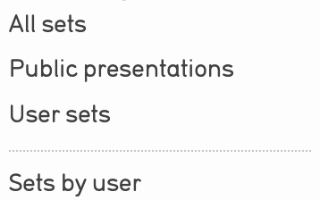

.. workflow_sets:

Sets
=====================

* `Creating New Sets`_ 
* `Adding Records to a Set`_ 
* `Set Options in the Inspector Window`_ 
* `Sharing Sets`_
* `Searching by Sets`_ 

**Sets** are ordered groupings of any record type created by the user for a specific purpose. Sets are ad-hoc groups of records for internal features such as a working checklist for an upcoming exhibition, or a set of Entities for which biographical information is needed. Sets are typically temporary groupings, and thus not meant for collection-level cataloging.

A **Set Item** is a record assigned to a Set. Set Items can take additional cataloging, allowing for the contextualization and annotation of records within an assigned Set. Sets can contain Set Items, where each record contains Set-specific captions and links. 

Navigate to **Manage > My Sets** to view the available Sets. The following options for viewing Sets include:

Sets can be filtered by:

* **All sets**: View all Sets in the CollectiveAccess system.

* **Public presentations**: View all public Sets in the system

* **User sets**: View all user-created Sets in the system

* **Sets by user**: View all user-created Sets, filtered by the users that created the Sets. 

**Creating New Sets** 
---------------------

CollectiveAccess can generate unique Sets to help organize and manage records for a multitude of purposes. To create a Set: 

1. **Navigate** to Manage > My Sets > All Sets. 
2. **Specify** the kind and content of the new set: 

.. image:: sets2.jpg
   :width: 1486px
   :height: 164px
   :align: center
   :scale: 40% 

The **Create new** dropdown contains two straightforward options for a new set:
	
* **Public presentation** will publish a set to the public website, or front-end 			        		database (Pawtucket).
	
* **User set** will create a set only for use in the back-end database (Providence).
	
The **Containing** dropdown contains a list of what types of records will be added to the new set based, on the primary tables available in CollectiveAccess. 

	
3. Select the **plus icon** |plus| to create the new set. 

.. |plus| image:: sets1.jpg
          :scale: 50% 
   

4. **Name the set**. This is an arbitrary name given to the Set to distinguish it. A Set Code, Description, and access settings can be configured as well. Note that items cannot be added to a set until the title information for that set is saved.

* **Name:** Assign a name for the new Set. 
* **Set code:** A unique alphanumeric code for this Set. Specify this if using the Set in a special context, for example, on a web front-end, in which the Set must be unambiguously identified.
* **Access:** Indicate if the Set is accessible to the public, not accessible to the public, or accessible to internal staff only. 
* **Status:** Indicates the current status of the object record. 
* **Set Description:** An optional description of the set. 

5. **Select Save** to save the new set. 

**Adding Records to a Set**
---------------------------
 
Records can only be added to as set after a new set has been created. To add records to a set:
 
 1. **Save** the new Set (see above).
 2. Within the set's user interface, navigate to **Items.**
 3. **Type** the name of records into the search drop-down. This search drop-down pulls records from across the primary table selected while creating the new set. 

.. image:: search_set.png
   :align: center
   :scale: 50%

4. **Select** the items that appear in the search drop-down to add them to the set. 

Set Options in the Inspector Window
-----------------------------------

Once a Set has been created and Saved, and records have begun to be added to the Set, a few options appear in the Set's Inspector Window. These include:

* |type|: Change the type of Set that has been created. For example, if a user Set was created, this will change the type from a user Set to a public presentation. Note that by changing types, any information in all fields not applicable to the new type will be discarded. In additon, changing types cannot be undone. 

An overlay will appear to confirm the action:

* |duplicate|: Duplicate the Set. If selected, a new Basic Info screen will display with the name, set code, access, status, and set description fields. Both the name and set code will indicate the Set is a duplication.

* |download|: Download all media associated with the Set. Media formats will vary based on records in the Set.

* |more|: See more information about the Set. This will collapse or expand relevant information about the Set, such as when the Set was created and when the Set was last edited. This icon also appears for records of any type in CollectiveAccess and has the same function.

* |batch|: The batch edit icon is a quick way to make edits to all records within a Set. Selecting this icon will display the batch edit interface for the Set, where metadata can be edited. 

The option also exists to duplicate items in the Set, and select the destination for duplicated Set items. Duplicated items can be added to the current set, or added to a new set. 

The Set's Inspector Window will also display the current Set being viewed, the number of items in the Set, the type of items in the Set, and the owner of the Set (the creator). 

**Sharing Sets**
----------------

Permissions can be assigned to each set created in CollectiveAccess. Sets can be publicly accessible, accessible only to certain users, or not accessible to the public. These permissions can be managed using the Access drop-down menu located in the Basic Info screen where a set is created. Permissions for sets are configurable. 

**Searching by Sets**
---------------------

Once a Set has been created, a user can search by Sets. Select the Set title from the Search By Set drop-down menu. All set items will be displayed in the results, as with any other kind of search method in CollectiveAccess. 