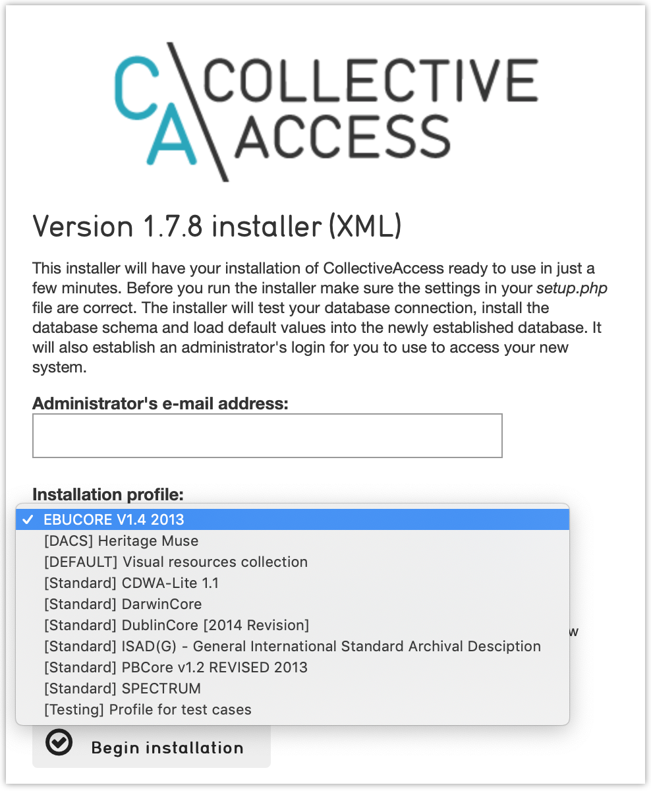

.. _install_centos8:
Installing on CentOS 8 and Red Hat Enterprise Linux 8
=====================================================

.. note::

	CentOS is a free, community-supported Linux distribution that is functionally compatible with its upstream source, Red Hat Enterprise Linux. For purposes of CollectiveAccess installation they are identical. The instructions provided here should work for either CentOS or Red Hat Enterprise Linux.

CollectiveAccess relies on a number of open-source software packages to run such as MySQL (database server), PHP (programming lanaguage) and Apache or nginx (web server), to name just a few. These required packages, all of which are standard parts of the CentOS distribution, can be installed using the `dnf` package manager. 

To start bring up a command line terminal on your CentOS system. Many of the commands required for installation must be run as the root (administrative) user. You can either log in as the root user, or (preferably) run the commands using `sudo`, which executes commands as the root user for authorized users. We assume use of `sudo` and include it whenever it is required.

First we install a web server. These instructions assume use of Apache. You can also install `nginx <https://www.nginx.com>`_, a popular alternative to Apache if desired, although the web-server specific configuration will differ from that described here. To install Apache enter in the terminal: 

.. code:: bash

   sudo dnf -y install httpd

Next, set Apache to start itself automatically every time the server is rebooted:

.. code:: bash

   sudo systemctl enable httpd

and also to start running now:

.. code:: bash

   sudo systemctl start httpd

You should now be able to connect to the web server by going to the URL `http://<ip address of your server>` in a web browser. An Apache welcome page should display. If unsure of your server's IP address, the `hostname -I` command will return it.

Next install PHP version 7.4 and required extensions. CentOS 8 offers only PHP 7.2 and 7.3. An external repository is required for installation of PHP 7.4. We'll use the popular EPEL and REMI repositories to obtain the latest packages. To add the repositories:

.. code:: bash
	
	sudo dnf -y install https://dl.fedoraproject.org/pub/epel/epel-release-latest-8.noarch.rpm
	sudo dnf -y install https://rpms.remirepo.net/enterprise/remi-release-8.rpm

and then enable REMI:

.. code:: bash

	sudo dnf config-manager --set-enabled remi
	sudo dnf -y module install php:remi-7.4
	
Now we can actually install PHP 7.4:

.. code:: bash

    sudo dnf -y install php php-cli php-common php-gd php-curl php-mysqlnd php-zip php-fileinfo php-gmagick php-opcache php-process php-xml php-mbstring php-redis

Once the PHP installation process completes typing `php -v` in the terminal should return output similar to:

.. code::

	PHP 7.4.3 (cli) (built: Oct  6 2020 15:47:56) ( NTS )
	Copyright (c) The PHP Group
	Zend Engine v3.4.0, Copyright (c) Zend Technologies
		with Zend OPcache v7.4.3, Copyright (c), by Zend Technologies

The default installation of PHP is configured with memory and file upload size limits that are often too low for typical use of CollectiveAccess. In particular, file uploads are limited to a maximum of 2mb, which is well below the media file sizes most users work with. To raise these limits edit the PHP configuration file at `/etc/php.ini`. 

With the `php.ini` file open search for `memory_limit` and change it to "256m". If you are planning to upload very large media files (Eg. JPEGs > 10mb or TIFFs > 100mb) you may wish to set this value to "384m" or even "512m". 

.. note:: 

	The `memory_limit` setting caps the amount of memory CollectiveAccess can use. It does not actually allocate memory to PHP or CollectiveAccess. Usually CollectiveAccess will use much less memory than these limits, but media processing may require larger memory allocations for short periods.

Next search for `upload_max_filesize` and change it to a value larger than the largest file you expect to upload. If you're planning to upload 500mb video files consider setting it to "750m" to provide a margin of safety. If you're planning to upload multiple 40mb TIFF files consider setting it to some multiple of 40. 

.. note:: 
	
	As with `memory_limit` this setting is a maximum. It does not actually allocate resources.

Finally, search for `post_max_size` and set it to a slightly larger value than `upload_max_filesize`. If `upload_max_filesize` is set to "750m", for example, you may elect to set `post_max_size` to "800m".

By default PHP will not display runtime errors on screen. If you're experiencing blank white screens, odds are a PHP error occurred but it's not being displayed. To enable on-screen error displays search for `display_errors` and set its value to "On". On-screen PHP error display can be useful for debugging, but it is adviseable to leave message display off in a production system.

Once you're done editing `php.ini` restart the web server, allowing your edits to take effect:

.. code::

    sudo systemctl restart httpd

.. tip::
	
	You can also change the `display_errors` setting by adding the following PHP code to your `setup.php` file: `ini_set('display_errors', 'On');`. Setting `display_errors` in `setup.php` does not require a web server restart, making it very convenient when debugging.

Now let's install MySQL. CollectiveAccess works with version 5.7 or newer of MySQL, or equivalent versions of MariaDB. To install the most current version, version 8.0:

.. code::

   sudo dnf install -y mysql-server

Then set MySQL to start now and automatically whenever the server reboots:

.. code::

    sudo systemctl start mysqld
    sudo systemctl enable mysqld

Next we install various packages to support data caching and processing of media: ffmpeg (audio/video), Ghostscript (PDFs), GraphicsMagick (images), mediainfo (metadata extraction), dcraw (RAW images), Poppler (content extraction from PDFs) and Redis (caching):

.. code::

	sudo dnf -y install ffmpeg ghostscript dcraw mediainfo poppler redis GraphicsMagick  

CentOS does not offer packages for LibreOffice (required to generate previews for Microsoft Word/Excel/PowerPoint files) and ExifTool (for metadata extraction from images). If you need the functionality provided by these applications you can install them manually using instructions provided on the `LibreOffice <https://www.libreoffice.org/>`_ and `ExifTool <https://exiftool.org>`_ web sites.

Now we are ready to install the CollectiveAccess `Providence` back-end cataloguing application. The web server we installed earlier uses `/var/www/html` for documents by default (the "web server root" directory). We are going to place CollectiveAccess here, in a subdirectory named `ca`. The URL for this directory will be http://<your server ip>/ca. 

.. tip::

    You can use a different web server root directory for the application by editing `/etc/httpd/conf/httpd.conf`. Modify the line `DocumentRoot /var/www/html` to point to your chosen directory.

You may download a release from https://github.com/collectiveaccess/providence/releases, or install is with Git. Using a release in somewhat simpler to install, while using Git allows you to easily update files and switch to development versions of CollectiveAccess.

To install with Git, in the first make sure Git is installed:

.. code::

   dnf install -y git

Next change directory into the web server root directory.

.. code::

     cd /var/www/html

Then "clone" the Providence application code from GitHub:

.. code::

    git clone https://github.com/collectiveaccess/providence.git ca

If you prefer to download a release, place the `release ZIP or tgz file <https://github.com/collectiveaccess/providence/releases>`_ into /var/www/html and uncompress it. Then rename the resulting directory (named something like `providence-1.7.11`) to `ca`.

In the terminal change directory into the `ca` application directory and copy the `setup.php-dist` file to `setup.php`. This file contains basic configuration for Providence. The "-dist" version is simply a template. The `setup.php` copy will need to be customized for your installation:

.. code::

    cd  /var/www/html/ca
    cp setup.php-dist setup.php

Edit `setup.php`, changing settings to suit. At a minimum you will need to edit the database login settings `__CA_DB_USER__`, `__CA_DB_PASSWORD__`, `__CA_DB_DATABASE__`. You may want to edit other settings, which are described by notes within `setup.php`. You should also edit the `__CA_STACKTRACE_ON_EXCEPTION__` to be true. This will allow you to receive full error messages on screen if something goes wrong. You may also set `__CA_CACHE_BACKEND__` to "Redis" to use the Redis memory-based cache system. Redis is faster and more reliable than the default file-based caching system, but requires Redis to be running on the server.

By default dnf installs the MySQL database server with an all-access, password-less administrative account named `root`. It's generally insecure to leave this account password-less, but in a testing environment this may not matter. If you decide to use the root account, set `__CA_DB_USER__` to "root", leave `__CA_DB_PASSWORD__` blank and set `__CA_DB_DATABASE__` to the name you'll use for your database. For this example, we'll assume the database is to be named `my_archive`.

MySQL can support multiple databases in a single installation, so the `my_archive` database must be created explicitly. Log into mysql in the terminal using the `mysql` command (assuming you haven't set a password for the root account):

.. code::

    mysql -uroot

.. tip::
	For ephemeral systems intended for testing or evaluation, leaving the root login password-less and using that login for the CollectiveAccess application may be acceptable. For any other use you should secure your MySQL installation using the `mysql_secure_installation` command and set up an application-specific MySQL login with access restricted to the specific database used for CollectiveAccess. If you've secured your MySQL installation using `mysql_secure_installation` be sure you include the password you set for root in your `mysql` command: `mysql -uroot -p<your password>`.

One you're logged in, at the `mysql>` prompt enter:

.. code::

    CREATE DATABASE my_archive;
    
To be sure your new database has been created run the `SHOW DATABASES;` command. Your new `my_archive` database should appear in the list of available databases.

If you wish to create a MySQL login specific to the newly created database, while still at the `mysql>` prompt enter these two commands:

.. code::

    CREATE USER my_user@localhost identified by 'my_password';
    GRANT ALL on my_archive.* to my_user@localhost;

where `my_user` is your preferred MySQL user name and `my_password` is your preferred password for the MySQL login. 

.. note::

	MySQL logins are specific to MySQL and have nothing to do with your server login. You can set the user name and password to whatever you want, independent of all other login credentials.

Go back to `setup.php` and enter your newly created MySQL login credentials into the `__CA_DB_USER__`, `__CA_DB_PASSWORD__` and `__CA_DB_DATABASE__` settings. The restart the web server with the command:

.. code::

    sudo systemctl restart httpd

Certain directories in the installation must be writeable by the web server, within which CA runs. On CentOS, the web server runs as user `apache`. Change the permissions on the `app/tmp`, `app/log`, `media` and `vendor` directories to be writeable by `apache`:

.. code::

    cd  /var/www/html/ca
    sudo chown -R apache app/tmp app/log media vendor
    sudo chmod -R 755 app/tmp app/log media vendor

Navigate in a web browser to http://<your server ip>/ca. You should see this, or something similar:

.. image:: ../../_static/images/first_install.png
    :width: 600px

Click on the `installer` link and you should see:

.. image:: ../../_static/images/install_screen.png
    :width: 600px

Select a profile, enter your email address and click on `Begin installation`. A profile is a preset template with record types, fields and other cataloguing settings that the installer uses to define a new working system. The standard profiles Providence ships with include implementations of widely used standards:

You can add your own profiles, or use profiles from other users by dropping profile files in the `/var/www/html/ca/install/profiles/xml` directory.

If you want to experiment with different profiles you may wish to set the `__CA_ALLOW_INSTALLER_TO_OVERWRITE_EXISTING_INSTALLS__` option in setup.php. By default the installer will refuse to install over an existing installation. With `__CA_ALLOW_INSTALLER_TO_OVERWRITE_EXISTING_INSTALLS__` set the installer will include an option to overwrite existing data. In a real system this is **extremely** dangerous – any one with access to the installer can delete the entire system – but is very handy for testing and evaluation.
